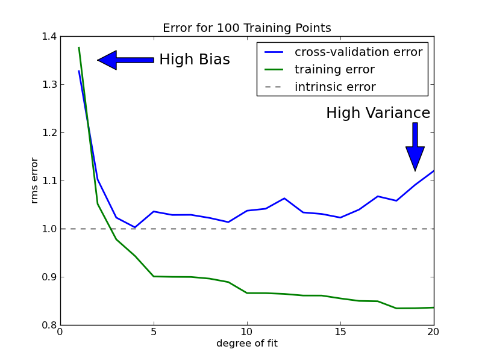

# On the Bias/Variance tradeoff in Machine Learning

From 05/08/2015SRJOGLEKAR246

One of the very first concepts any Machine Learning amateur comes across is the Bias-Variance tradeoff. However, inspite of how fundamental the idea is to the domain, I had always found it tricky to fully wrap my head around the it- especially from a practical understanding POV. Not to mention that literature regarding the topic on the internet isn’t that kind towards someone just starting his study on intelligent systems. Anyways, I recently started reading An Introduction to Statistical Learning, one of the best (neither too abstract, nor too rigorous) ML books I have ever come across. This book provides a good understanding of the aforementioned topic really well, right in the second chapter. And so, I thought I should write a blog post pouring out my understanding of the concept-  for others, and my own future self.

For prediction-based Statistical learning methods, the principle aim is to develop a model that can take in *a set of predictor variables* as input, and provide the *best estimate of the dependent variables as the output*. To understand how well your algorithm did its job, you usually use two types of (experimentally computed) quantities:

1. **Training Error** – A measure of how accurately your model predicts the outputs for the inputs used to train the model. Intuitively, as the complexity of your modeling technique increases, this error reduces.

2. **Testing(or Cross-validation) Error** – A measure of how accurately your model predicts the outputs for the inputs NOT used to train the model. This is the type of error measure you primarily want to reduce. Since your model was trained on the training data itself, it is how it performs on unseen inputs, that determines how ‘useful’ it really is in the real world.

Usually, the trends shown by the above two, are as follows:

As the complexity(or degree of fit) of your algorithm increases, the training error keeps on reducing. The testing error shows similar trends at first, until it starts going back up after a certain point. Why is that so? The reason, is *overfitting*.

In general, every dataset contains random patterns that are caused by variables you do not consider- whether you like it or not. Obviously, your model is supposed to ‘learn’ ONLY those patterns that are a result of your predictor variables- not these random trends you have no control over. Usually, if you select a model thats too simple for your application, its bad at learning pretty much any patterns in the data. This is called **underfitting–** not understanding even the essential trends in the data. However, as the flexibility of your model increases(i.e., as it starts getting more complex), it gets more sensitive to trends in the data, and starts learning more and more patterns. This causes the decrease in the cross-validation error.

But as the complexity goes on increasing beyond the required/ideal point, your model gets so sensitive that it starts to see patterns that are misleading. In essence, it has now started to model the random errors that aren’t actually a function of your predictor variables. Intuitively, this is plain wrong. This is what we call **overfitting–** learning those trends that are caused by random chance, rather than your input variables. As a result, the cross validation error starts increasing beyond a certain point.

Underfitting and overfitting now bring me to the main topics of this post:

## I. Bias

Bias is the error thats caused because of your model intrinsically making assumptions that are far from reality. Essentially, this happens if the model you have chosen for learning is very different(usually way too simple) from the real relationship between your dependent and independent variables. Intuitively, its called so, because your *modeling is ‘biased’ towards a wrong type of function.* For example, if the relationship between Y(your output) and X(your input) is actually a degree-4 equation, and you use simple linear regression for modeling, your bias will be pretty high.

## II. Variance

This is the error thats caused because of fluctuations in the training dataset. Ideally speaking, assuming the same problem and same source of data, your learned model should be the same(or approximately same) irrespective of which training dataset you use. In terms of an equation, the coefficients and the constant would approximately be the same independent of the dataset used for training. **However, this may not be the case, if your algorithm is too sensitive and captures random patterns that are present only in that particular training set.** In essence, variance is the error thats caused because *your learning function varies too much with the data used for training*.

Now back to the diagram shown earlier. When the degree of fit is too low, your bias error is pretty high – because your model is unable to fully grasp the relationship between the inputs and the outputs. As the degree goes on increasing, the model starts understanding things better – causing the bias error to fall. Ofcourse, the variance error is simultaneously increasing, since your algorithm is becoming more and more sensitive. However, the overall cross-validation error reduces because the fall in the bias error is far too high compared to the increase in the variance error. However, at a certain point, your model has become as intelligent as it possibly could. If you go on increasing the degree beyond this point, the increase in the variance error becomes too significant in front of the (possible) decrease in the bias error. This is the point where overfitting has begun, and your model is remembering trends it shouldn’t.

Therefore, the perfect bias-variance tradeoff can be summarized as- Your model should have low bias(the relationship your model assumes shouldn’t be too simple), and low variance(the relationship your model assumes shouldn’t be too convoluted to be true).