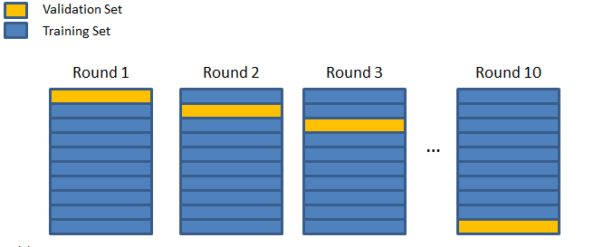

# Cross Validation and the Bias-Variance tradeoff (for Dummies)

[Another reference - Balancing Bias and Variance to Control Errors in Machine Learning](https://towardsdatascience.com/balancing-bias-and-variance-to-control-errors-in-machine-learning-16ced95724db)

Most ML newbies out there have a pretty good grasp on every learning algorithm, but lack one crucial piece of the puzzle- Understanding a way to test and validate their model with respect to real-world data. This is, infact, the most important part of the whole data mining process. And one that is commonly ignored. This post tries to acquaint the reader with an important(and very powerful) method of ensuring that a given model works, before it’s let out into the world.

Literature on testing ML models always talks about a ‘training’ dataset and a ‘test’ dataset. However, in a practical scenario, we usually don’t get an actual ‘test’ set until we go for deployment. And since the training set is the one we use for helping the model learn, its not usually an accurate indicator of the model’s effectiveness with respect to unseen data. One simple(and straight-forward) way of solving this problem, is called the **hold-out method**. Its exactly what it sounds like:

1. You hold-out a part of the available dataset from the whole learning process.

2. You then train your model using the remaining portion of your dataset.

3. The part of the dataset you held-out during training is now used as the test set, since its actually unseen from the model’s POV. The testing framework will usually give you an indicator of the model’s effectiveness, for e.g. the mean squared error in case of linear regression.

4. If the indicator in the previous step suggests that the model works well enough, it is then trained using the entire dataset we previously had.

5. Deployment!

This is roughly how it goes. However, **how you hold-out** the data and how many times you run steps i-iii determine how accurately the method will assess your model. In fact, theres a bias-variance tradeoff inherent in the entire process! Lets take each case one by one (Remember, each time I mention bias or variance, it is with respect to the testing process, and not your model- unless otherwise mentioned):

## The Validation Set Approach

This is a pretty straight-forward way of doing it. You reserve around half of your original dataset for testing(or validation), and the other half for training. Once you get an estimate of the model’s error, you may also use the portion previously used for training for testing now, and vice versa. Effectively, this gives you two estimates of how well your model works.

However, there are a couple of problems with this approach. First off, you get only one(or two) estimates of the model’s accuracy. Though this is better than having no test dataset, it still leaves a lot of room for improvement. Secondly, since you reserved half of the original dataset for testing, you induced a significant amount of bias into the whole process- in plain English, do you think the framework trained with half of the dataset will be comparable to the one trained with the complete dataset? Usually, No. The next method tries to tackle this.

### Leave-One-Out- Cross Validation (LOOCV)

In this case, we run steps i-iii of the hold-out technique, multiple times. Each time, *only one* of the data-points in the available dataset is held-out and the model is trained with respect to the rest. Therefore, this process allows the entire procedure of training+testing to be run as many times as the number of data-points in your training set. Since each data point appears in the training as well as test set(in different iterations), the process is called **cross-validation**. The good thing about this approach is that there is negligible bias inherent in the testing process- Since you are using almost your entire dataset for training each time, the model you come up with would be pretty close to the real thing.

However, we have now induced a significant amount of *variance* into our testing technique. Since there is only one data point being used for testing every time, the variance in the estimates of your model’s error would be pretty high! (Especially if you have multiple outliers in your dataset) This wasn’t a problem with the previous method, since half of the total dataset was being used for testing. Moreover, this technique is computationally very, very intensive- you have to train and test your model as many times as there are number of data points. This can spell trouble if your dataset contains millions of them.

The two approaches described above give us a fair idea of what we want from our final testing procedure-

1. (**Minimizing the testing bias**) We want a sufficiently large portion of the dataset for *training*. In other words, we don’t want to hold-out too much of the data for testing. This mainly ensures that the model we train as a part of the testing procedure, would be *as close as possible* to the one that we would get if we trained it on the entire dataset.

2. (**Minimizing the testing variance**) We want a good amount of data points for *testing*. If too little a number is used for this purpose, you will not be able to trust estimate of error that is given by your testing framework- this is especially true if your luck is really bad and you happen to randomly choose the few bad data points from your dataset(the outliers) for testing.

3. We would want to run the whole procedure of testing+training multiple times, to ensure that our model consistently gives low estimates of error (giving a low estimate of error means your model itself has low bias, and doing so consistently means low variance too).

The best way to do this, is:

## k-fold Cross-Validation

This is a brilliant way of achieving the bias-variance tradeoff in your testing process AND ensuring that your model itself has low bias and low variance. The testing procedure can be summarized as follows (where k is an integer) –

1. Divide your dataset randomly into k different parts.

2. Repeat k times:

   1. Choose a part out of the k available ones (one that hasn’t been chosen before, obviously).

   2. Use the other k-1 parts together for training your model.

   3. Use the part that was held-out in step ii.a., for testing. This will give you one of the k estimates of your model’s error.

For k=10, the process can be visualized as follows:

Choosing a good value of ‘k‘ ensures that your testing procedure gives you the best possible estimate of how well your model works. Choose a value too small, and you will drift towards the extremity of using the Validation Set Approach(biased testing). Choose a value too large, and it will be more like LOOCV (too much of variance in the testing procedure, and computationally intensive). Usually, a value between 5-10 is used in practical Machine Learning scenarios.

That brings us to the final question:

**How do we assess the model’s bias-variance characteristics using k-fold Cross Validation?**

When you perform k-fold CV, you get k different estimates of your model’s error- say e_1, e_2, e_3, ..., e_k. Since each e_i is an error estimate, it should ideally be zero.

To check out you model’s **bias**, find out the **mean** of all the e_is. If this value is low, it basically means that your model gives low error on an average– indirectly ensuring that your model’s notions about the data are accurate enough.

To check out your model’s **variance**, compute the **standard deviation** of all the e_is. If this value is high, it means that your model’s performance(in terms of its error) varies a lot with the dataset used for training- something you don’t want.

Obviously, what is ‘high’ enough to rule out your model as being ineffective, depends on your particular application and your domain knowledge (and subsequently your skill as a data miner). Nevertheless, k-fold Cross-Validation is a powerful practical tool to quantify a model’s performance, and has been shown to pretty accurately estimate the real-world numbers in a wide range of scenarios.