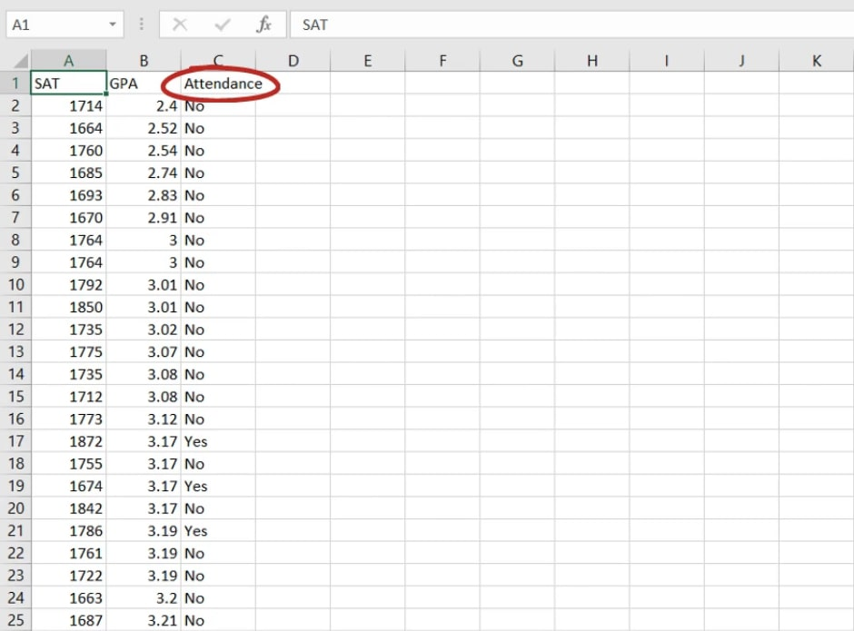
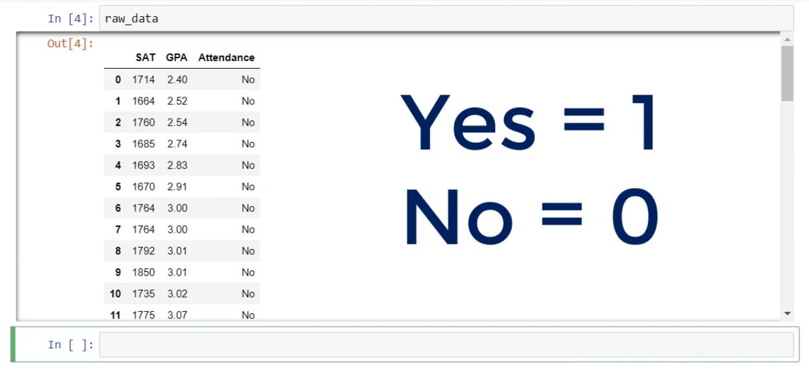

# Dummy Variables

Realizing how to include dummy variables into a regression is the best way to end your introduction into the world of linear regressions. Another useful concept you can learn is the Ordinary Least Squares. But now, onto dummy variables.  **Apart from the offensive use of the word “dummy”, there is another meaning – an imitation or a copy that stands as a substitute.**

In the picture below, you can see a dataset that includes a variable that measures if a student attended more than 75% of their university lectures.

Mapping Values
What we would usually do in such cases is to map the Yes/No values with 1s and 0s. In this way, if the student attended more than 75% of the lessons, the dummy will be equal to 1. Otherwise, it will be a 0.

So, we will have transformed our yes/no question into 0s and 1s. That’s what the dummy name stands for – we are imitating the categories with numbers.