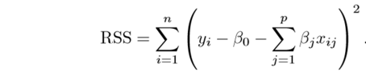
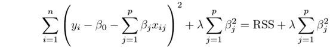
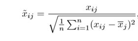
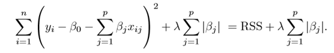

# Regularization

With material from [here](https://towardsdatascience.com/regularization-in-machine-learning-76441ddcf99a)

This is a form of regression, that constrains/ regularizes or shrinks the coefficient estimates towards zero. In other words, **this technique discourages learning a more complex or flexible model, so as to avoid the risk of overfitting.**

A simple relation for linear regression looks like this. Here Y represents the learned relation and *β represents the coefficient estimates for different variables or predictors(X).*

**Y ≈ β0 + β1X1 + β2X2 + …+ βpXp**

The fitting procedure involves a loss function, known as residual sum of squares or RSS. The coefficients are chosen, such that they minimize this loss function.

Now, this will adjust the coefficients based on your training data. *If there is noise in the training data, then the estimated coefficients won’t generalize well to the future data. This is where regularization comes in and shrinks or regularizes these learned estimates towards zero.*

## Ridge Regression

Above image shows ridge regression, where the** RSS is modified by adding the shrinkage quantity**. Now, the coefficients are estimated by minimizing this function. Here, **λ is the tuning parameter that decides how much we want to penalize the flexibility of our model**. The increase in flexibility of a model is represented by increase in its coefficients, and if we want to minimize the above function, then these coefficients need to be small. This is how the Ridge regression technique prevents coefficients from rising too high. Also, notice that we shrink the estimated association of each variable with the response, except the intercept β0, This intercept is a measure of the mean value of the response when xi1 = xi2 = …= xip = 0.

When λ = 0, the penalty term has no effect, and the estimates produced by ridge regression will be equal to least squares. However, **as λ→∞, the impact of the shrinkage penalty grows, and the ridge regression coefficient estimates will approach zero**. As can be seen, selecting a good value of λ is critical. Cross validation comes in handy for this purpose. The coefficient estimates produced by this method **are also known as the L2 norm**.

**The coefficients that are produced by the standard least squares method are scale equivariant,** i.e. if we multiply each input by c then the corresponding coefficients are scaled by a factor of 1/c. Therefore, regardless of how the predictor is scaled, the multiplication of predictor and coefficient(Xjβj) remains the same. **However, this is not the case with ridge regression, and therefore, we need to standardize the predictors or bring the predictors to the same scale before performing ridge regression. The formula used to do this is given below.**

## Lasso

Lasso is another variation, in which the above function is minimized. Its clear that **this variation differs from ridge regression only in penalizing the high coefficients.** It uses |βj|(modulus)instead of squares of β, as its penalty. In statistics, this is **known as the L1 norm.**

## What does Regularization achieve?

A standard least squares model tends to have some variance in it, i.e. this model won’t generalize well for a data set different than its training data. **Regularization, significantly reduces the variance of the model, without substantial increase in its bias.** So the tuning parameter λ, used in the regularization techniques described above, controls the impact on bias and variance. As the value of λ rises, it reduces the value of coefficients and thus reducing the variance. **Till a point, this increase in λ is beneficial as it is only reducing the variance(hence avoiding overfitting), without loosing any important properties in the data.** But after certain value, the model starts loosing important properties, giving rise to bias in the model and thus underfitting. Therefore, the value of λ should be carefully selected.