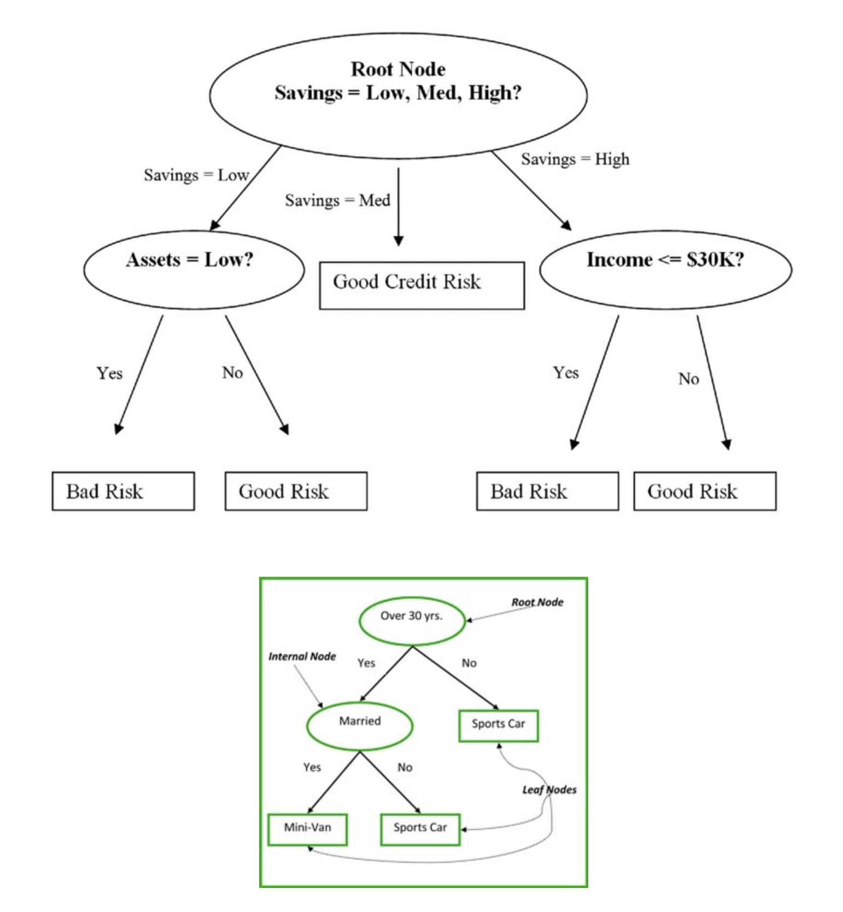
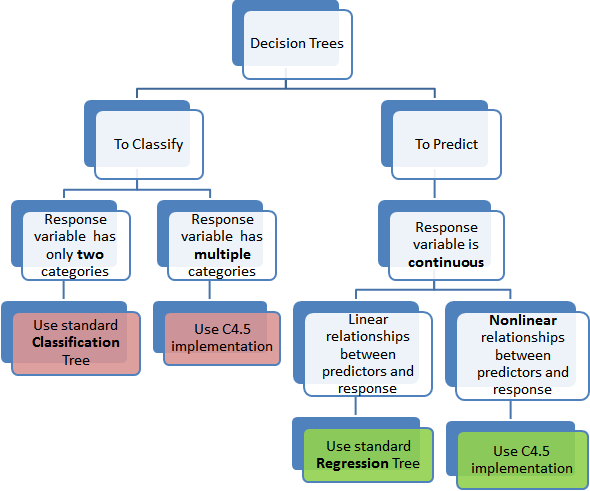
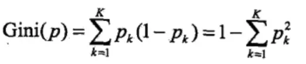
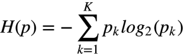
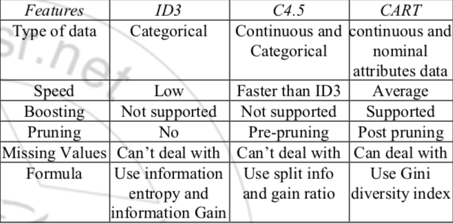
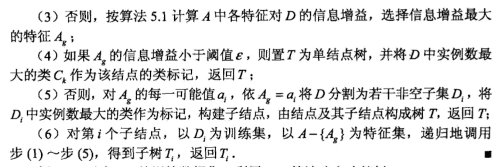
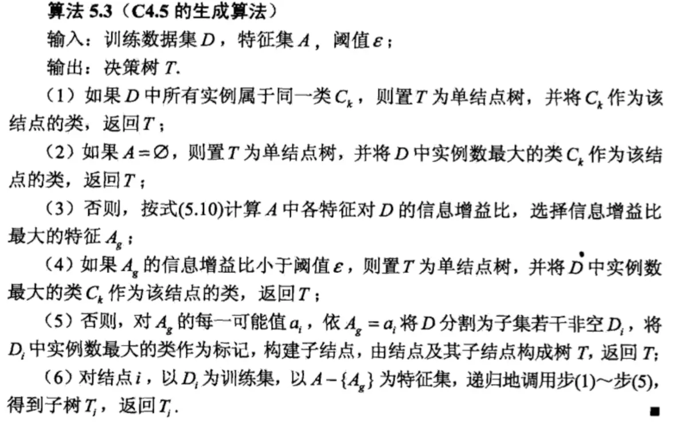
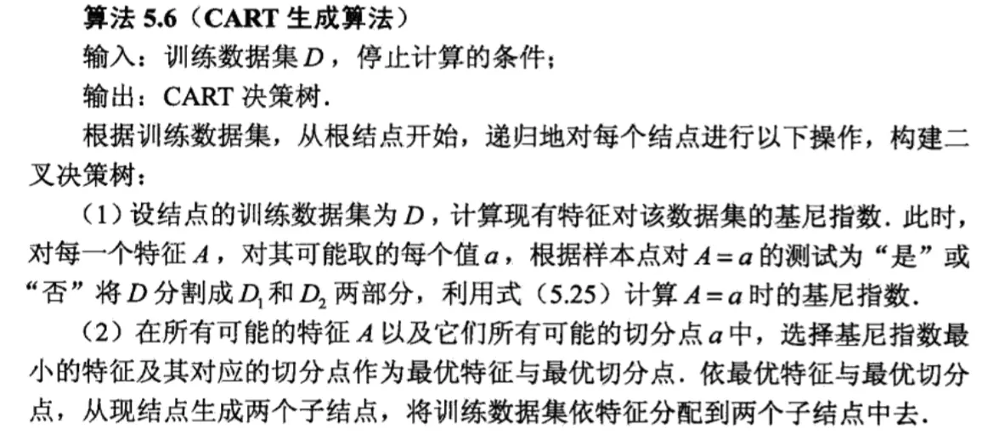
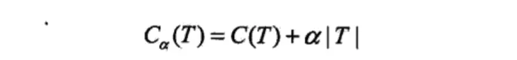
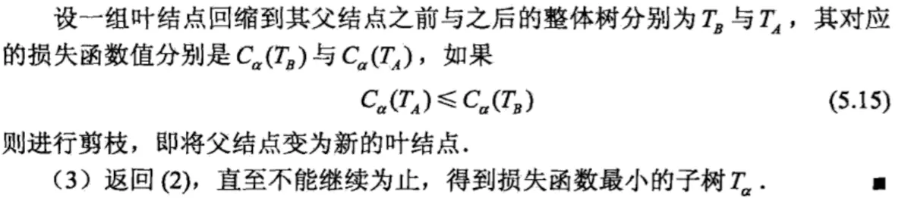

# Decision Trees

- [Decision Trees](#decision-trees)
  - [Introduction](#introduction)
  - [Types of Decision Trees](#types-of-decision-trees)
  - [Assumptions while creating Decision Tree](#assumptions-while-creating-decision-tree)
  - [Advantage and Disadvantage](#advantage-and-disadvantage)
  - [How does a tree decide where to split?](#how-does-a-tree-decide-where-to-split)
  - [Three common algorithms in tree-based model](#three-common-algorithms-in-tree-based-model)
    - [ID3 Iterative Dichotomy](#id3-iterative-dichotomy)
    - [C4.5](#c45)
    - [CART](#cart)
  - [Pruning tree](#pruning-tree)

## Introduction

Tree based learning algorithms are considered to be one of the best and mostly used supervised learning methods. Tree based methods empower predictive models with high accuracy, stability and ease of interpretation. Unlike linear models, they map non-linear relationships quite well. They are adaptable at solving any kind of problem at hand (classification or regression). **Decision Tree algorithms are referred to as CART (Classification and Regression Trees)**.

## Types of Decision Trees

Types of decision tree is based on the type of target variable we have. It can be of two types:

1. **Categorical Variable Decision Tree**: Decision Tree which has categorical target variable then it called as categorical variable decision tree. E.g.:- In above scenario of student problem, where the target variable was “Student will play cricket or not” i.e. YES or NO.
2. **Continuous Variable Decision Tree**: Decision Tree has continuous target variable then it is called as Continuous Variable Decision Tree.

## Assumptions while creating Decision Tree

Some of the assumptions we make while using Decision tree:

1. At the beginning, the whole training set is considered as the root.
2. Feature values are preferred to be categorical. If the values are continuous then they are discretized prior to building the model.
3. Records are distributed recursively on the basis of attribute values.
4. Order to placing attributes as root or internal node of the tree is done by using some statistical approach.

## Advantage and Disadvantage

Advantage

* Easy to understand
* Easy to generate

Disadvantage

* May suffer from overfitting
* Classifies by rectangular partitioning
* Does not easily handle nonnumeric data
* Can be quite large - pruning is necessary

## How does a tree decide where to split?

The decision of making strategic splits heavily affects a tree’s accuracy. The decision criteria is different for classification and regression trees.

Decision trees use multiple algorithms to decide to split a node in two or more sub-nodes. The creation of sub-nodes increases the homogeneity of resultant sub-nodes. In other words, we can say that purity of the node increases with respect to the target variable. Decision tree splits the nodes on all available variables and then selects the split which results in most homogeneous sub-nodes.

The algorithm selection is also based on type of target variables. The four most commonly used algorithms in decision tree are:

* Gini Index
    
* Information Gain
    
  * [Explain of Gini Index and Information Gain](https://www.jianshu.com/p/3ef0d7fa92a5)
* Chi-Square
* Reduction in Variance

## Three common algorithms in tree-based model

### ID3 Iterative Dichotomy

### C4.5

### CART

## Pruning tree

[reference](https://www.jianshu.com/p/3ef0d7fa92a5)

Cost function:

Where | T | is the number of leaf nodes of the tree T, and t is the number of leaf nodes of the number T. There are Nt samples on the leaf node, and there are Ntk samples in the k class. Ht (T) is the empirical entropy on leaf node t:

Simplify the formula:

In this way, C (T) represents the prediction error of the model on the training data, and | T | represents the complexity of the model, that is, the more leaf nodes, the more complicated the decision tree, and the greater the loss. α is the control value, in fact, the latter is equivalent to the existence of regularization. When α = 0, the loss of the unpruned decision tree is the smallest; when α = + ∞, the loss of the decision tree of a single node is the smallest. The smaller α is, the more complicated the selected tree is. Therefore, it is said that the model selection is a regularized maximum likelihood estimation.

