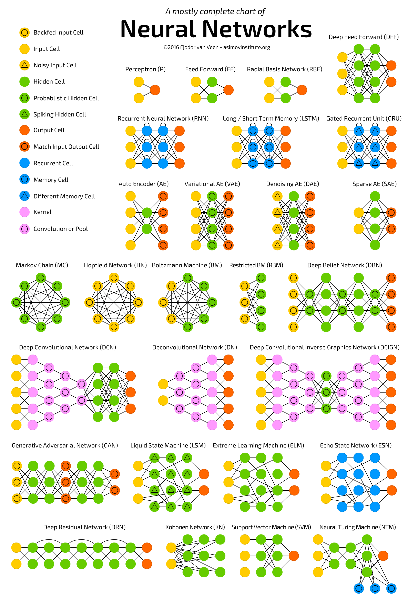

# Neural Network Introduction

- [Neural Network Introduction](#neural-network-introduction)
  - [Perceptron](#perceptron)
  - [Feed Forward](#feed-forward)
  - [Radial Basis Network](#radial-basis-network)
  - [Deep Feed Forward](#deep-feed-forward)
  - [Recurrent Neural Network](#recurrent-neural-network)
  - [Long/ Short Term Memory](#long-short-term-memory)

## Perceptron

Perceptron. The simplest and oldest model of Neuron, as we know it. Takes some inputs, sums them up, applies activation function and passes them to output layer. No magic here.

## Feed Forward

Feed forward neural networks are also quite old — the approach originates from 50s. The way it works is described in one of my previous articles — “[The old school matrix NN](https://medium.com/towards-data-science/diy-ai-an-old-school-matrix-nn-401a00021a55)”, but generally it follows the followi
2. activation flows from input layer to output, without back loops
3. there is one layer between input and output (hidden layer)
In most cases this type of networks is trained using [Backpropagation](https://en.wikipedia.org/wiki/Backpropagation) method.

## Radial Basis Network

RBF neural networks are actually FF (feed forward) NNs, that use [radial basis function](https://en.wikipedia.org/wiki/Radial_basis_function) as activation function instead of [logistic function](https://en.wikipedia.org/wiki/Logistic_function). What makes the difference?

Logistic function map some arbitrary value to a 0…1 range, answering a “yes or no” question. It is good for classification and decision making systems, but works bad for continuous values.

Contrary, radial basis functions answer the question “how far are we from the target”? This is perfect for function approximation, and machine control (as a replacement of PID controllers, for example).

To be short, these are just FF networks with different activation function and appliance.

## Deep Feed Forward

DFF neural networks opened pandora box of [deep learning](https://en.wikipedia.org/wiki/Deep_learning) in early 90s. These are just FF NNs, but with more than one hidden layer. So, what makes them so different?

If you read my [previous article](https://medium.com/towards-data-science/diy-ai-an-old-school-matrix-nn-401a00021a55) on backpropagation, you may have noticed that, when training a traditional FF, we pass only a small amount of error to previous layer. Because of that stacking more layers led to exponential growth of training times, making DFFs quite impractical. Only in early 00s we developed a bunch of approaches that allowed to train DFFs effectively; now they form a core of modern Machine Learning systems, covering the same purposes as FFs, but with much better results.

## Recurrent Neural Network

Recurrent Neural Networks introduce different type of cells — Recurrent cells. The first network of this type was so called [Jordan network](https://en.wikipedia.org/wiki/Recurrent_neural_network#Jordan_network), when each of hidden cell received it’s own output with fixed delay — one or more iterations. Apart from that, it was like common FNN.

Of course, there are many variations — like passing the state to input nodes, variable delays, etc, but the main idea remains the same. This type of NNs is mainly used then context is important — when decisions from past iterations or samples can influence current ones. The most common examples of such contexts are texts — a word can be analysed only in context of previous words or sentences.

## Long/ Short Term Memory 

This type introduces a memory cell, a special cell that can process data when data have time gaps (or lags). RNNs can process texts by “keeping in mind” ten previous words, and LSTM networks can process video frame “keeping in mind” something that happened many frames ago. LSTM networks are also widely used for writing and speech recognition.

Memory cells are actually composed of a couple of elements — called gates, that are recurrent and control how information is being remembered and forgotten. The structure is well seen in the wikipedia illustration (note that there are no activation functions between blocks):

The (x) thingies on the graph are gates, and they have they own weights and sometimes activation functions. On each sample they decide whether to pass the data forward, erase memory and so on — you can read a quite more detailed explanation here. Input gate decides how many information from last sample will be kept in memory; output gate regulate the amount of data passed to next layer, and forget gates control the tearing rate of memory stored.

This is, however, a very simple implementation of LSTM cells, many others architectures exist.