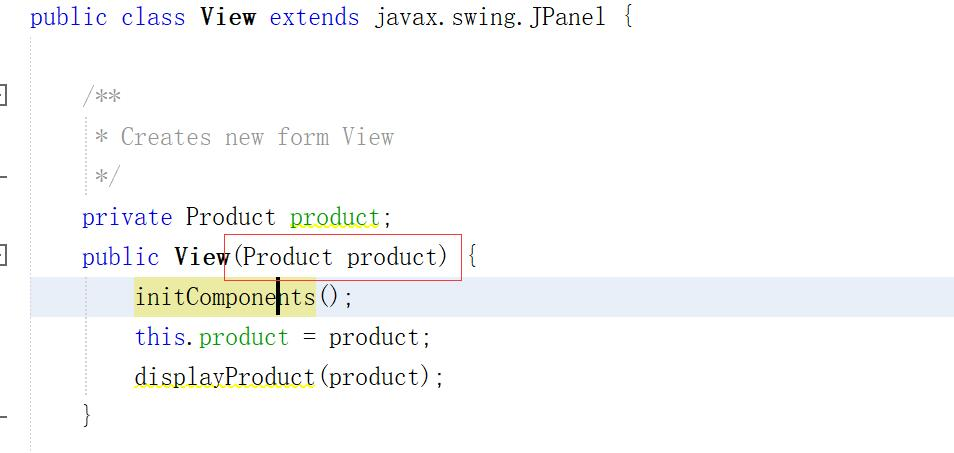

# Application Engineer Development Summary for Sep, 2019

## Week 1

### Lecture-Kal

1. Demonstrate how to create a java/swing application
1. How to define java classes
1. How to create and populate java objects
1. How to **pass data** between from the Jframe to JPanels
1. Show how to implement relationships between classes
1. Show how java works to connect and access objects
1. Show how to **traverse** relationships

---

#### 1. Demonstrate how to create a java/swing application


[Simple GUI](summarySep2019/src/main/java/DemonstrateHowToCreateAJavaSwingApplication/simpleGUI.java)

#### 2. How to define java classes

[Simple Class](summarySep2019/src/main/java/DefineClasses/simpleClass.java)

#### 3. How to create and populate java objects

[Simple Object](summarySep2019/src/main/java/CreateAndPopulateObject/simpleObject.java)

#### 4. How to pass data between from the Jframe to JPanels

[Simple pass data](../labs/lab_1/src/main/java/interfance)


> use constructor to pass data



> pass data

---

#### 5-7. Solution


> consider this kind of relation between two classes


> to abstract the relationship

we can implement this kind of "traverse" relationship like this

```java

Class Person {

String lastName;
String firstName;
Address workaddress;
Address homeaddress;
Address localaddress;

public Address getWorkAddress(){
Return workaddress;
}
Public void setWorkAddress(Address addressparam){
Workaddress = addressparam;
}
:::
}

```

### Lecture-Peter

1. Java Language Basics
1. Java Data Types
1. Java Primitive Types
1. Java String class
1. Java Reference Type
1. Java Parameter Passing

[slices](../lectures/Lecture1-Object&#32;and&#32;Class/Java_DataTypes.ppt)

### Lab in week 1

#### 1. How to pass data between from the Jframe to JPanels

[Simple pass data](../labs/lab_1/src/main/java/interfance)


> use constructor to pass data


> pass data

---

## Week 2

1. How to implement the connection between instances
1. How to use ArrayList to store data.
1. How to use Table to display data.

---

#### 1. How to implement the connection between instances

[The explanation of connection between classes](https://blog.csdn.net/Jalon2015/article/details/51003521)

* 依赖（Dependency）
* 关联（Association）
* 聚合（Aggregation）
* 组合（Composition）
* 泛化（Generalization）
* 实现（Realization）


> example of connection

#### 2. How to use ArrayList to store data

```java
public class ProductCatalog {
    private ArrayList<Product> productCatalog;
    public ProductCatalog(){
        productCatalog = new ArrayList<Product>();
    }

    public ArrayList<Product> getProductCatalog() {
        return productCatalog;
    }

    public void setProductCatalog(ArrayList<Product> productCatalog) {
        this.productCatalog = productCatalog;
    }
    public Product addProduct(){
        Product pro = new Product();
        this.productCatalog.add(pro);
        return pro;
    }
    public void deleteProduct(Product pro){
        this.productCatalog.remove(pro);
    }

}
```

[catalog and item code](../labs/lab_2/src/main/java/Business/)

#### 3. How to use table to display data

Populate data from catalog

```java
public void populateTable(){
        DefaultTableModel dtm = (DefaultTableModel)productTable.getModel();
        dtm.setRowCount(0);

        for(Product pro : this.productCatalog.getProductCatalog()){
            Object obj[] = new Object[numberOfColumns];
            obj[0] = pro;
            obj[1] = pro.getPrice();
            ...
            ...

            dtm.addRow(obj);
        }
    }
```

> Usually we use first column to store an object of item

```java
@Override
public String toString(){
    return this.name;
}
```

> And we Override the item ```toString()``` method to display them

```java
private void viewBtnActionPerformed(java.awt.event.ActionEvent evt) {
    // TODO add your handling code here:
    int selectRow = productTable.getSelectedRow();

    if(selectRow>=0){
        Product pro = (Product)productTable.getValueAt(selectRow, 0);
        someAction()
    }
    else{
        JOptionPane.showInternalMessageDialog(null, "Please select any row!");
    }
}
```

> And this is the method to select a row and do somthing

---

## Week 3

1. How add a filter in table display
1. How to use cardlayout to display

---

#### 1. How add a filter in table display


```java
AbnormalViewVitalJPanel1 viewPanel = new AbnormalViewVitalJPanel1(vsh,Double.valueOf(this.maxBp.getText()),Double.valueOf(this.minBp.getText()));
splitPanel.setRightComponent(viewPanel);
```

> Take filter as parameters and pass it to the panel object that will display data

#### 2. How to use cardlayout to display


```java
newPanel p = new newPanel(this.mainDisplayPanel);

this.mainDisplayPanel.add("newPanel",p);
CardLayout layout = (CardLayout)this.mainDisplayPanel.getLayout();

layout.next(this.mainDisplayPanel);
```

> mainDisplayPanel is the panel that is used as containor


```java
this.mainDisplayPanel.remove(this);
CardLayout layout = (CardLayout) this.mainDisplayPanel.getLayout();
layout.previous(this.mainDisplayPanel);
```

> use there method can implement cardlayout display

---

## Week 4

1. How to use loop
1. How to use try catch final
1. How to do validation and exception handling
1. How to handle git team workflow

Check the [PPT of lab 3.5](..//labs/lab_3_5_example/Lab&#32;3.5&#32;-&#32;Product&#32;Manager.pptx) for detail

### 1. How to use loop

* for
* for each
* while

### 2. How to use try catch final

* NullPointer Exception
```java
String a = null;
System.out.println(a.charAt(0));
```

* NumberFormat Exception
```java
int num = Integer.parseInt("akki");
```

* StringIndexOutOfBound Exception
```java
String a = "this is test";
char c = a.charAt(100);
System.out.println(c);
```

* ArrayIndexOutOfBound Exception

#### 3. How to do validation and exception handling

1. Data validation:

Checking the data before performing operations that could fail, for example check for 0 before doing a division.

2. Exception handling:

Well defined behavior if an operation fail, for example if a database query times out.

3. Exception Handling
```java
try{
    // block of code to try
}catch(Exception e){
    // block of code to handle errors
}
```
#### 4. How to handle git team workflow


### Quiz ArrayList String Access Modifier Git commit

1. ArrayList


2. String

[link](http://www.runoob.com/java/java-string.html)

3. Access Modifier


4. Git comments you’ve practiced in lab.
The following [link](https://docs.oracle.com/javase/8/docs/api/index.html) 
