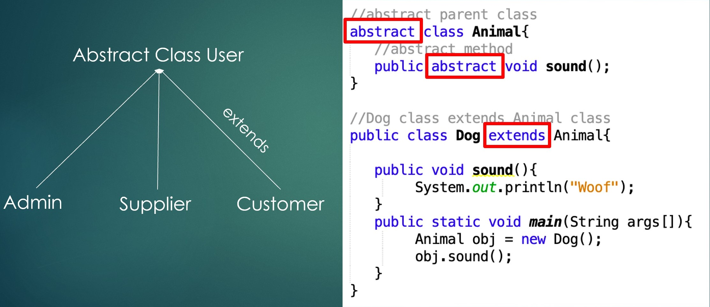
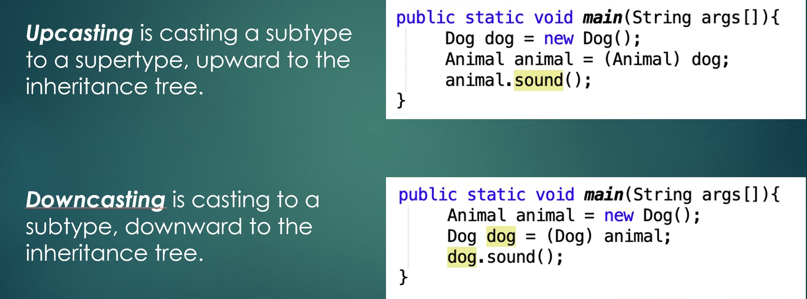
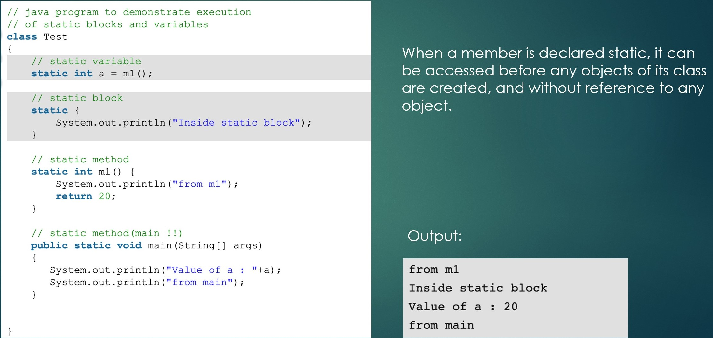
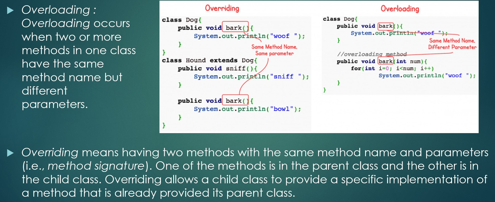

# Application Engineer Development Summary for Sep, 2019

## Week 5

1. How to use abstract class
1. What is upcasting and downcasting
1. How to use regex validation
1. How to use git multiple branches
1. How to use Swing comboBox

#### 1. How to use abstract class

#### 2. How to upcasting and downcasting

#### 3. How to use regex validation

[cainiao](https://www.runoob.com/regexp/regexp-tutorial.html)

#### 4. git multiple branches and comboBox

There are easy, no need to talk.

## Week 6

1. How to use enum
2. The run order of static block
3. Override & Overload

#### 1. How to use enum

* [enum](https://www.cnblogs.com/it-tsz/p/11442005.html)
    1. [Java 实例 - enum 和 switch 语句使用](https://www.runoob.com/java/method-enum.html)
    1. [Java 实例 - Enum（枚举）构造函数及方法的使用](https://www.runoob.com/java/method-enum1.html)

#### 2. The run order of static block

#### 3. Override & Overload

## Week 7

1. How to use AutoBoxing
2. How to use interface
3. How to use Comparable interface

#### 1. How to use AutoBoxing

[doc](https://docs.oracle.com/javase/tutorial/java/data/autoboxing.html)

#### 2. How to use interface

[how to java doc](https://how2j.cn/k/interface-inheritance/interface-inheritance-interface/289.html)

#### 3. How to use Comparable interface

[how to java doc](https://how2j.cn/k/collection/collection-comparator-comparable/693.html#step829)