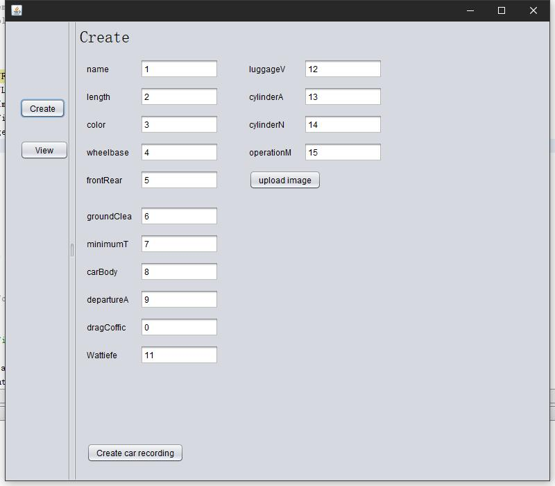
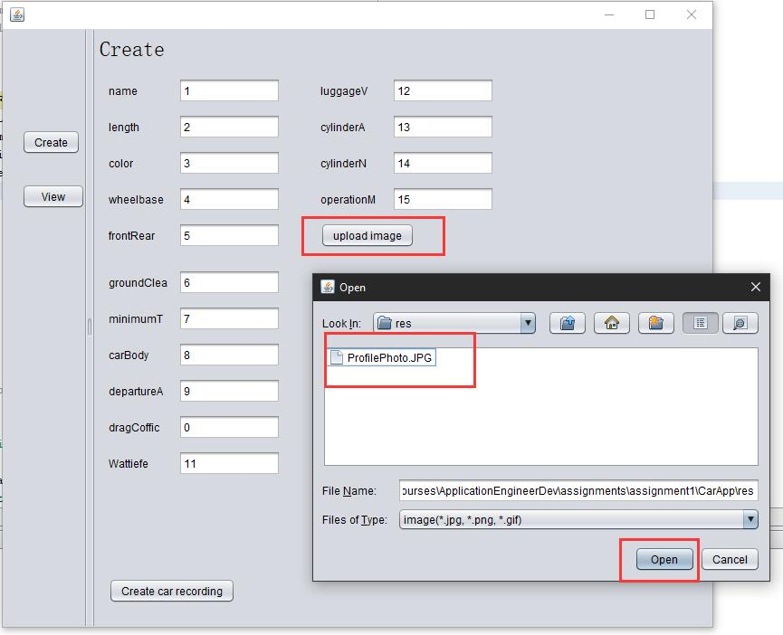
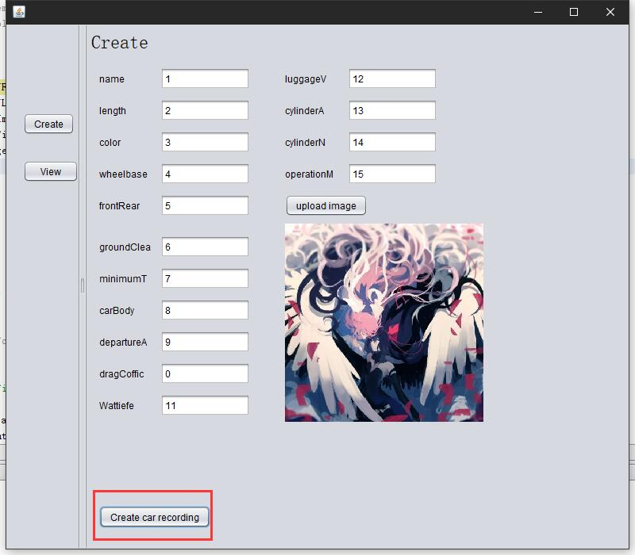
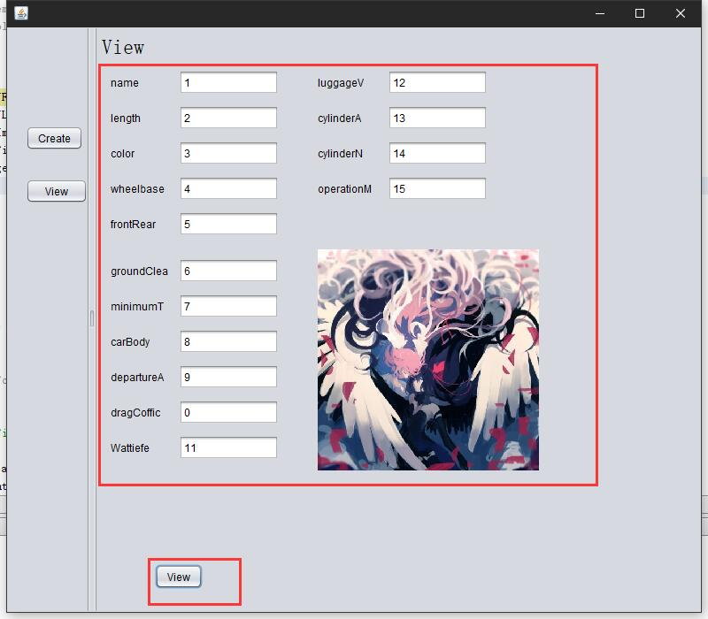

# Assignment 1

Zixiao Wang

## Create panel

Main create panel

You can load your image file

After loading file, it will display in the right buttom

## View panel

After click the "Create car recording" button, you can view your record

