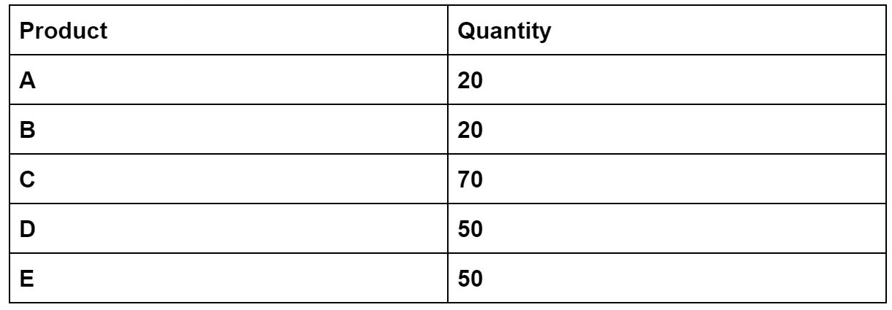

Assignment 5 Guidelines

List all results tied at the same position and indicate which products are tied at the same position:
Eg. find 3 most popular products. (products have highest sale quantity)

You need to give:
1. Product C, sale quantity 70
2. Product D, sale quantity 50
    Product E, sale quantity 50
3. Product A, sale quantity 20
    Product B, sale quantity 20

1) Our top 3 best negotiated products (meaning products that sell above target)
Sales quantity of the product sold above the target price.

2) Our 3 best customers (customers who buy about target price)
Sum of absolute value of the difference between the sale price and target price of the products this customer bought.

3) Our top 3 best sales people (sell higher that target) 
3 sales people who have the most profit
Profit of a product = (sale price - target price) * sale quantity

4) Our total revenue for the year that is above expected target
Sum of the profits made by every sales people.
5) Determine if the company is pricing its products correctly. Show how to make changes so prices are performing at optimum levels. [As we discussed in class] 
You need to think about the questions, including but not limited to the following questions: Is the target price too high or too low? Is there enough gap between the target price and ceiling price? Is the ceiling price/targe price/floor price should be adjusted depending on your analysis?
a. You need to have two copies of the data. The first one includes original prices and the other one includes prices after adjustments.   
b. You need to explain how and why to make changes in prices. 
c. You are required to implement a simple program to demonstrate why the original prices need to be adjusted and why the modified prices are performing at optimum levels. 
