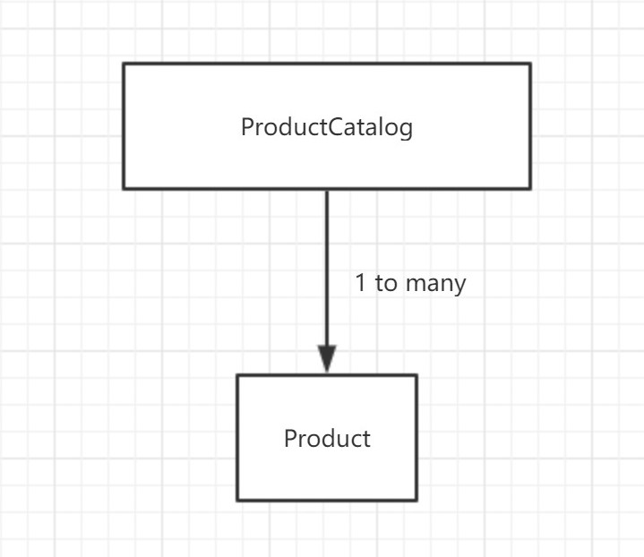

# Lab 2

## Key words

Swing, table, catalog

## Introcudtion

Please complete the following lab to enforce the implementation ideas we discussed in class. I will follow up with a programming assignment for the week. The link is as below

[video](https://drive.google.com/file/d/1sinn2eEBtvOYQbQmcfrnOIdVP1dx58ko/view?usp=sharing)

catalog UML:



## Q & A

1. Collections

We use ArrayList to collect objects of same type 

2. How to display data in table

```java
public void populateTable(){
        DefaultTableModel dtm = (DefaultTableModel)productTable.getModel();
        dtm.setRowCount(0);
        
        for(Product pro : this.productCatalog.getProductCatalog()){
            Object obj[] = new Object[2];
            obj[0] = pro;
            obj[1] = pro.getPrice();
            
            dtm.addRow(obj);
        }
    }
```