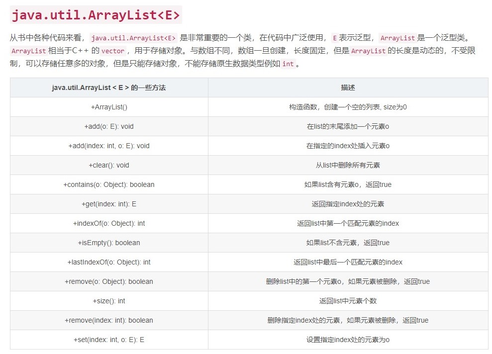
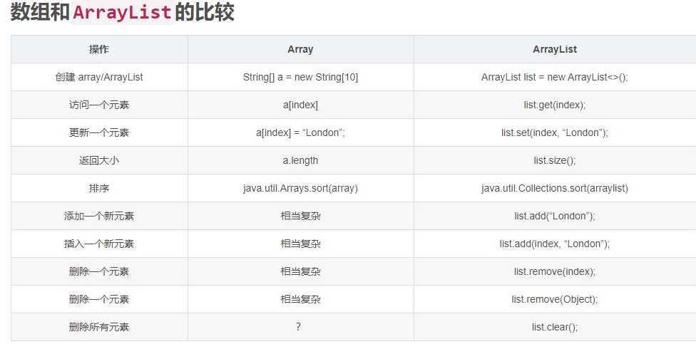

# Quiz for every lab

Here’re *some important points* for weekly *quizzes*:

1. Make sure you typed in your NUID correctly. A lot of people had their NUID wrong in last week’s quiz and we fixed that. But we won’t do that again starting from this week. The wrong NUID will cause a direct *0*.
2. Close any program that might interrupt full-screen mode, especially for Windows users.

## Quiz Topic - 11/3 Lab

This week’s quiz will cover everything in previous quizzes. The materials in previous lab (Map, Hashmap and Collections, etc.) will also be in the quiz.

## Quiz Topic - 10/20 Lab

This week’s quiz topic:

1. Everything in previous quizzes
2. [Inheritance & Polymorphism](https://blog.csdn.net/musetisa/article/details/51741548)
3. [static](https://www.runoob.com/java/java-modifier-types.html)
4. [enum](https://www.cnblogs.com/it-tsz/p/11442005.html)
    1. [Java 实例 - enum 和 switch 语句使用](https://www.runoob.com/java/method-enum.html)
    1. [Java 实例 - Enum（枚举）构造函数及方法的使用](https://www.runoob.com/java/method-enum1.html)
5. [overload & override](https://www.runoob.com/java/java-override-overload.html)

## Quiz Topic - 10/13 Lab

* [RegEx](http://www.runoob.com/regexp/regexp-tutorial.html)

The topic of this quiz will cover the details from all of labs,lectures and assignments. The principal topic of this week is RegEx and , kinds of loops and Inheritance(extends) which were mentioned in previous lab

The weekly quiz will follow this mode : Section 1 is Multiple choice question
Section 2 is Coding question.

You will not be allowed to go backward to check your section 1 answers when you start doing section 2.

And the time limit of whole quiz is 45 minutes. And the section 1's time limit is 40 minutes and section 2 is 5 minutes. However, if you finish the MCQ in advance, the remaining minutes will roll over into section 2. 

And because of different situations between afternoon and morning quiz, we are going to send Prof a proposal that students grades will be curved separately when we count final grades. Enjoy your quiz

## Quiz 3

### 1. Loops: 

* [While Loop:](https://www.w3schools.com/java/java_while_loop.asp)
* [For Loop:](https://www.w3schools.com/java/java_for_loop.asp)
* [Break/Continue:]( https://www.w3schools.com/java/java_break.asp)
 
### 2. [Exceptions and Exception Handling](https://www.w3schools.com/java/java_try_catch.asp )

The order of return in catch try finally

```java
public static void main(String []args) {
        System.out.println(test1());
    }
    public static int test1(){
        int i = 111;
        try {
            int[] a = new int[2];
            a[3] = 0;
            i++;
            System.out.println("try i=" + i);
            return p1();
        }
        catch (IndexOutOfBoundsException e){
            i++;
            System.out.println("catch i=" + i);
            return p2();
        }
        finally {
            i++;
            System.out.println("finally i=" + i);
            return p3();
        }
    }
    public static int p1(){
        System.out.println("p1");
        return 1;
    }
    public static int p2(){
        System.out.println("p2");
        return 2;
    }
    public static int p3(){
        System.out.println("p3");
        return 3;
    }
```
```
catch i=112
p2
finally i=113
p3
3
```
 
### 3. [Array](https://www.w3schools.com/java/java_arrays.asp)

## Quiz 2

### 1. ArrayList





Index of ArrayList will start at 0

ArrayList.remove(2) will remove the object whos index is 2

### 2. String

[link](http://www.runoob.com/java/java-string.html)

### 3. Access Modifier


## Quiz 1

### 1. Reverse the string

* new StringBuffer(s).reverse().toString()

```java

// Reverse the String

public String reverse(String s){
    return new StringBuffer(s).reverse().toString();
}

// Even ArrayList:

public List<Integer> evenList(List<Integer> list){
    List<Integer> result = new ArrayList<>();
    for(int n :list){
        if(n % 2 == 0)result.add(n);
        }
        return result;
}
```

### 2. String related operation


### 3. StringBuffer

* append追加
* delete 删除
* insert 插入
* reverse 反转

```java
package character;
  
public class TestString {
  
    public static void main(String[] args) {
        String str1 = "let there ";
 
        StringBuffer sb = new StringBuffer(str1); //根据str1创建一个StringBuffer对象
        sb.append("be light"); //在最后追加
         
        System.out.println(sb);
         
        sb.delete(4, 10);//删除4-10之间的字符
         
        System.out.println(sb);
         
        sb.insert(4, "there ");//在4这个位置插入 there
         
        System.out.println(sb);
         
        sb.reverse(); //反转
         
        System.out.println(sb);
 
    }
  
}
```