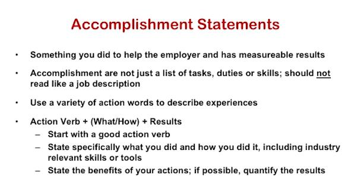

# Online class before the first class

## Before the first class

Before your first class you are expected to do the following:

1. View the course video on creating a Resume [here](https://www.youtube.com/watch?v=XSIGxfbDIDM&feature=youtu.be)

2. Write a draft resume that follows the format and guidelines presented and bring it to the first class. If a link has been provided to you for the [VMOCK tool](https://careers.northeastern.edu/article/vmock/), you may use VMOCK to review and correct your resume draft for spelling, grammar, and general formatting errors.

Be ready to participate in class by downloading the Poll Everywhere application as explained in another announcement you will receive.

Print a copy of the class Syllabus and bring it to class with you.

We'll see you soon!

[NEU career](https://careers.northeastern.edu)

[NEU resume guiding](https://careers.northeastern.edu/article/resumes/)

[my Linkin](https://www.linkedin.com/in/brickea-wang-0772b5190/) 

## Very first step to employer

> A good resume can show all above to your employer

> 4 core elements for a resume

> 1. Usual nobody care about your experience before undergraduate degree 
> 2. You need to contain your highlight key pieces that are going to distinguish you from others.

# How to build a good resume

## 1. Contact Information

> Two types of contact information

> Zixiao Wang

> 349 A1, Pleasant

> Boston, MA 02148

> 571-306-9240

> wang.zixi@husky.neu.edu

## Summary & Skills

> Some example statement

## Education & honor

> Should certificate or certifications be involved?

> Contact Summary Technical Skills Education

## Experience

## Academic Project

## Other things that are usually not on a resume

## A good resume

## Review & Summary

