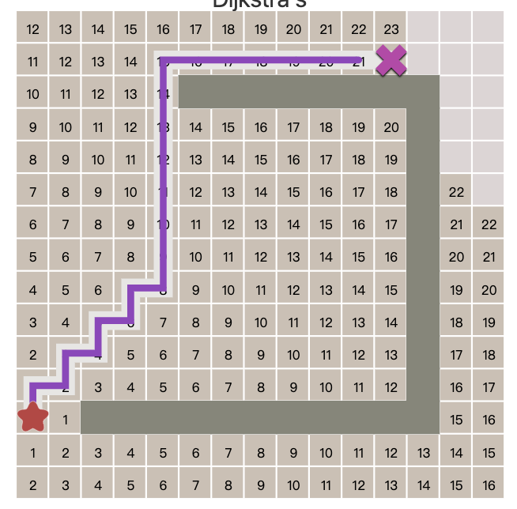

<div style="text-align:right;">Team Bravo </div>
<div style="text-align:right;">Brickea, 2020.2.17 </div>
<div style="text-align:right;">Pathfinding Demo </div>


```python
from queue import *
import numpy as np
from matplotlib import pyplot as plt
import networkx as nx
```

# Methodology

[Introduction to the A* Algorithm](https://www.redblobgames.com/pathfinding/a-star/introduction.html)
* Breadth First Search
* Dijkstra’s Algorithm
* A*

## ~~Import the coordinate data~~

## Simluation data



During the simulation, the map node will have three states
* 0 : Not been visited by algorithm
* 1 : Have been visited by algorithm
* 2 : Have a wall so it cannot pass through


```python
# Initiate the map for 15 X 15
# The (0,0) is the top left element
simulate_map = np.zeros((15,15))
simulate_map.shape
```


    (15, 15)


```python
# This step is to simulate the information of the corresponding wall
def init_wall(start,end,current_map):
    if start[0] == end[0]:
        # The wall is in a row
        for i in range(start[1],end[1]+1):
            current_map[start[0]][i] = 2
    else:
        # The wall is in a column
        for j in range(start[0],end[0]+1):
            current_map[j][start[1]] = 2
        
```


```python
# Initiate the wall 
# From (12,2) to (12,12)
init_wall((12,2),(12,12),simulate_map)
# From (12,12) to (2,12)
init_wall((2,12),(12,12),simulate_map)
# From (2,5) to (2,12)
init_wall((2,5),(2,12),simulate_map)
simulate_map
```


    array([[0., 0., 0., 0., 0., 0., 0., 0., 0., 0., 0., 0., 0., 0., 0.],
           [0., 0., 0., 0., 0., 0., 0., 0., 0., 0., 0., 0., 0., 0., 0.],
           [0., 0., 0., 0., 0., 2., 2., 2., 2., 2., 2., 2., 2., 0., 0.],
           [0., 0., 0., 0., 0., 0., 0., 0., 0., 0., 0., 0., 2., 0., 0.],
           [0., 0., 0., 0., 0., 0., 0., 0., 0., 0., 0., 0., 2., 0., 0.],
           [0., 0., 0., 0., 0., 0., 0., 0., 0., 0., 0., 0., 2., 0., 0.],
           [0., 0., 0., 0., 0., 0., 0., 0., 0., 0., 0., 0., 2., 0., 0.],
           [0., 0., 0., 0., 0., 0., 0., 0., 0., 0., 0., 0., 2., 0., 0.],
           [0., 0., 0., 0., 0., 0., 0., 0., 0., 0., 0., 0., 2., 0., 0.],
           [0., 0., 0., 0., 0., 0., 0., 0., 0., 0., 0., 0., 2., 0., 0.],
           [0., 0., 0., 0., 0., 0., 0., 0., 0., 0., 0., 0., 2., 0., 0.],
           [0., 0., 0., 0., 0., 0., 0., 0., 0., 0., 0., 0., 2., 0., 0.],
           [0., 0., 2., 2., 2., 2., 2., 2., 2., 2., 2., 2., 2., 0., 0.],
           [0., 0., 0., 0., 0., 0., 0., 0., 0., 0., 0., 0., 0., 0., 0.],
           [0., 0., 0., 0., 0., 0., 0., 0., 0., 0., 0., 0., 0., 0., 0.]])


## Breadth First Search Algorithm


```python
class BFS_PathFind(object):
    def __init__(self,start,end,current_map):
        # Start,end should be a tuple with x,y
        # current_map should be a 2-D array
        self.start = start
        self.end = end
        self.current_map = current_map
        self.map_shape = current_map.shape
        self.came_from = [[() for i in range(current_map.shape[0])] for j in range(current_map.shape[1])]
        
        
    def is_have_came_from(self,point):
        return not self.came_from[point[0]][point[1]] == ()
    
    def calculate_came_from(self):
        frontier = []
        frontier.append(self.start)
        self.came_from[self.start[0]][self.start[1]] = self.start
        while len(frontier)!=0:
            current = frontier.pop(0)
            
            if current == self.end:
                # If we found the end point the exit the algorithm
                return self.came_from
            
            # Neiborhood
            top = (current[0]-1,current[1])
            left = (current[0],current[1]-1)
            buttom = (current[0]+1,current[1])
            right = (current[0],current[1]+1)
            
            # Top path within map and is not a wall
            if top[0] > -1 and self.current_map[top[0]][top[1]]!=2:
                if not self.is_have_came_from(top):
                    # If we dont have came from for this point
                    self.came_from[top[0]][top[1]] = current
                    frontier.append(top)
            
            # Left path within map and is not a wall
            if left[1] > -1 and self.current_map[left[0]][left[1]]!=2:
                if not self.is_have_came_from(left):
                    # If we dont have came from for this point
                    self.came_from[left[0]][left[1]] = current
                    frontier.append(left)
                    
            # Buttom path within map and is not a wall
            if buttom[0] < self.map_shape[0] and self.current_map[buttom[0]][buttom[1]]!=2:
                if not self.is_have_came_from(buttom):
                    # If we dont have came from for this point
                    self.came_from[buttom[0]][buttom[1]] = current
                    frontier.append(buttom)
                    
            # Right path within map and is not a wall
            if right[1] < self.map_shape[1] and self.current_map[right[0]][right[1]]!=2:
                if not self.is_have_came_from(right):
                    # If we dont have came from for this point
                    self.came_from[right[0]][right[1]] = current
                    frontier.append(right)
        return self.came_from
            
    def find_path(self):
        current = self.end
        while current != self.start:
            self.current_map[current[0]][current[1]] = 1
            current = self.came_from[current[0]][current[1]]
        self.current_map[current[0]][current[1]] = 1
        return self.current_map
```


```python
%%time
test = BFS_PathFind((5,7),(1,11),simulate_map)
test.calculate_came_from()
test.find_path()
```

    CPU times: user 744 µs, sys: 2 µs, total: 746 µs
    Wall time: 749 µs


    array([[0., 0., 0., 0., 0., 0., 0., 0., 0., 0., 0., 0., 0., 0., 0.],
           [0., 0., 0., 0., 1., 1., 1., 1., 1., 1., 1., 1., 0., 0., 0.],
           [0., 0., 0., 0., 1., 2., 2., 2., 2., 2., 2., 2., 2., 0., 0.],
           [0., 0., 0., 0., 1., 1., 1., 1., 0., 0., 0., 0., 2., 0., 0.],
           [0., 0., 0., 0., 0., 0., 0., 1., 0., 0., 0., 0., 2., 0., 0.],
           [0., 0., 0., 0., 0., 0., 0., 1., 0., 0., 0., 0., 2., 0., 0.],
           [0., 0., 0., 0., 0., 0., 0., 0., 0., 0., 0., 0., 2., 0., 0.],
           [0., 0., 0., 0., 0., 0., 0., 0., 0., 0., 0., 0., 2., 0., 0.],
           [0., 0., 0., 0., 0., 0., 0., 0., 0., 0., 0., 0., 2., 0., 0.],
           [0., 0., 0., 0., 0., 0., 0., 0., 0., 0., 0., 0., 2., 0., 0.],
           [0., 0., 0., 0., 0., 0., 0., 0., 0., 0., 0., 0., 2., 0., 0.],
           [0., 0., 0., 0., 0., 0., 0., 0., 0., 0., 0., 0., 2., 0., 0.],
           [0., 0., 2., 2., 2., 2., 2., 2., 2., 2., 2., 2., 2., 0., 0.],
           [0., 0., 0., 0., 0., 0., 0., 0., 0., 0., 0., 0., 0., 0., 0.],
           [0., 0., 0., 0., 0., 0., 0., 0., 0., 0., 0., 0., 0., 0., 0.]])


```python

```
