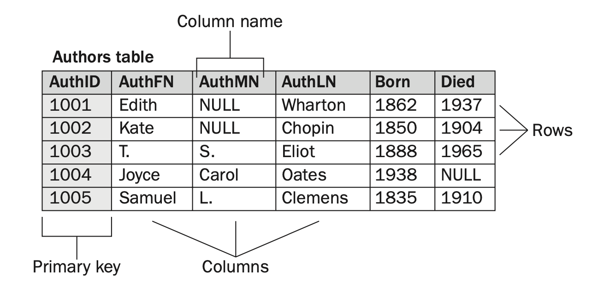
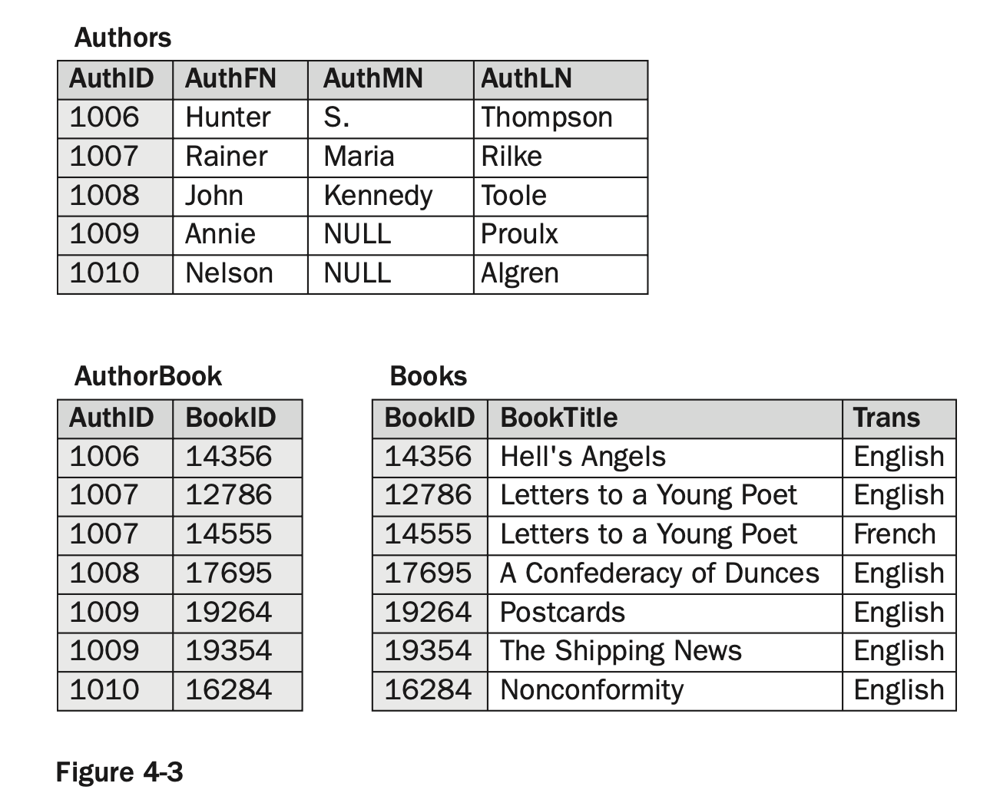
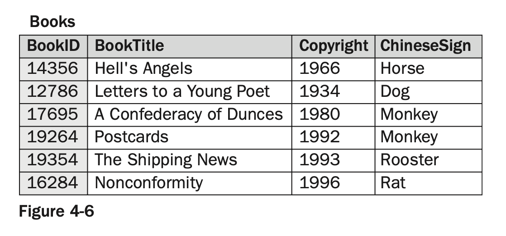
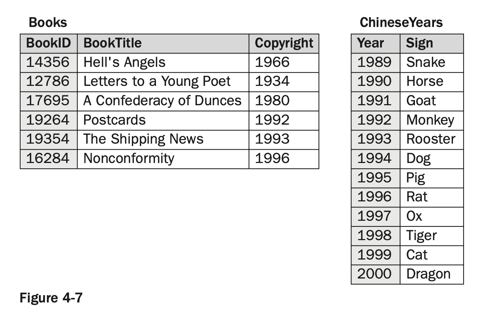

# Beginning MySQL Ch4.Designing a RDB

Summary 

* You are introduced to the relational model and the components that make up that model. 
* You learn how data in a relational structure is organized according to normal forms,
which are prescriptive methods for organizing data in a relational database.
* You are provided with the information necessary to identify the relationships between tables in a relational database, including one-to-one, one-to-many, and many-to-many relationships.
* You learn how to create a data model. The process includes identifying entities, normalizing data, identifying relationships, and refining the data model.

- [Beginning MySQL Ch4.Designing a RDB](#beginning-mysql-ch4designing-a-rdb)
  - [The Relational Model](#the-relational-model)
    - [Table](#table)
      - [Columns](#columns)
      - [Rows](#rows)
      - [Priary Key](#priary-key)
  - [Data Normalization](#data-normalization)
    - [First Normal Form](#first-normal-form)
      - [Composite Primary Key](#composite-primary-key)
    - [Second Normal Form](#second-normal-form)
    - [Third Normal Form](#third-normal-form)
  - [Relationships](#relationships)

## The Relational Model

### Table

At the heart of the relational model — and of any relational database — is the **table**, which is made up of a set of related data organized in a column/row structure, similar to what you might see in a spreadsheet program such as Microsoft Excel. 

#### Columns

Each table in a relational database is made up of one or more **columns**. A column is a structure in a table that stores the same type of data. 

#### Rows

Along with the columns, each table contains zero or more **rows**. A row is a structure in a table made up of a set of related data. A row can be thought of as a record that represents one instance of the object defined by the table

#### Priary Key

One other item that is important to note in a table is the **primary key**. A primary key is one or more columns in a table that uniquely identify each row so that no two rows are identical.

## Data Normalization

Normalized data is organized into a structure that preserves the integrity of the data while minimizing redundant data. The goal of all normalized data is to prevent lost data and inconsistent data, while minimizing redundant data.

A normalized database is one whose tables are structured according to the rules of normalization. These rules — referred to as **normal forms** — specify how to organize data so that it is considered normalized.

The degree to which a database is considered normalized depends on which normal forms can be applied.

Often, the more normalized the data, the more taxing it can be on a system. As a result, a database design must strike a balance between a fully normalized database and system performance. **In most situations, the first three normal forms provide that balance.**

### First Normal Form

* Each column in a row must be atomic. In other words, **the column can contain only one value** for any given row.
* Each row in a table must contain the **same number of columns**. Given that each column can con- tain only one value, this means that each row must contain the same number of values.
* **All rows in a table must be different**. Although rows might include the same values, each row, when taken as a whole, must be unique in the table.

Take a look at an example to help illustrate these requirements. Figure 4-2 contains a table that violates the first normal form. For example, the fifth row contains two values in the BookTitle column: Postcards and The Shipping News. Although a value can consist of more than one word, as in The Shipping News, only one value can exist in a column. As a result, the BookTitle column for that row is not atomic because it contains two values. In addition, the row as a whole contains more values than the other rows in the table, which also violates the first normal form.

By creating tables for both authors and books, adding a primary key column to each table, and placing only one value in each column, you are ensuring that the data conforms to the first normal form. 

Another thing to notice is that a primary key has been defined on the AuthorBook table. The primary key is made up of two columns. (Both columns are shown in gray.) As a result, each set of values in the two columns must be unique.

#### Composite Primary Key

A primary key made up of more than one column is referred to as a composite primary key.

### Second Normal Form

* The table must be in first normal form.
* All nonprimary key columns in the table must be dependent on the entire primary key.

The most effective way to normalize the data in the AuthorBook table is to use the solution that you saw for the first normal form: Create a table for the authors and one for the books, add a primary key column to each table, and create a third table that matches up the identifiers for authors and books, as shown in Figure 4-5. For the Authors table, the primary key is the AuthID column, and for the Books, table, the primary key is the BookID column. Now the columns in each table are dependent on their respective primary keys, and no columns exist that are not dependent on the primary key.

### Third Normal Form

* The table must be in second normal form.
* All nonprimary key columns in the table must be dependent on the primary key and must be independent of each other.

If you take a look at Figure 4-6, the BookTitle and Copyright columns are clearly dependent on the pri- mary key. For each book ID, there is a title and a copyright date. But you see an example of a table that violates the third normal form. 

Without the Copyright column, the ChineseSign column would have no meaning. As a result, the ChineseSign col- umn violates the third normal form.

By separating the data into two tables, each column is now dependent on its respective primary key, and no columns are dependent on nonkey columns.

In the meantime, you can go a long way to achieving a normalized database by thinking in terms of sep- arating data into **entities**, discrete categories of information. For example, books represent one entity; publishers represent another. If you keep in mind that, whenever designing a database, you want each table to represent a distinct entity, you go a long way in designing a database that achieves the third normal form.

## Relationships