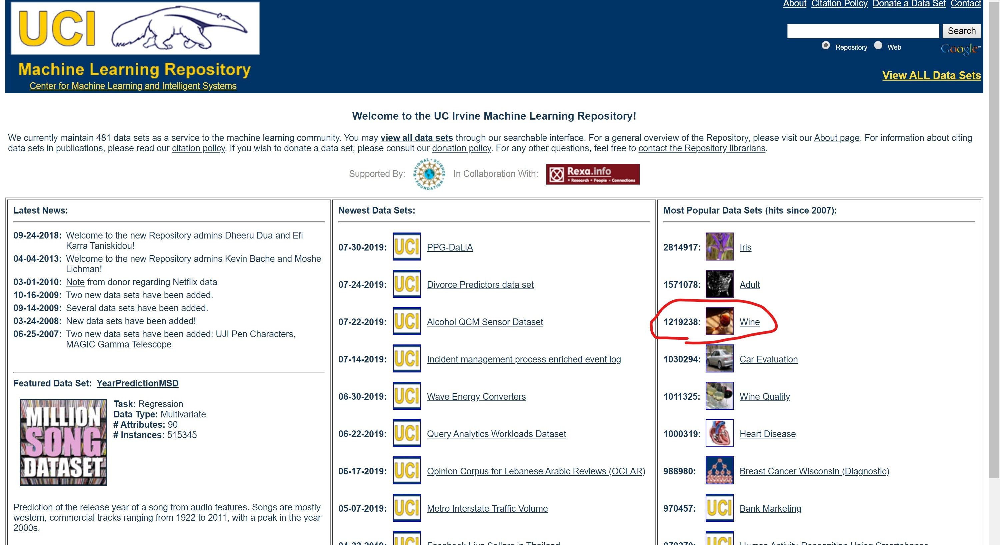
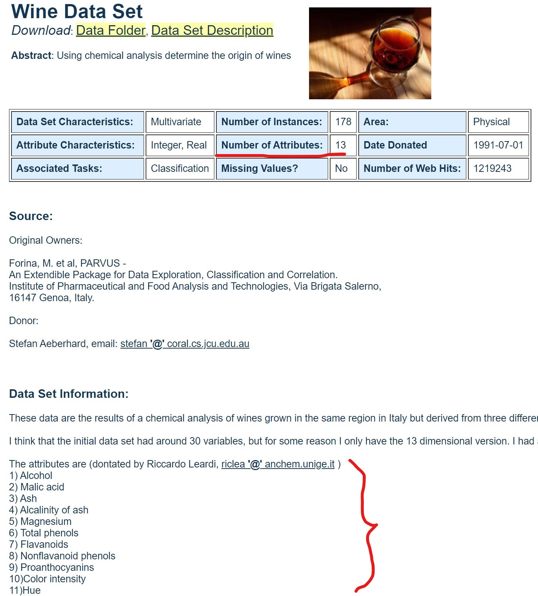
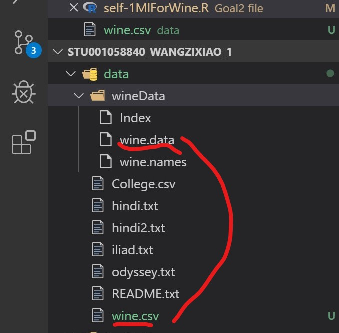
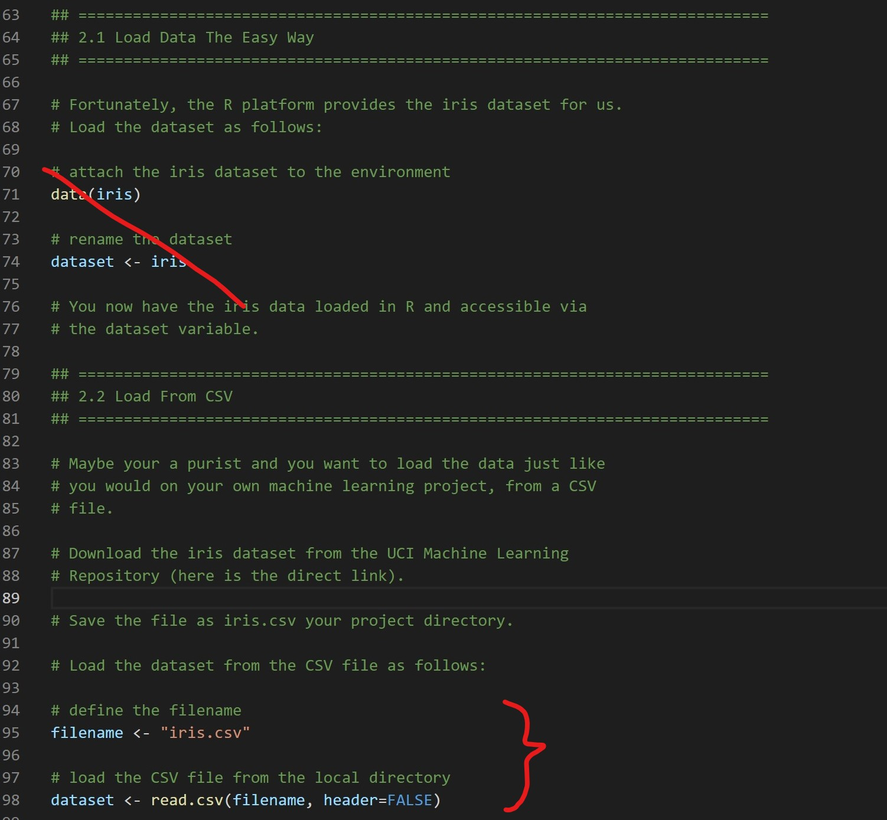

# Problems and Solutions

Lecture 1 Introduction to Data Science with R

---

## 1. Anaconda

### To create new conda environments

**You are going to create new environments in this class:**

> conda create --name theano python=3.4

Because theano does not support python 3.5!

**Activate it:**

Windows: 

> activate theano

OSX/Linux: 

> source activate theano

**List all & default (*) **

environment:

> conda info –envs

**Python version?**

> conda version

## 2. RStdio

Set the RStudio working directory to that folder

> Session → Set Working Directory → Choose
Directory...

> Navigate to Rlab, and Open the /programs directory

Focus console after executing from source option: Moves the
focus to the console after executing a line or selection ofcode within the source editor (you will thank me)

> Tools → Global Options → Code Editing...

> Check “Focus console after executing from Source”

## 3. ML with R

### 1. Prepare the dataSet



> download from [UCI](http://archive.ics.uci.edu/ml/index.php)



> choose a dataSet with few attributes (Wine for example)



> change .data file to .cvs (we can load cvs data with R)

### 2. Repeat the code from 8-ml.R



> use code row 95-98 to load cvs data file

```R

# set the column names in the iris dataset
colnames(dataset) <- c("Sepal.Length","Sepal.Width","Petal.Length","Petal.Width","Species")

# set the column names in the wine dataset
colnames(dataSet) <- c("alcohol","malicAcid","ash","alcalinityOfAsh","magnesium","totalPhenols","flavanoids","nonflavanoidPhenols","proanthocyanins","colorIntensity","hue","diluted","proline","classIdentifier")

```
> remember to change the colunms to the right name in your data set. The name can be view from data set webpage


> Then follow the rest of 8-ml.R code

---

**Problem**: the train function not work, and the error says the accuray module is not suit the regression module.

**Problem**: the featurePlot only show NULL

**Solution for above all: Check the dataset if it has factor.**

> as.factor() can make the attribute become the factor

> is.factor() can check the attribute if it is factor

```R
# take the wine data set for example
dataSet$classIdentifier <- as.factor(dataSet$classIdentifier)
is.factor(dataSet)
```

## 4. Python environment from lecture 1

> conda create --name theano python=3.4

> conda activate theano

> python --version

## 5. Resources

### Commercial packages from Continuum Analytics and other

vendors into Anaconda:

* IOPro: fast, memory-efficient Python interface for databases,data files, Amazon S3 and MongoDB

* Accelerate: includes NumbaPro, a compiler that targets multicore CPUs and GPUs directly from simple Python syntax

* MKL Optimizations: accelerates NumPy, SciPy, scikit-learn and NumExpr using Intel’s Math Kernel Library

All commercial packages from Continuum Analytics are
available for a free 30 day trial

The Anaconda Add-Ons are free for individual Academic
use

Visit the Anaconda Academic page to request an Academic
license

### On the Cloud: Wakari

Web-based Python environment for collaborative data
analysis, exploration and visualization

* You can upload, create, and publish IPython Notebooks easily

from your browser, and Wakari has Anaconda already installed

* Create a free account for a full Python environment in the cloud

[website](http://wakari.io/)

### Google Colaboratory

Free Jupyter notebook environment that requires no setup
and runs entirely on the Cloud

[website](https://colab.research.google.com/notebooks/welcome.ipynb)

Free GPU support

* Able to cut down training time from few hours to well below 5 mins

* Direct integration with Google drive, where you can download a lot of

data or just upload your own

* Share the link for the notebook and anyone can import it and
run it for themselves
