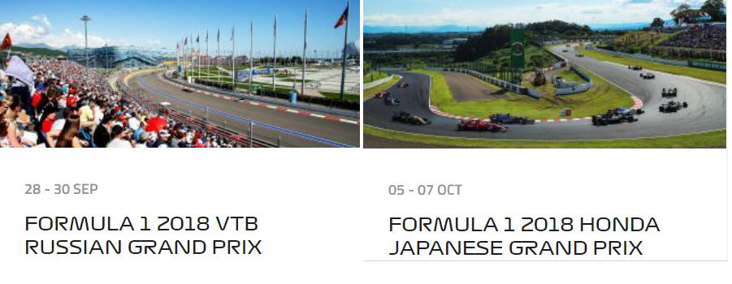
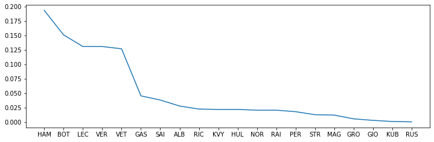
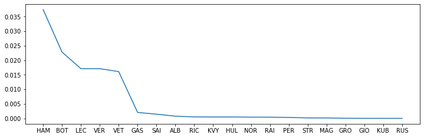

<div style="text-align: right">INFO 6105 Data Sci Engineering Methods and Tools, Assignment 3</div>
<div style="text-align: right">Zixiao Wang, 22 September 2019</div>

# Homework: Introduction to Data Science for Sports

<br />
<center>
    
</center>

You need to provide *proof* for your answers. `I think it's one in a million because Mercedes sucks and I like Ferrari a lot more` is not a good answer. Leverage the counting framework in this workbook!

Hint: Use SingaporeanGrandPrix, or `SGP` to denote the Probability Distribution given by F1 driver wins. Write driver initials as keys and driver wins as values in a dictionary that you pass to our function `ProbDist`..

### Preparation


```python
class ProbDist(dict):
    """A Probability Distribution; an {outcome: probability} mapping."""
    def __init__(self, mapping=(), **kwargs):
        self.update(mapping, **kwargs)
        # Make probabilities sum to 1.0; assert no negative probabilities
        total = sum(self.values())
        for outcome in self:
            self[outcome] = self[outcome] / total
            assert self[outcome] >= 0
```


```python
SGP = ProbDist(
    HAM = 296,# MERCEDES
    BOT = 231,# MERCEDES
    LEC = 200,# FERRARI
    VER = 200,# RED BULL
    VET = 194,# FERRARI
    GAS = 69,
    SAI = 58,
    ALB = 42,# RED BULL
    RIC = 34,# RENAULT
    KVY = 33,
    HUL = 33,# RENAULT
    NOR = 31,
    RAI = 31,
    PER = 27,
    STR = 19,
    MAG = 18,
    GRO = 8,
    GIO = 4,
    KUB = 1,
    RUS = 0)
SGP
```


    {'HAM': 0.1935905820797907,
     'BOT': 0.1510791366906475,
     'LEC': 0.13080444735120994,
     'VER': 0.13080444735120994,
     'VET': 0.12688031393067364,
     'GAS': 0.04512753433616743,
     'SAI': 0.03793328973185088,
     'ALB': 0.027468933943754086,
     'RIC': 0.02223675604970569,
     'KVY': 0.02158273381294964,
     'HUL': 0.02158273381294964,
     'NOR': 0.020274689339437543,
     'RAI': 0.020274689339437543,
     'PER': 0.01765860039241334,
     'STR': 0.012426422498364944,
     'MAG': 0.011772400261608895,
     'GRO': 0.005232177894048398,
     'GIO': 0.002616088947024199,
     'KUB': 0.0006540222367560497,
     'RUS': 0.0}


## Question 1.1 (20 points) 

There are a number of F1 races coming up: 
- Singapore GP: Date: Sun, Sep 22, 8:10 AM
- Russian GP: Date: Sun, Sep 29, 7:10 AM
- Japanese GP: Date: Sun, Oct 13, 1:10 AM
- Mexican GP Date: Sun, Oct 13, 1:10 AM

The Singaporean Grand Prix this weekend and the Russian Grand Prix the weekend after, as you can see [here](https://www.formula1.com/en/racing/2019.html). 

The 2019 driver standings are given [here](https://www.formula1.com/en/results.html/2019/drivers.html). Given these standings (please do not use team standings given onthe same Web site, use driver standings), what is the Probability Distribution for each F1 driver to win the Singaporean Grand Prix? What is the Probability Distribution for each F1 driver to win *both* the Singaporean and Russian Grand Prix? What is the probability for Mercedes to win both races? What is the probability for Mercedes to win at least one race? Note that Mercedes, and each other racing team, has two drivers per race.

### 1.1.1 Probability Distribution for each F1 driver to win the Singaporean Grand Prix


```python
from matplotlib import pyplot as plt
%matplotlib inline

fig, ax = plt.subplots(figsize=(12, 3.75))
x = list(SGP.keys())
y = list(SGP.values())
plt.plot(x,y)
(x,y)
```


    (['HAM',
      'BOT',
      'LEC',
      'VER',
      'VET',
      'GAS',
      'SAI',
      'ALB',
      'RIC',
      'KVY',
      'HUL',
      'NOR',
      'RAI',
      'PER',
      'STR',
      'MAG',
      'GRO',
      'GIO',
      'KUB',
      'RUS'],
     [0.1935905820797907,
      0.1510791366906475,
      0.13080444735120994,
      0.13080444735120994,
      0.12688031393067364,
      0.04512753433616743,
      0.03793328973185088,
      0.027468933943754086,
      0.02223675604970569,
      0.02158273381294964,
      0.02158273381294964,
      0.020274689339437543,
      0.020274689339437543,
      0.01765860039241334,
      0.012426422498364944,
      0.011772400261608895,
      0.005232177894048398,
      0.002616088947024199,
      0.0006540222367560497,
      0.0])





### 1.1.2 Probability Distribution for each F1 driver to win both the Singaporean and Russian Grand Prix? 


```python
from matplotlib import pyplot as plt
%matplotlib inline

fig, ax = plt.subplots(figsize=(12, 3.75))
x = list(SGP.keys())
y = list([i**2 for i in SGP.values()])
plt.plot(x,y)

(x,y)
```


    (['HAM',
      'BOT',
      'LEC',
      'VER',
      'VET',
      'GAS',
      'SAI',
      'ALB',
      'RIC',
      'KVY',
      'HUL',
      'NOR',
      'RAI',
      'PER',
      'STR',
      'MAG',
      'GRO',
      'GIO',
      'KUB',
      'RUS'],
     [0.03747731346999218,
      0.02282490554319135,
      0.017109803446855452,
      0.017109803446855452,
      0.016098614063146298,
      0.0020364943552619703,
      0.0014389344698805435,
      0.0007545423320063254,
      0.0004944733196141227,
      0.00046581439884063976,
      0.00046581439884063976,
      0.00041106302781070234,
      0.00041106302781070234,
      0.0003118261678189406,
      0.00015441597610787045,
      0.00013858940791952918,
      2.737568551496873e-05,
      6.843921378742182e-06,
      4.277450861713864e-07,
      0.0])





### 1.1.3  The probability for Mercedes to win both races


```python
# There are two drivers of Mercedes
# HAM and BOT

# Let A = HAM wins the race
# Let B = BOT wins the race

# Let C = Mercedes wins a race

# Because HAM and BOT can't win a same race
# So C = the probability of (HAM won but BOT lost) and (HAM lost but BOT won)
# P(C) = P(A) + P(B)

# The probability for Mercedes to win a race
Mercedes_win = SGP['HAM'] + SGP['BOT']
print("The probility of Mercedes to win a match: {0:.10f}".format(Mercedes_win))

# The probability for Mercedes to win two races
print("The probility of Mercedes to win both races: {0:.10f}".format(Mercedes_win**2))
```

    The probility of Mercedes to win a match: 0.3446697188
    The probility of Mercedes to win both races: 0.1187972150
    

### 1.1.4 The probability for Mercedes to win at least one race


```python
# Let A = Mercedes to win at least one race
# The counter event of A is Merceds win no race
# Let B = the counter event of A

# The probability of Mercedes to win no race
Mercedes_lost_all = (1-Mercedes_win)**2

# The probability of Mercedes to win at least one race
result = 1 - Mercedes_lost_all

print("The probability of Mercedes to win at least one race: {0:.10f}".format(result))
```

    The probability of Mercedes to win at least one race: 0.5705422225
    

##  1.2  Question(30 points) 

If Mercedes wins the first race, what is the probability that Mercedes wins the next one? If Mercedes wins at least one of these two races, what is the probability Mercedes wins both races? How about Ferrari, Red Bull, and Renault?

### 1.2.1 If Mercedes wins the first race, what is the probability that Mercedes wins the next one?


```python
# Let A = Mercedes wins the first race
# Let B = Mercedes wins the second race

# If Mercedes wins the first race,the probability that Mercedes wins the next one
# P(B) = the probability of Mercedes to win a race
pB = Mercedes_win

print("If Mercedes wins the first race,the probability that Mercedes wins the next one is: {0:.10f}".format(pB))
```

    If Mercedes wins the first race,the probability that Mercedes wins the next one is: 0.3446697188
    

### 1.2.2 If Mercedes wins at least one of these two races, what is the probability Mercedes wins both races? How about Ferrari, Red Bull, and Renault?


```python
# The probility of Mercedes, Ferrari, Red Bull and Renault to win one race
Ferrari_win = SGP['LEC'] + SGP['VET']
RedBull_win = SGP['VER'] + SGP['ALB']
Renault_win = SGP['RIC'] + SGP['HUL']

teams = {'Mercedes':Mercedes_win,'Ferrari':Ferrari_win,"RedBull":RedBull_win,"Renault":Renault_win}

# If Mercedes wins at least one of these two races, the probability Mercedes wins both races
# p(AB|1-(1-A)(1-B))

for team in teams.keys():
    print("If {0} wins at least one of these two races, the probability {0} wins both races is: {1:.10f}".format(team,(((teams[team])**2)/(1-(1-teams[team])**2))))
```

    If Mercedes wins at least one of these two races, the probability Mercedes wins both races is: 0.2082180956
    If Ferrari wins at least one of these two races, the probability Ferrari wins both races is: 0.1478978979
    If RedBull wins at least one of these two races, the probability RedBull wins both races is: 0.0859375000
    If Renault wins at least one of these two races, the probability Renault wins both races is: 0.0224005349
    

### Question 1.3 (50 points)

Mercedes wins one of these two races on a rainy day. What is the probability Mercedes wins both races, assuming races can be held on either rainy, sunny, cloudy, snowy or foggy days? Assume that rain, sun, clouds, snow, and fog are the only possible weather conditions on race tracks.


```python
# Let A = Mercedes wins the first race
A = Mercedes_win

# Let B = Mercedes wins the second race
B = Mercedes_win

# Let C = One of weathers = 1/5
C = 1/5

# Let D = Mercedes wins one of these two races on a rainy day.
pD = (A*C)*(1-B) + (1-A)*(B*C) + (A*C)*B + ((1-C)*A)*(B*1/5)

# Let E = Mercedes wins all races
# Mercedes wins one of these two races on a rainy day.The probability Mercedes wins both races is p(E|D)

print("Mercedes wins one of these two races on a rainy day.The probability Mercedes wins both races is: {0:.10f}".format((A*C*B+A*(1-C)*B*C)/pD))


```

    Mercedes wins one of these two races on a rainy day.The probability Mercedes wins both races is: 0.3212761634
    
