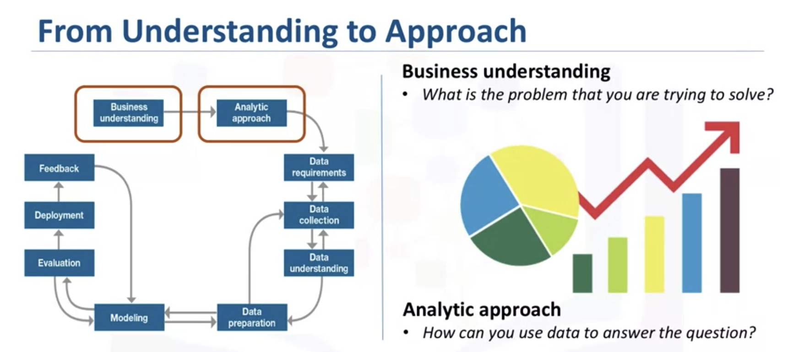
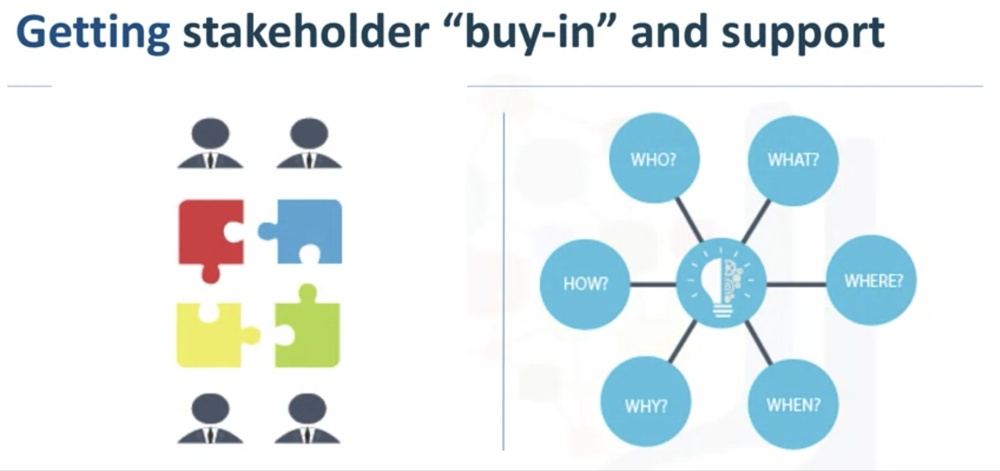
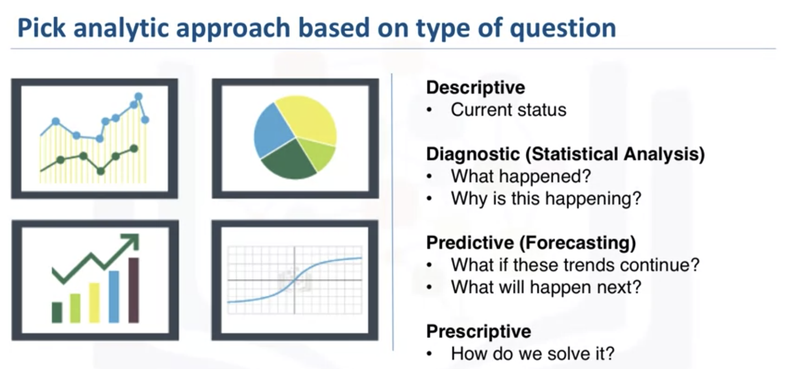
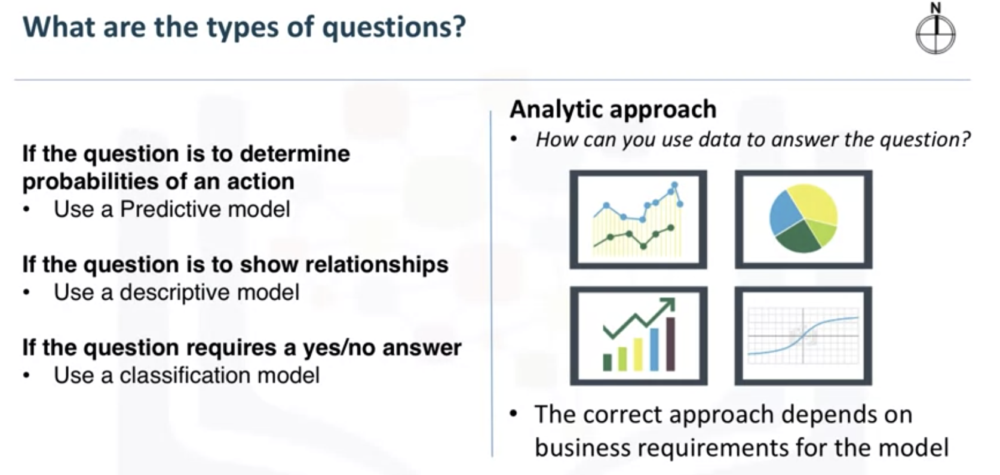
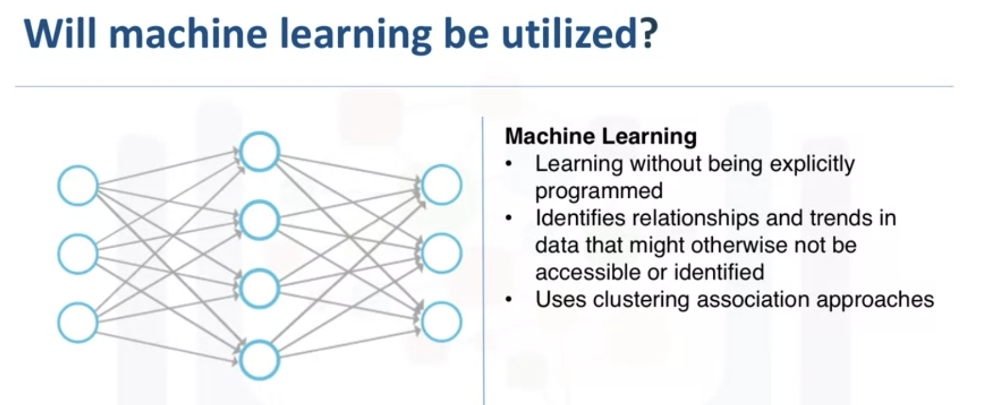

# From Problem to Approach

- [From Problem to Approach](#from-problem-to-approach)
  - [What is the goal](#what-is-the-goal)
  - [Objectives that are in support of the goal](#objectives-that-are-in-support-of-the-goal)
  - [Analytic Approach](#analytic-approach)

**Business Understanding and Analytic Approach**

In this lesson, you have learned:

* The need to understand and prioritize the business goal.
* The way stakeholder support influences a project.
* The importance of selecting the right model.
* When to use a predictive, descriptive, or classification model.

## What is the goal

First question is to ask the person who give you the problem - **What is his goal**

For example, if a business owner asks: 

"How can we reduce the costs of performing an activity?" 

We need to understand, is the goal to improve the efficiency of the activity? Or is it to increase the businesses profitability?

## Objectives that are in support of the goal

## Analytic Approach

