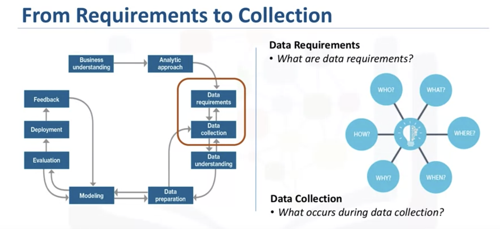
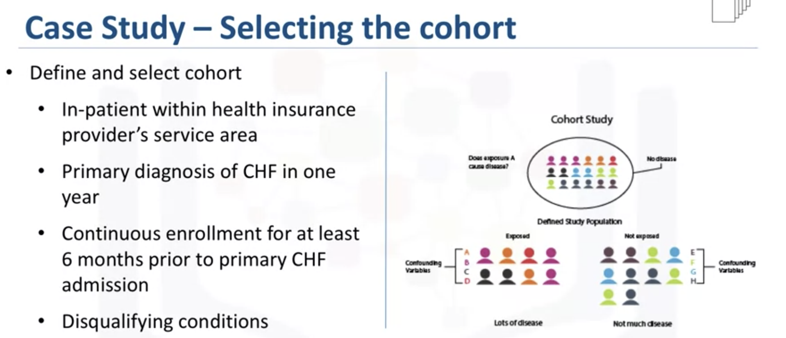
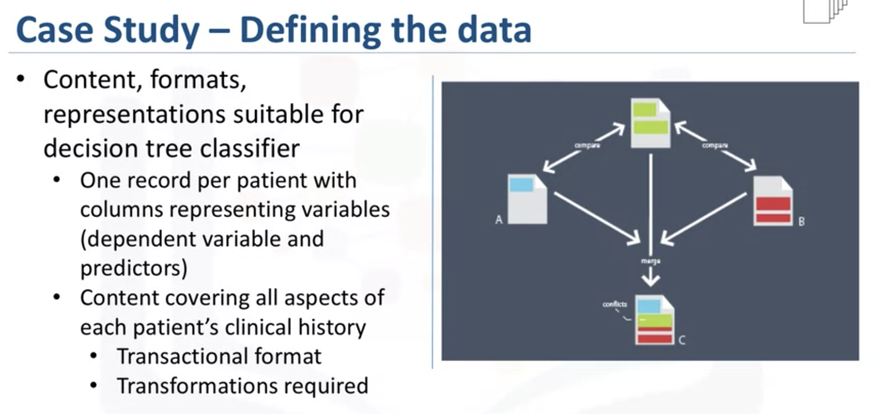
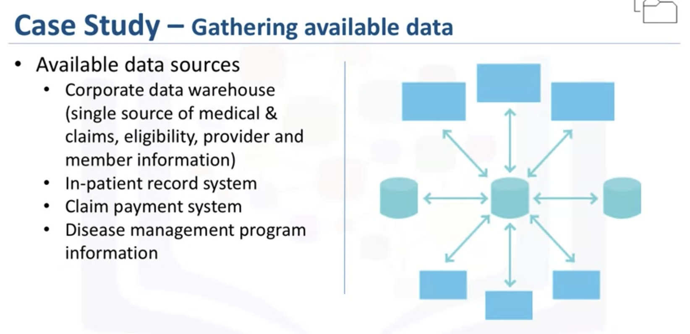
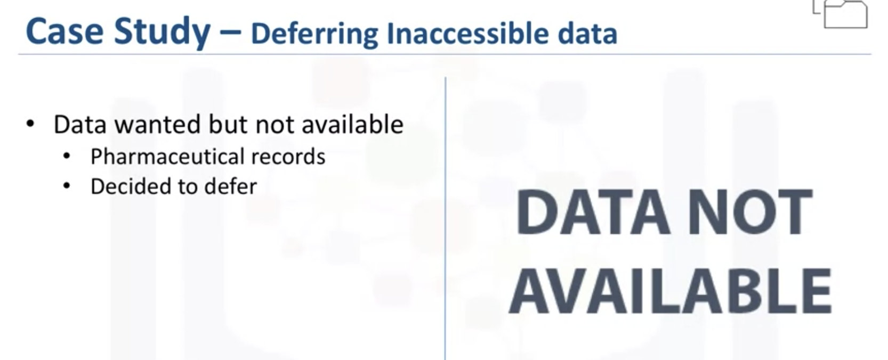
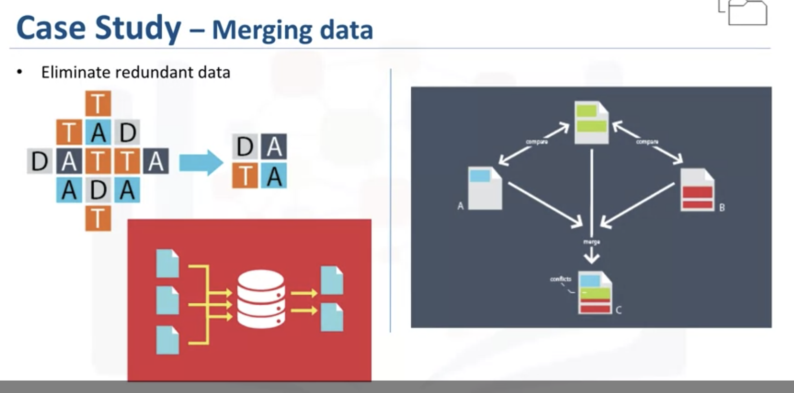

# From Requirement to Collection

- [From Requirement to Collection](#from-requirement-to-collection)
  - [Data Requirement](#data-requirement)
  - [Data Collection](#data-collection)

**Data Requirement and Data Collection**

In this lesson, you have learned:

* The significance of defining the data requirements for your model.
* Why the content, format, and representation of your data matter.
* The importance of identifying the correct sources of data for your project.
* How to handle unavailable and redundant data.
* To anticipate the needs of future stages in the process.

## Data Requirement

This includes identifying the necessary data content, formats and sources for initial data collection

**Case 1** 

* Define Data

## Data Collection

* Gather available data
* Defer unavailable data
* Merge data
* Descriptive statistics and visualization (not supervised and unsupervised methods) can be applied to the data set to assess the content, quality, and initial insights about the data.

