# From Model to Evaluation

- [From Model to Evaluation](#from-model-to-evaluation)
  - [Modeling](#modeling)
  - [Evaluation](#evaluation)
  - [Additional Information about sensitivity and specificity](#additional-information-about-sensitivity-and-specificity)

In this lesson, you have learned:

* The difference between descriptive and predictive models.
* The role of training sets and test sets.
* The importance of asking if the question has been answered.
* Why diagnostic measures tools are needed.
* The purpose of statistical significance tests.
* That modeling and evaluation are iterative processes.

Modelling is the stage in the data science methodology where the data scientist has the chance to sample the sauce and determine if it's bang on or in need of more seasoning!

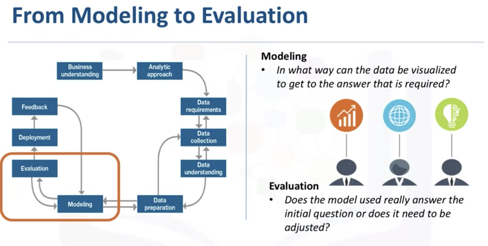

This portion of the course is geared toward answering two key questions: 
* First, what is the purpose of data modeling.
* Second, what are some characteristics of this process?

## Modeling

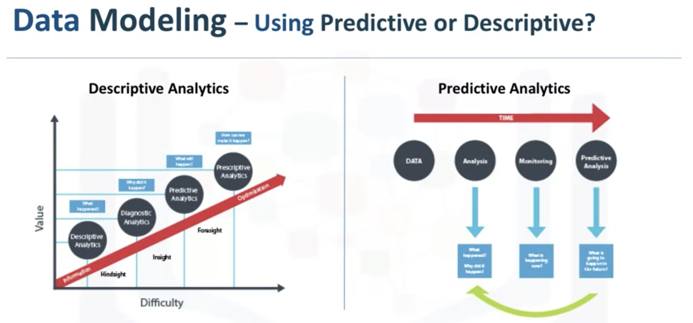

Data Modelling focuses on developing models that are either descriptive or predictive. 

* An example of a descriptive model might examine things like: if a person did this, then they're likely to prefer that. 
* A predictive model tries to yield yes/no, or stop/go type outcomes. 

These models are based on the analytic approach that was taken, either statistically driven or machine learning driven.

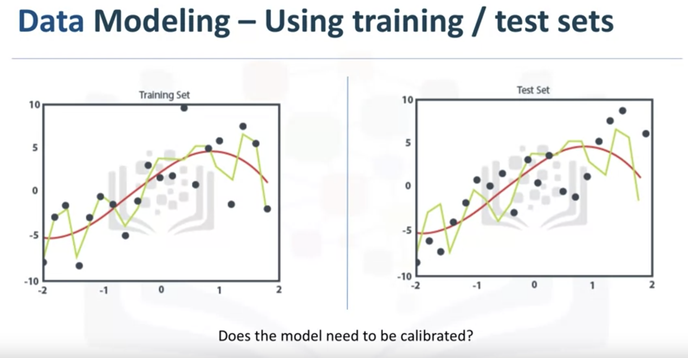

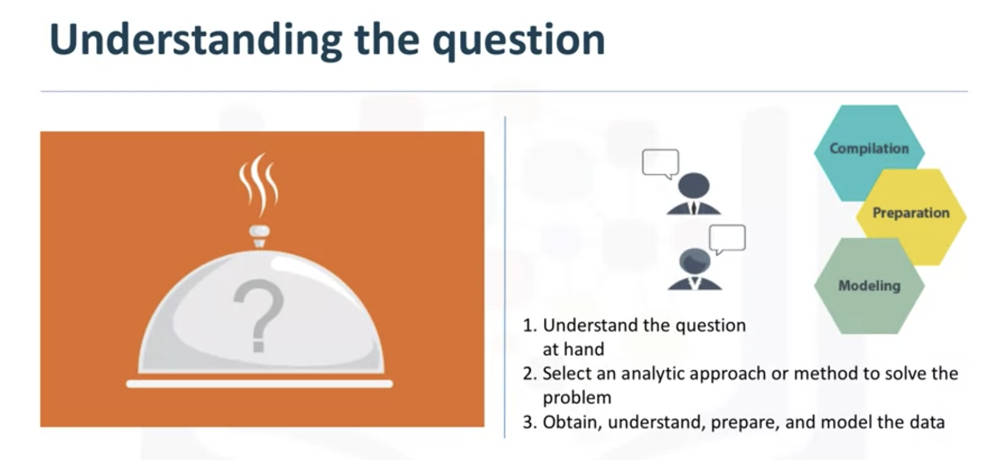

The success of data compilation, preparation and modelling, depends on the understanding of the problem at hand, and the appropriate analytical approach being taken. 

**The data supports the answering of the question**, and like the quality of the ingredients in cooking, sets the stage for the outcome. 

Constant refinement, adjustments and tweaking are necessary within each step to ensure the outcome is one that is solid. 

In John Rollins' descriptive Data Science Methodology, the framework is geared to do 3 things: 

* First, understand the question at hand. 
* Second, select an analytic approach or method to solve the problem. 
* Third, obtain, understand, prepare, and model the data. 

The end goal is to move the data scientist to a point where a data model can be built to answer the question

**Case**

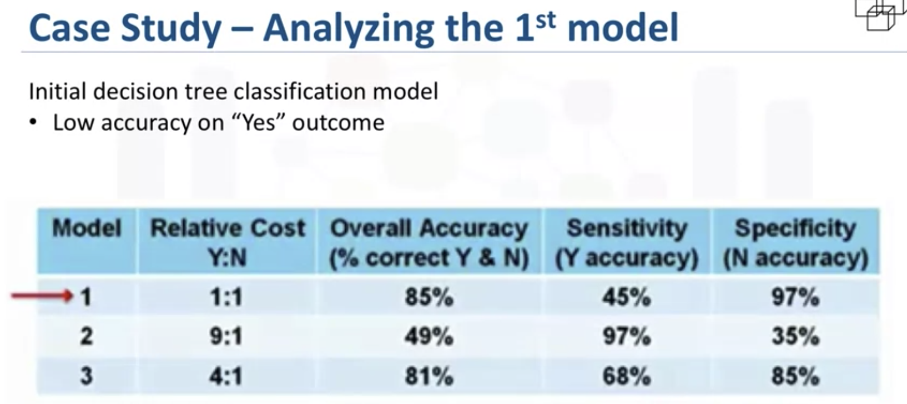

The first model predicts very low accuracy on Y. A statistician calls this a type I error, or a false-positive

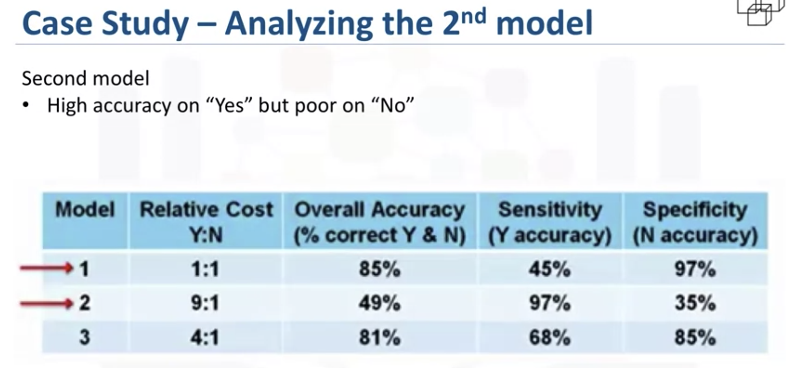

The second model predicts very low accuracy on N. This is a type II error, or a false-negative.

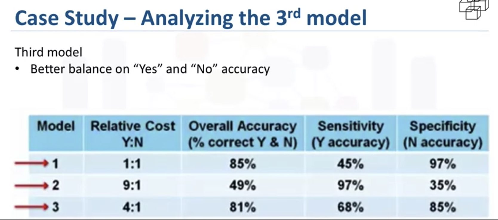

This time 68% accuracy was obtained on only yes, called sensitivity by statisticians, and 85% accuracy on the no, called specificity, with an overall accuracy of 81%. This is the best balance that can be obtained with a rather small training set

## Evaluation

Evaluation answers the question: Does the model used really answer the initial question or does it need to be adjusted?

The modeling and evaluation stages are done iteratively.

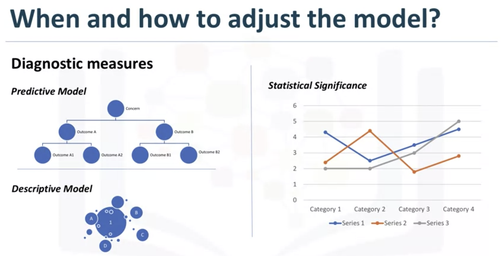

Model evaluation can have two main phases. 
* The first is the diagnostic measures phase, which is used to ensure the model is working as intended. 
  * If the model is a predictive model, a decision tree can be used to evaluate if the answer the model can output, is aligned to the initial design. It can be used to see where there are areas that require adjustments. 
  * If the model is a descriptive model, one in which relationships are being assessed, then a testing set with known outcomes can be applied, and the model can be refined as needed. 
* The second phase of evaluation that may be used is statistical significance testing. This type of evaluation can be applied to the model to ensure that the data is being properly handled and interpreted within the model. This is designed to avoid unnecessary second guessing when the answer is revealed.

**Case**

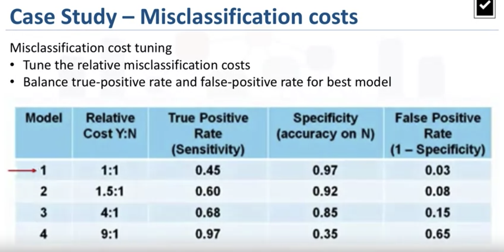

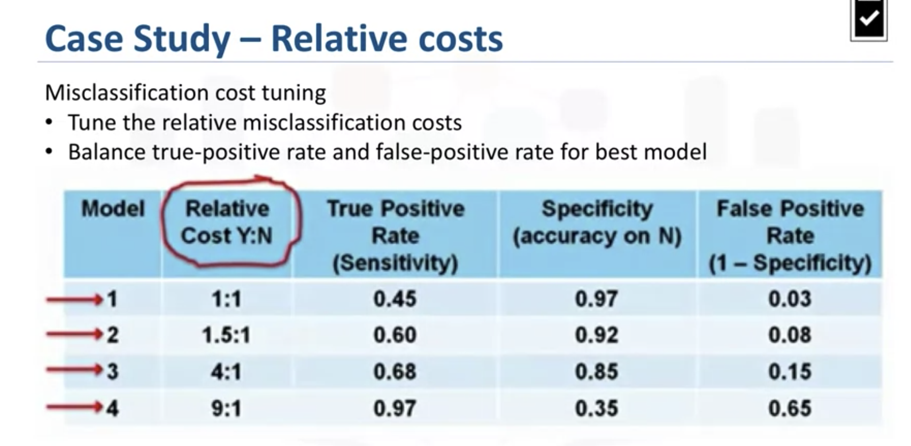

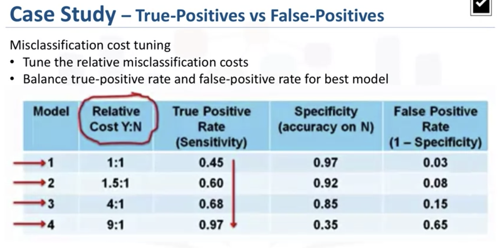

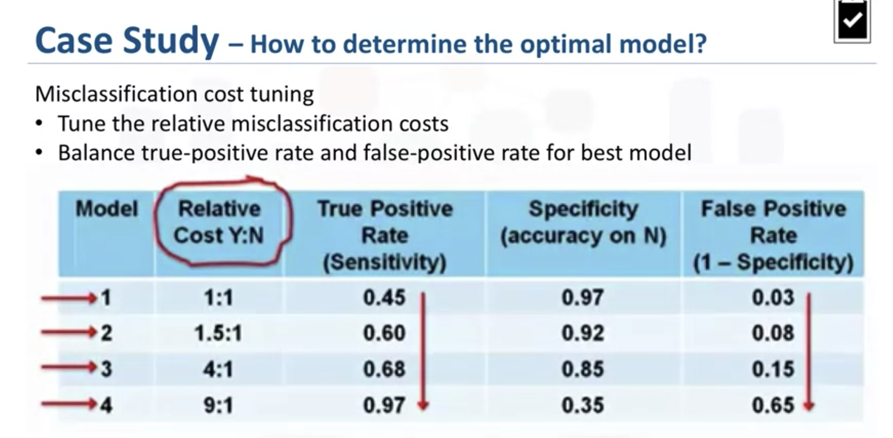

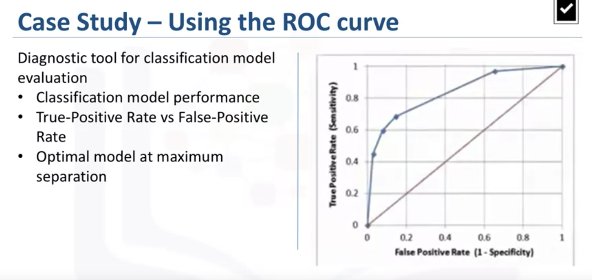

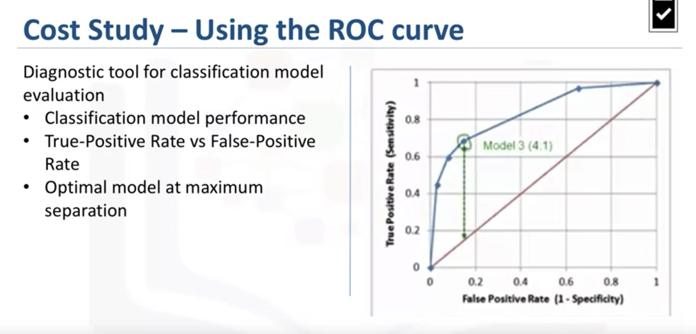

## Additional Information about sensitivity and specificity

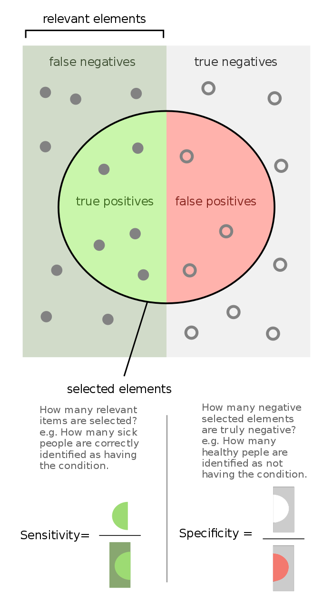