# From Understanding to Preparation

- [From Understanding to Preparation](#from-understanding-to-preparation)
  - [Data Understanding](#data-understanding)
  - [Data Preparation](#data-preparation)

In this lesson, you have learned:

* The importance of descriptive statistics.
* How to manage missing, invalid, or misleading data.
* The need to clean data and sometimes transform it.
* The consequences of bad data for the model.
* Data understanding is iterative; you learn more about your data the more you study it.

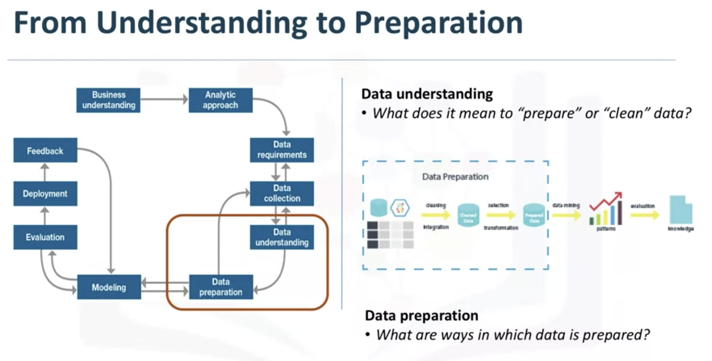

## Data Understanding

This stage answers the question: Is the data you collected representative of the problem to be solved?

**Case**

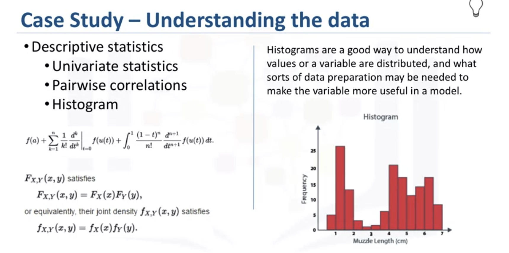

* First, these statistics included Hearst, univariates, and statistics on each variable, such as mean, median, minimum, maximum, and standard deviation. 
* Second, pairwise correlations were used, to see how closely certain variables were related, and which ones, if any, were very highly correlated, meaning that they would be essentially redundant, thus making only one relevant for modeling. 
* Third, histograms of the variables were examined to understand their distributions. Histograms are a good way to understand how values or a variable are distributed, and which sorts of data preparation may be needed to make the variable more useful in a model.

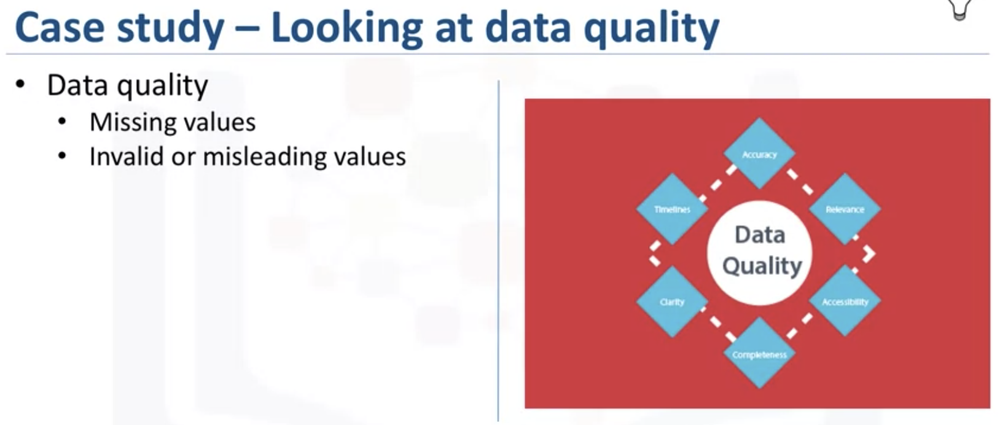

The univariates, statistics, and histograms are also used to assess data quality. From the information provided, certain values can be re-coded or perhaps even dropped if necessary, such as when a certain variable has many missing values. The question then becomes, **does "missing" mean anything**? Sometimes a missing value might mean "no", or "0" (zero), or at other times it simply means "we don't know". Or, if a variable contains invalid or misleading values, such as a numeric variable called "age" that contains 0 to 100 and also 999, where that "triple-9" actually means "missing", but would be treated as a valid value unless we corrected it

In a summary. The more one works with the problem and the data, the more one learns and therefore the more refinement that can be done within the model, ultimately leading to a better solution to the problem.

## Data Preparation

This stage answers the question: In what ways in which data is prepared.

And this part is the most time-comusing in a data science project, which will take about 70 to 90 precent time of whole project.

In a sense, data preparation is similar to washing freshly picked vegetables in so far as unwanted elements, such as dirt or imperfections, are removed. 

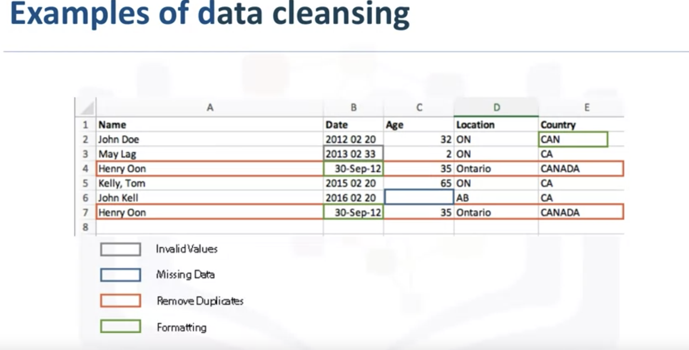
 
To work effectively with the data, it must be prepared in a way that addresses missing or invalid values and removes duplicates, toward ensuring that everything is properly formatted.

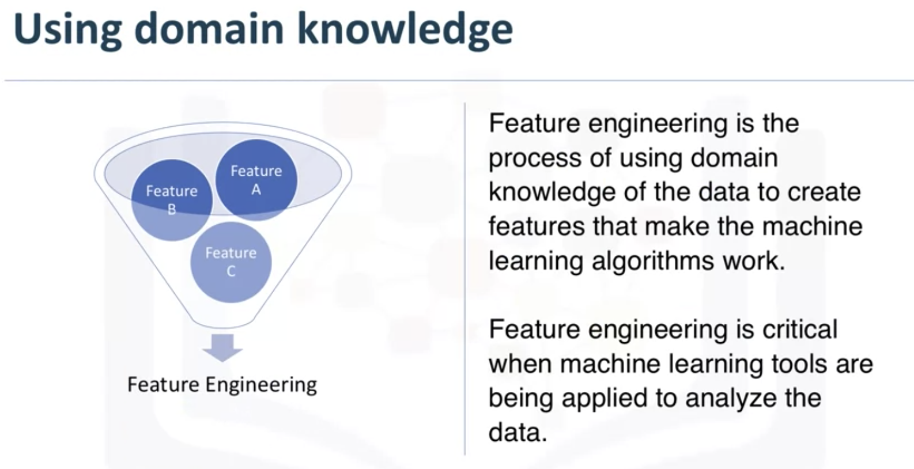

**Case**

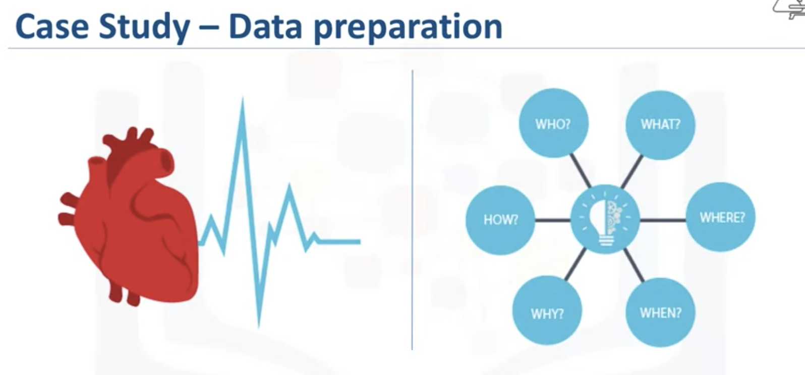

Define the problem like "Heart faliure".

This sounded easy at first but defining it precisely, was not straightforward.

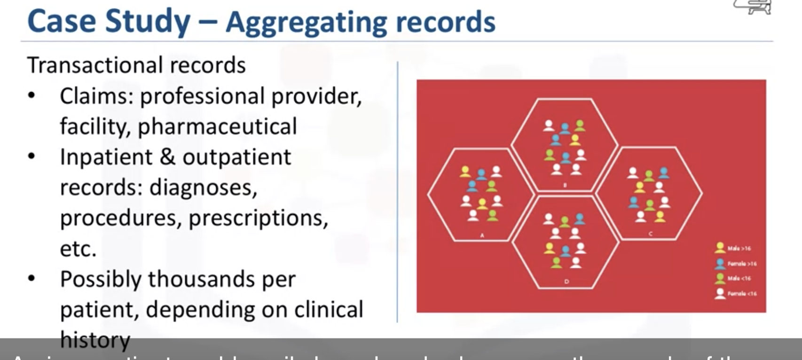

After defination, we need to aggregate the record we need.

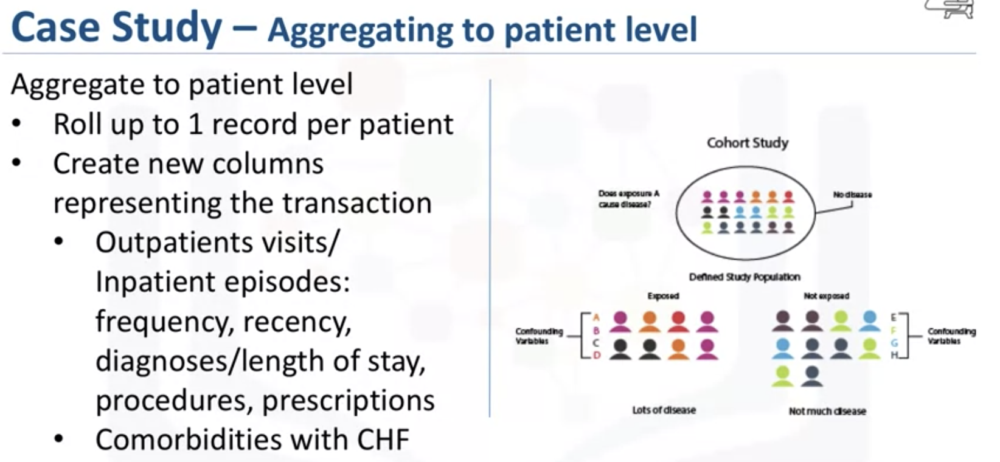

And also make the records transform into patient level.

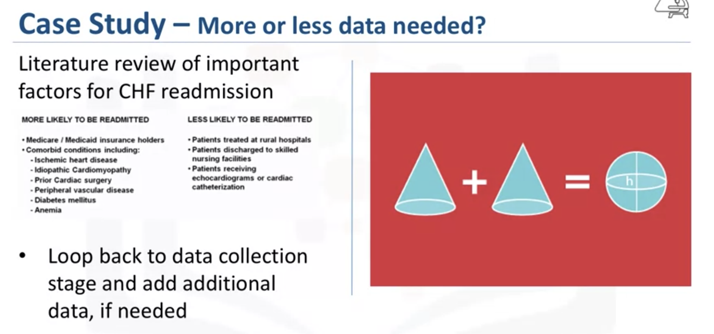

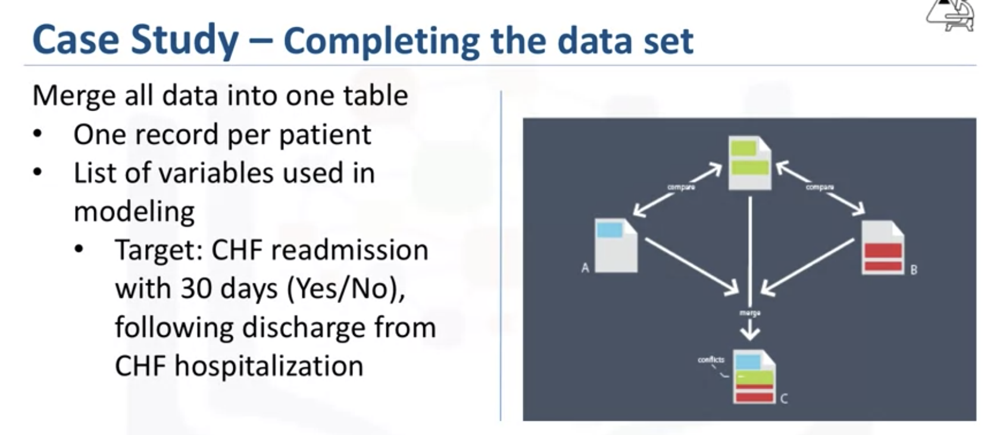

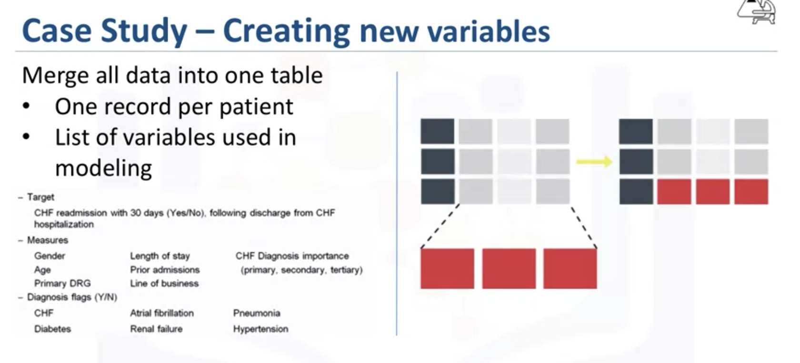

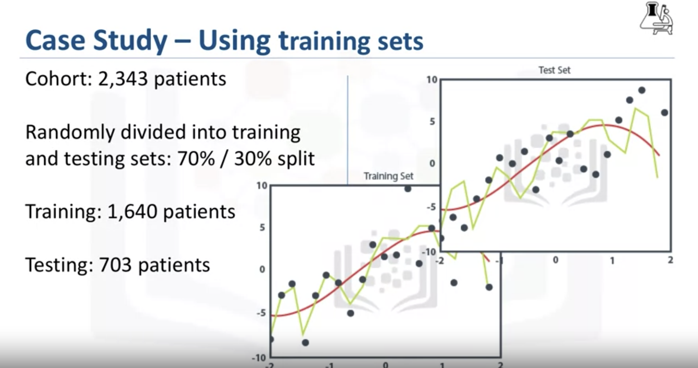