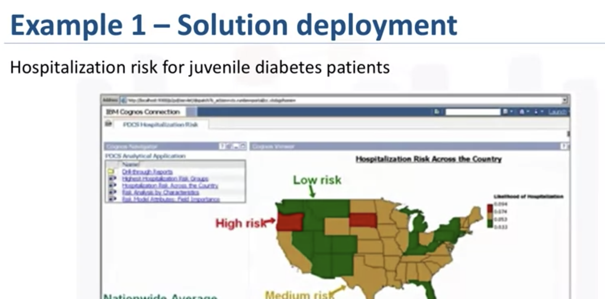

# From Deployment to Feedback

- [From Deployment to Feedback](#from-deployment-to-feedback)
  - [Deployment](#deployment)
  - [Feedback](#feedback)

In this lesson, you have learned:

* The importance of stakeholder input.
* To consider the scale of deployment.
* The importance of incorporating feedback to refine the model.
* The refined model must be redeployed.
* This process should be repeated as often as necessary.

The key to making the answer relevant and useful to address the initial question, involves getting the stakeholders familiar with the tool produced.

## Deployment

In a business scenario, stakeholders have different specialties that will help make this happen, such as the solution owner, marketing, application developers, and IT administration. Once the model is evaluated and the data scientist is confident it will work, it is deployed and put to the ultimate test.

**Case**

Some deployment example

## Feedback

* Assessing model performance
* Refinement
* Redeployment