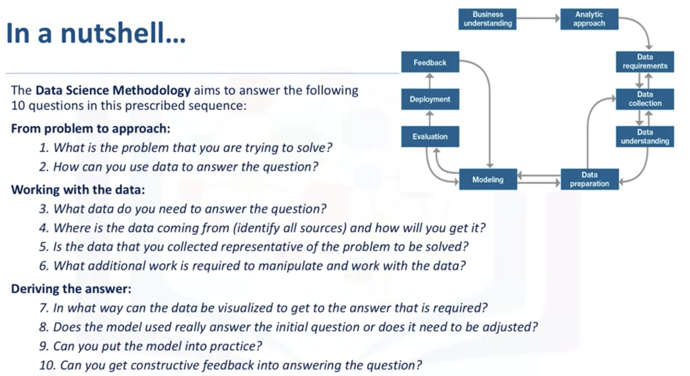
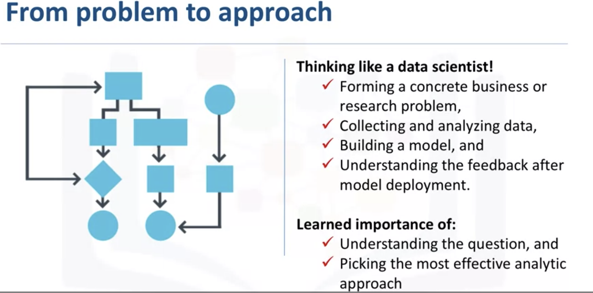
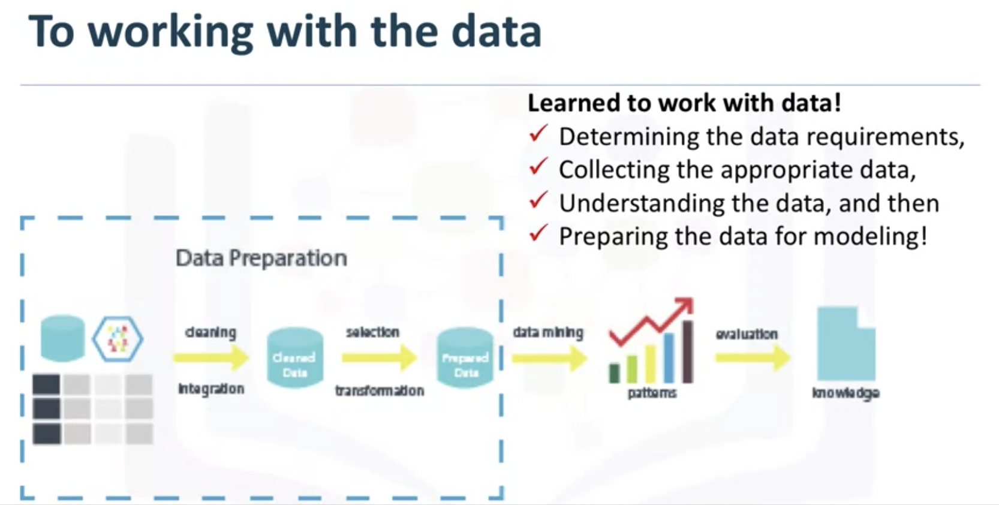
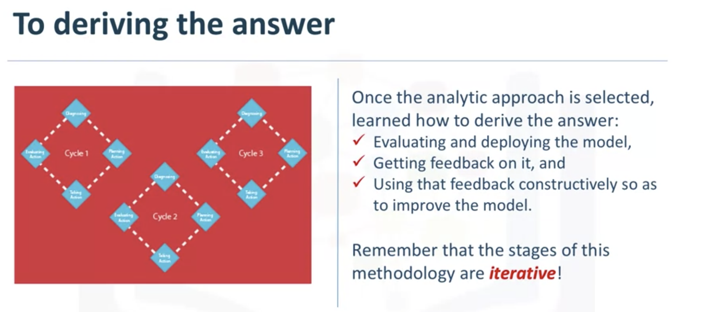

# Coursera - Data Science Methodology Syllabus

*The data science methodology discussed in this course has been outlined by John Rollins, a seasoned and senior data scientist currently practising at IBM*

- [Coursera - Data Science Methodology Syllabus](#coursera---data-science-methodology-syllabus)
  - [Module 1: From Problem to Approach and from Requirements to Collection](#module-1-from-problem-to-approach-and-from-requirements-to-collection)
  - [Module 2: From Understanding to Preparation and from Modeling to Evaluation](#module-2-from-understanding-to-preparation-and-from-modeling-to-evaluation)
  - [Module 3: From Deployment to Feedback](#module-3-from-deployment-to-feedback)
  - [Summary of Methodology](#summary-of-methodology)

Why we need some methodology for data science - [Cross Indrustries Data Mining](./CRIS-DM.md)

## Module 1: From Problem to Approach and from Requirements to Collection
* Business Understanding
* Analytic Approach
  * [Note - From Understanding to Apporach](Model&#32;1&#32;-&#32;From&#32;Problem&#32;to&#32;Approach/Model&#32;1&#32;-&#32;From&#32;Problem&#32;to&#32;Approach.md)
* Data Requirements
* Data Collection
  * [Note - From Requirements to Collection](Model&#32;1&#32;-&#32;From&#32;Requirement&#32;to&#32;Collection/From&#32;Requirement&#32;to&#32;Collection.md)
* Lab: From Problem to Approach
  * [jupyter notebook](Model&#32;1&#32;-&#32;From&#32;Problem&#32;to&#32;Approach/DS0103EN-1-1-1-From-Problem-to-Approach-v2.0.ipynb)
* Lab: From Requirement to Collection
  * [jupyter notebook](Model&#32;1&#32;-&#32;From&#32;Requirement&#32;to&#32;Collection/DS0103EN-2-2-1-From-Requirements-to-Collection-v2.0.ipynb)
* Quiz: From Problem to Approach
* Quiz: From Requirement to Collection
## Module 2: From Understanding to Preparation and from Modeling to Evaluation
* Data Understanding
* Data Preparation
  * [Note - From Understanding to Preparation](Model&#32;2&#32;-&#32;From&#32;Understanding&#32;to&#32;Preparation/From&#32;Understanding&#32;to&#32;Preparation.md)
* Modeling
* Evaluation
  * [Note - From Modeling to Evaluation](Model&#32;2&#32;-&#32;From&#32;Model&#32;to&#32;Evaluation/From&#32;Model&#32;to&#32;Evaluation.md)
* Lab: From Understanding to Preparation
  * [jupyter notebook](Model&#32;2&#32;-&#32;From&#32;Understanding&#32;to&#32;Preparation/DS0103EN-3-3-1-From-Understanding-to-Preparation-v2.0.ipynb)
* Lab: From Modeling to Evaluation
  * *[jupyter notebook](Model&#32;2&#32;-&#32;From&#32;Model&#32;to&#32;Evaluation/DS0103EN-4-4-1-From-Modeling-to-Evaluation-v2.0.ipynb)
* Quiz: From Understanding to Preparation
* Quiz: From Modeling to Evaluation
## Module 3: From Deployment to Feedback
* Deployment
* Feedback
  * [Note - From Deployment to Feedback](Model&#32;3&#32;-&#32;From&#32;Deployment&#32;to&#32;Feedback/From&#32;Deployment&#32;to&#32;Feedback.md)
* Quiz: From Deployment to Feedback
* Peer-review Assignment

## Summary of Methodology

