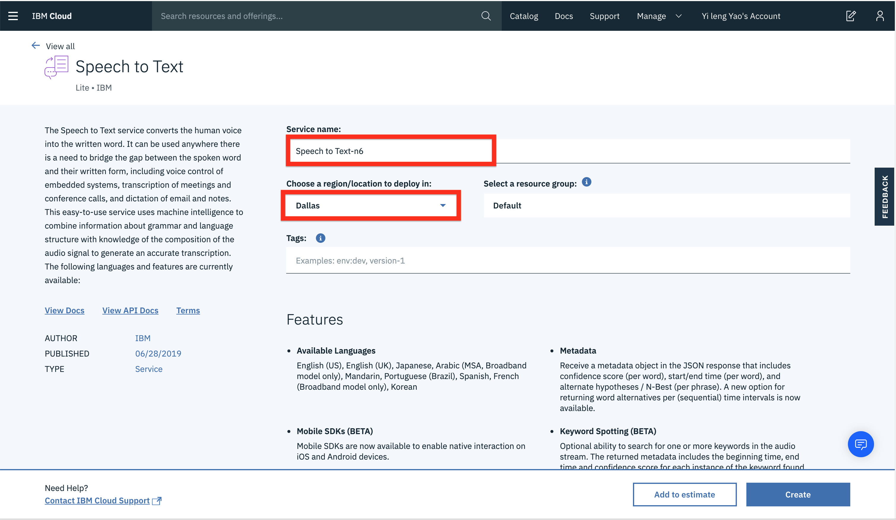
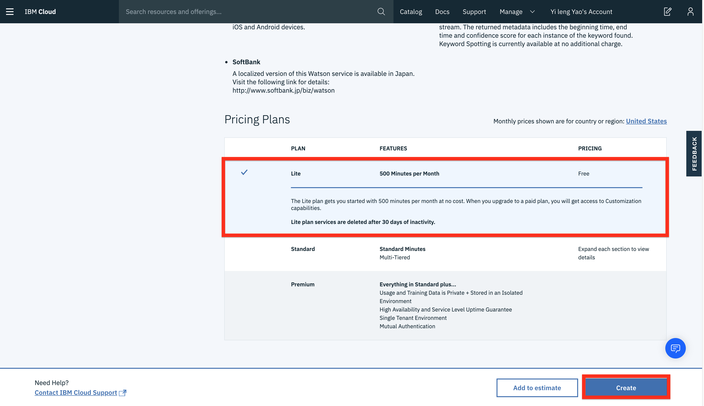
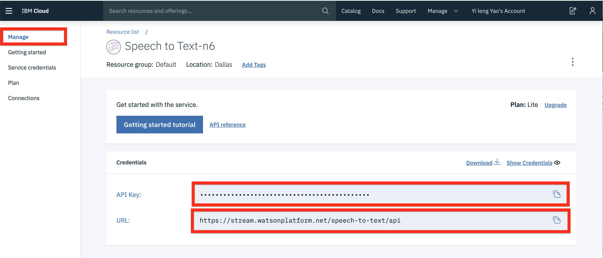
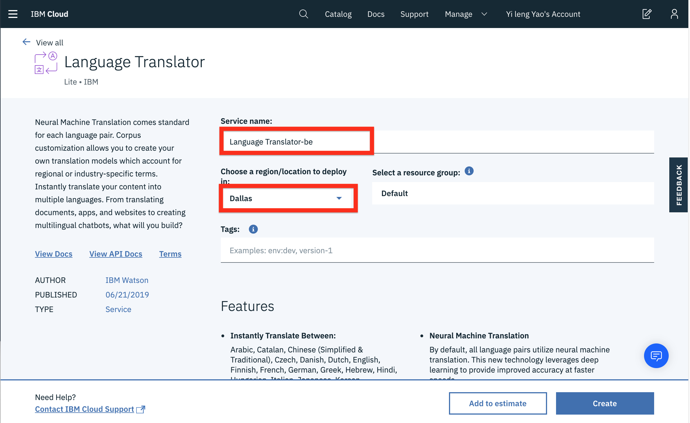
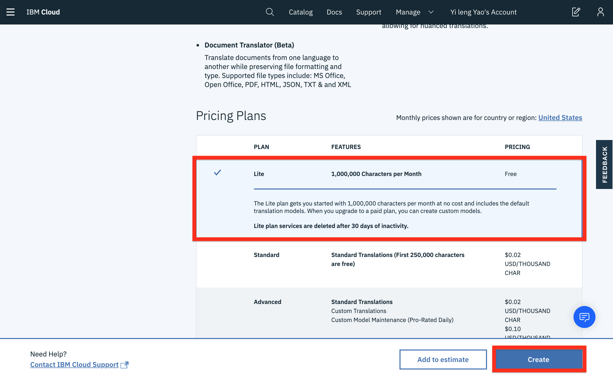

# Create a Speech to Text Instance

To create a speech to text instance click [Speech to Text](https://cocl.us/coursera_speech_to_text)

On the next page, you will get to name your service instance and choose your region. Click on the arrow to reveal the drop-down menu of regions. Make sure to select the region that is closest to you. Since I am located in Canada, then I am choosing Dallas as my region since it is the closest region to me.

Then scroll down and make sure that the lite plan is selected, and click the Create button.

## Save your Speech to Text API Key
Go to Manage, then save your Speech to Text API Key, and URL you will need it for the labs in this section.

## Create a Language Translator Instance

To create a translation instance click [Language Translator](https://cocl.us/PY0101EN_Cousera_LanguageTranslator)

On the next page, you will get to name your service instance and choose your region. Click on the arrow to reveal the drop-down menu of regions. Make sure to select the region that is closest to you. Since I am located in Canada, then I am choosing Dallas as my region since it is the closest region to me.

Then scroll down and make sure that the lite plan is selected, and click the Create button.

## Save your Speech to Text API Key

