# Indentifying objects with IBM Waston

## About this exercise:

In this lesson, we'd like to take you on a bit of a side journey. It's a fun exercise and I hope you enjoy it as much as we enjoyed putting this short exercise together for you. This exercise is ungraded, so feel free to have fun with it!

Image Classification with IBM Watson Visual Recognition:
What better way to understand the applications of data science than to try it out yourself? You'll be uploading images and seeing how IBM Watson identifies the various objects and faces (even gender and age!) in your images.

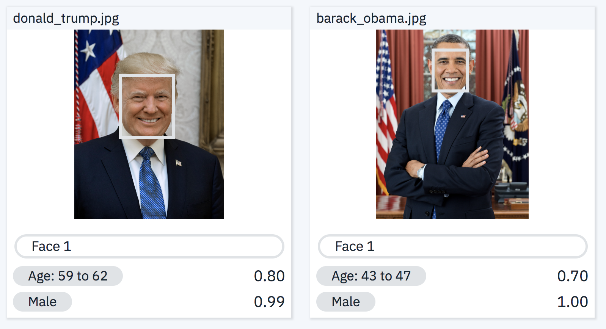

In this hands-on exercise you will utilize IBM Watson Visual Recognition (VR) to upload and classify your images. Watson VR is a service that uses deep learning algorithms to identify objects, faces and other content in an image. Follow the steps below to complete this exercise.

NOTE: In order to complete this exercise you will be creating an IBM Cloud account and provisioning an instance for Watson Visual Recognition service. A credit card is NOT required to sign up for IBM Cloud Lite account and there is no charge associated in creating a Lite plan instance of the Watson VR service.

## Step 1: Create an IBM Cloud Account

Click on the link below to create an IBM cloud account:

[Sign Up for IBM Watson Visual Recognition on IBM Cloud](https://cloud.ibm.com/registration?target=catalog%3fcategory=watson&cm_mmc=Email_Outbound-_-Developer_Ed+Tech-_-WW_WW-_-Campaign-Skills+Network+Cognitive+Class+Coursera+AI0101EN+Watson+VisualRecognition&cm_mmca1=000026UJ&cm_mmca2=10006555&cm_mmca3=M12345678)

On the page to which you get redirected by clicking on the link above, enter your email address, first name, last name, country or region, and set your password.

NOTE: To get enhanced benefits, please sign up with you company email address rather than a free email ID like Gmail, Hotmail, etc.

If you would like IBM to contact you for any changes to services or new offerings, then check the box to accept the box to get notified by email. Then click on the Create Account button to create your IBM Cloud account.

**If you already have an IBM Cloud account you can just log in using the link above the Email field (top right in the screenshot below).

## Step 2: Confirm Your Email Address
An email is sent to your email address to confirm your account.

## Step 3: Login to Your Account

## Step 4: Create a New Resource

On your dashboard page, click on the Create a resource on the top right to create a new source.

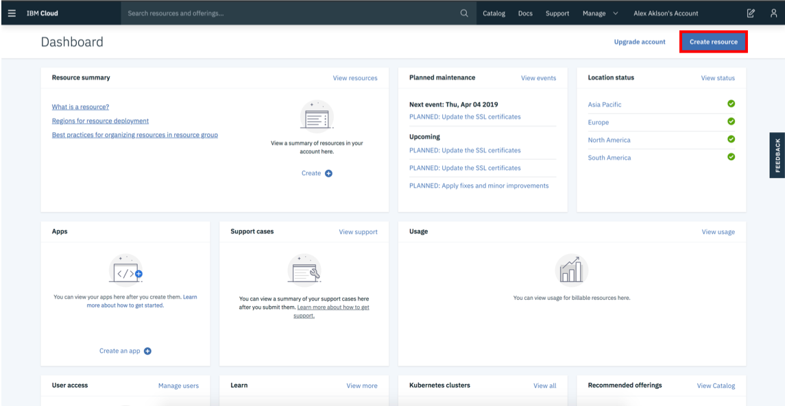

## Step 5: Create a Watson Studio Resource

On the Catalog page, select the AI category from the left pane, and then select the Watson Studio resource.

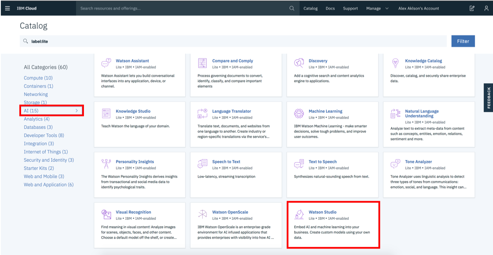

On the next page, you will get to name your service instance and choose your region. Click on the arrow to reveal the drop-down menu of regions. Make sure to select the region that is closest to you. Since I am located in Canada, then I am choosing Dallas as my region since it is the closest region to me.

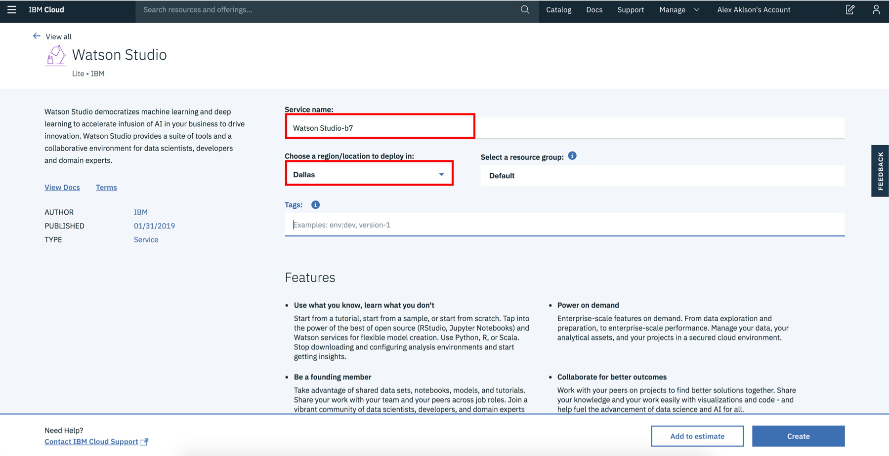

Then scroll down and make sure that the lite plan is selected, and click the Create button.

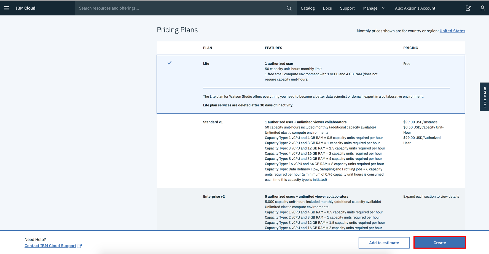

On the next page, click the Get Started button to start using Watson Studio.

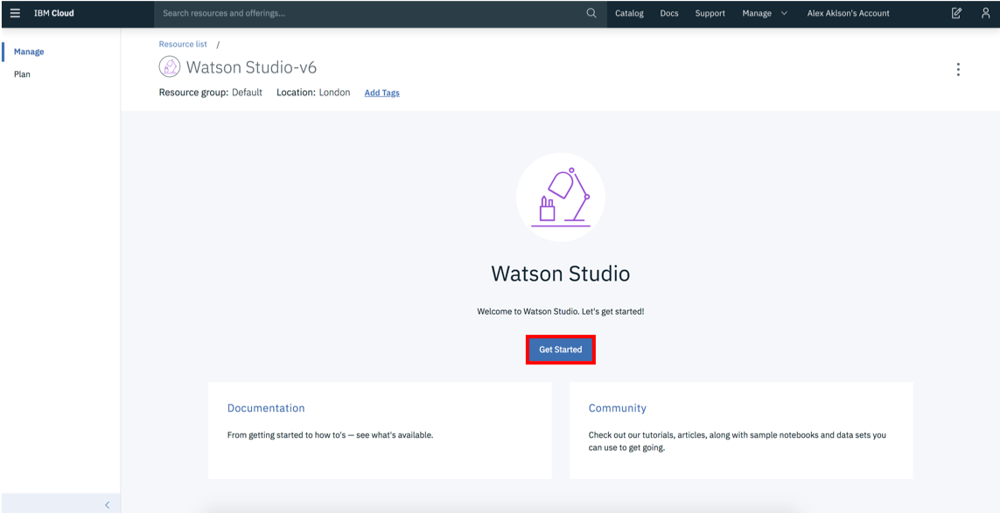

This will start provisioning your Watson Studio instance.

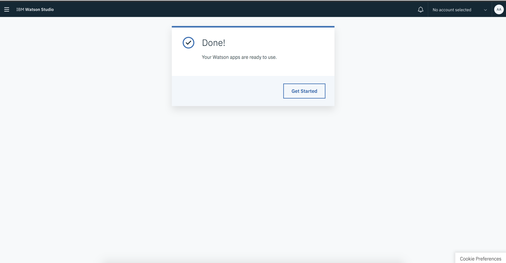

Once the provisioning process is complete, click the Get Started button to start using Watson Studio.

## Step 6: Create a Project

Once you land on the IBM Watson Studio main page, start by creating a project.

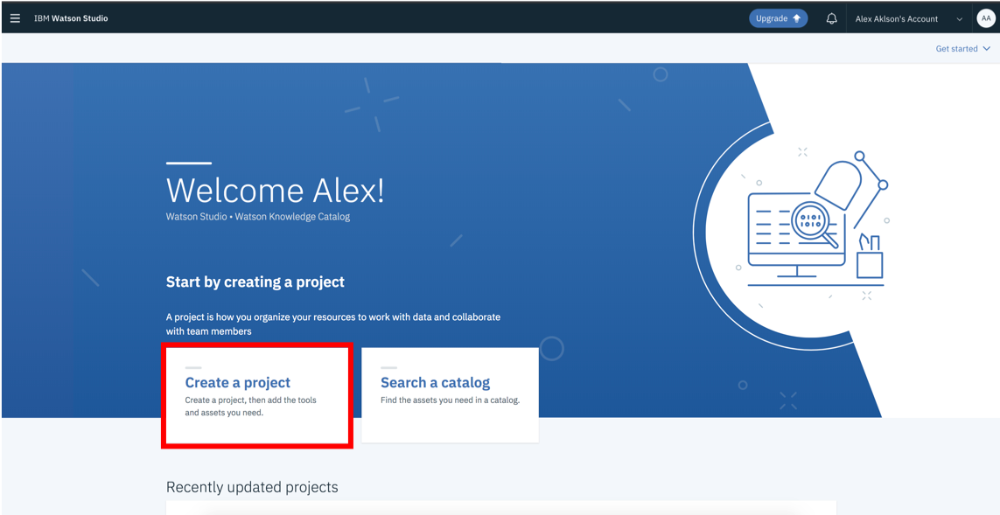

Create a Visual Recognition project.

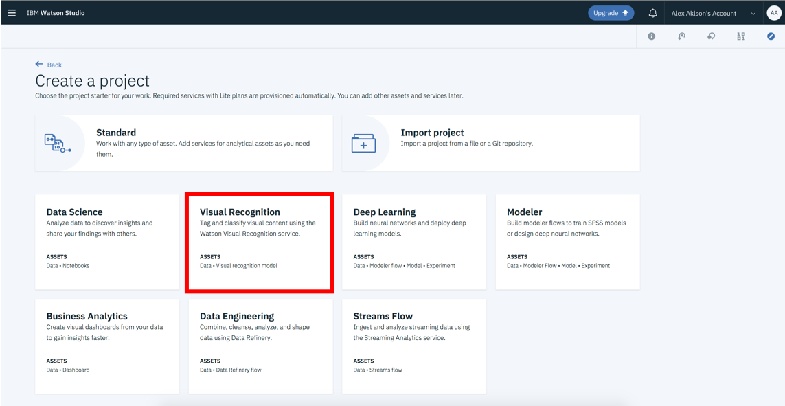

The closer this region is to your actual location, the faster images can be classified. If you're not sure which to choose, go ahead and select US South.

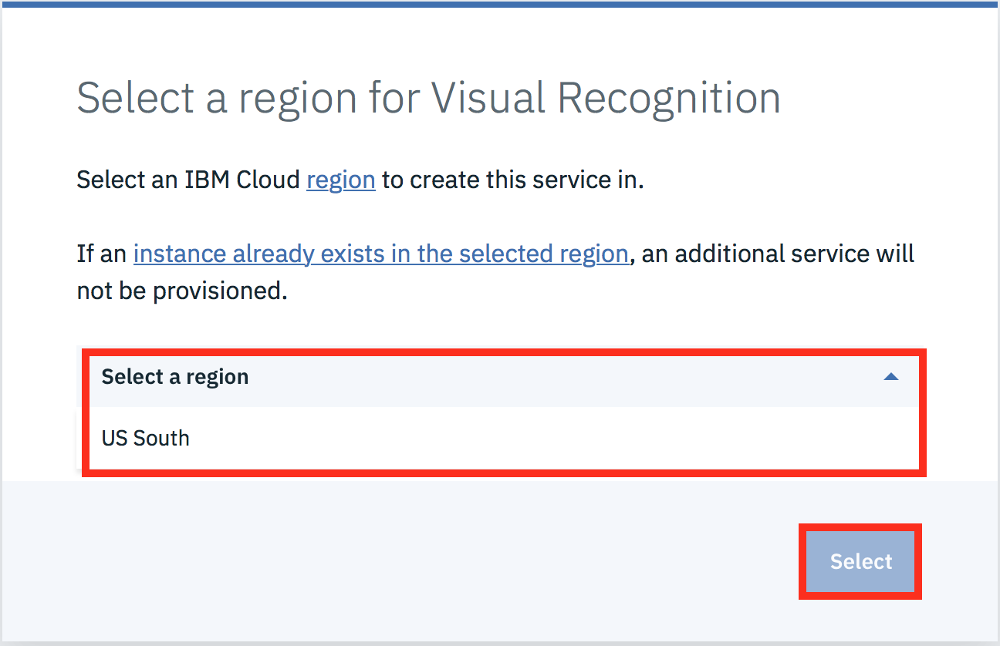
## Step 7: Setting up Your Project
Now let's fill in some project details and click Create. The IBM Cloud Object Storage, which provides you storage for your images, should be automatically created for you.

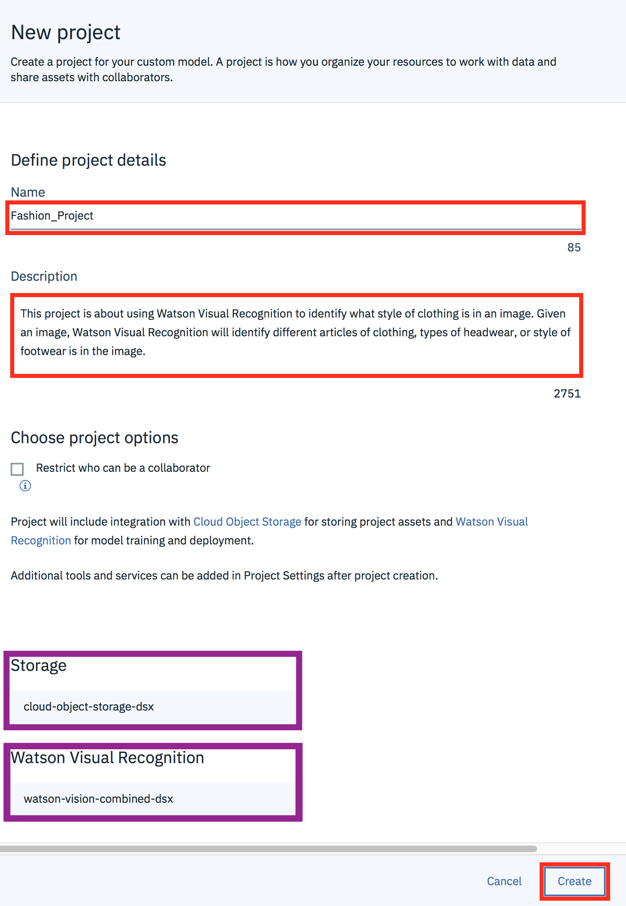
## Step 8: Selecting Built-in Models for Watson Visual Recognition
After creating your project, by default, you will land on the page where you can create your own custom models to classify objects -- but let's skip this step. Instead, let's use some existing image classification models that Watson Visual Recognition comes with by default!

To access the built-in models, click on the name of the service, as seen in the red box below:

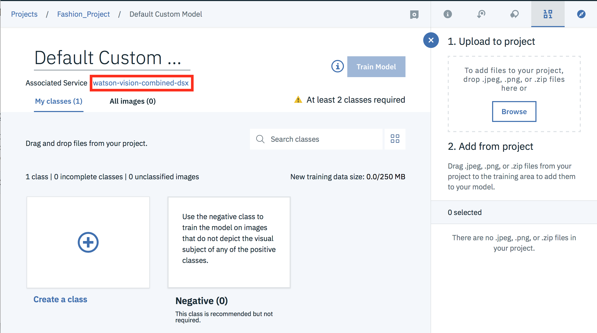
## Step 9: Choose the General model.
Now you can see all the built-in image classification models that IBM Watson provides! Let's try the General model.

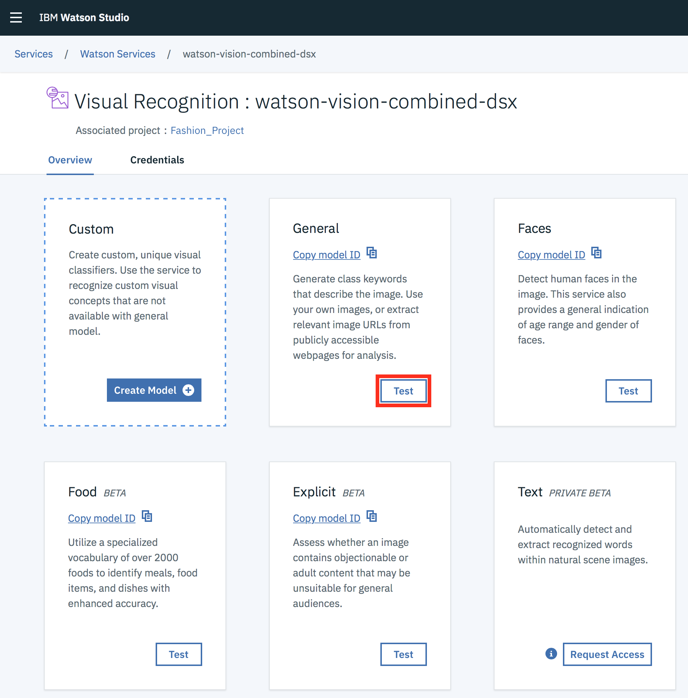
## Step 10: Try out the General model
To test the General model, click on Test.

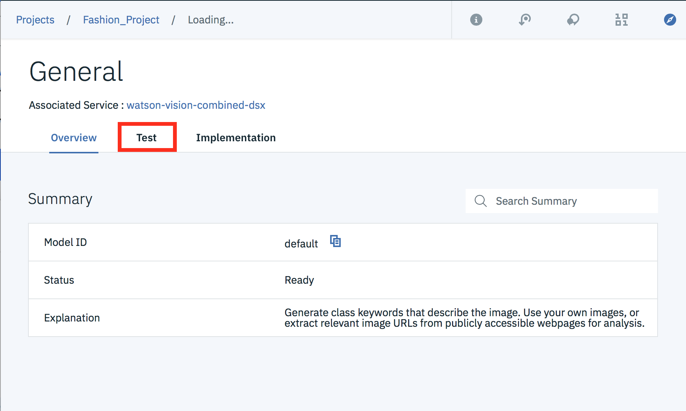
## Step 11: Upload Your Images!
Now you can upload any images you'd like by clicking on Browse.

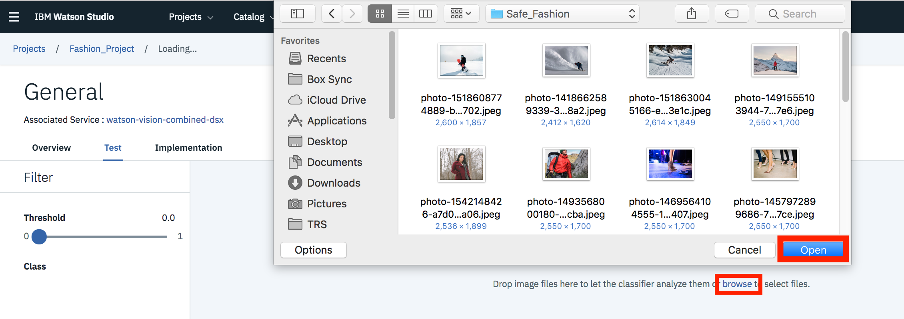
## Step 12: Check Out the Results!
Once you have uploaded your images, Watson Studio Visual Recognition will tell you what it thinks it found in your images! Beside each class of object (or color, age, etc.), it will also give you a confidence score (between 0 and 1) on how confident it thinks it found that particular object in your image (0 for lowest confidence and 1 for highest confidence).

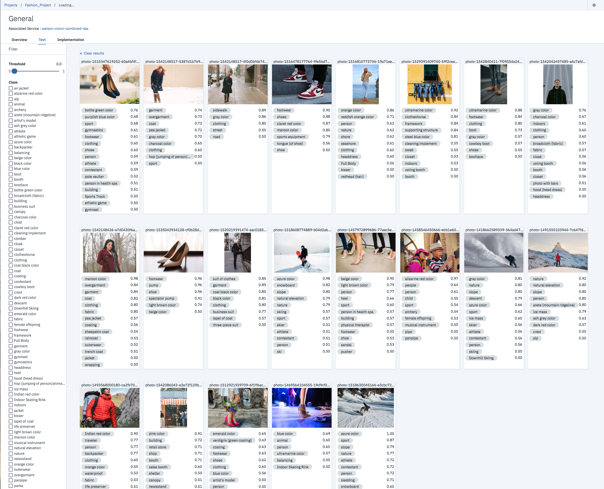
Step 13: Filter Your Results
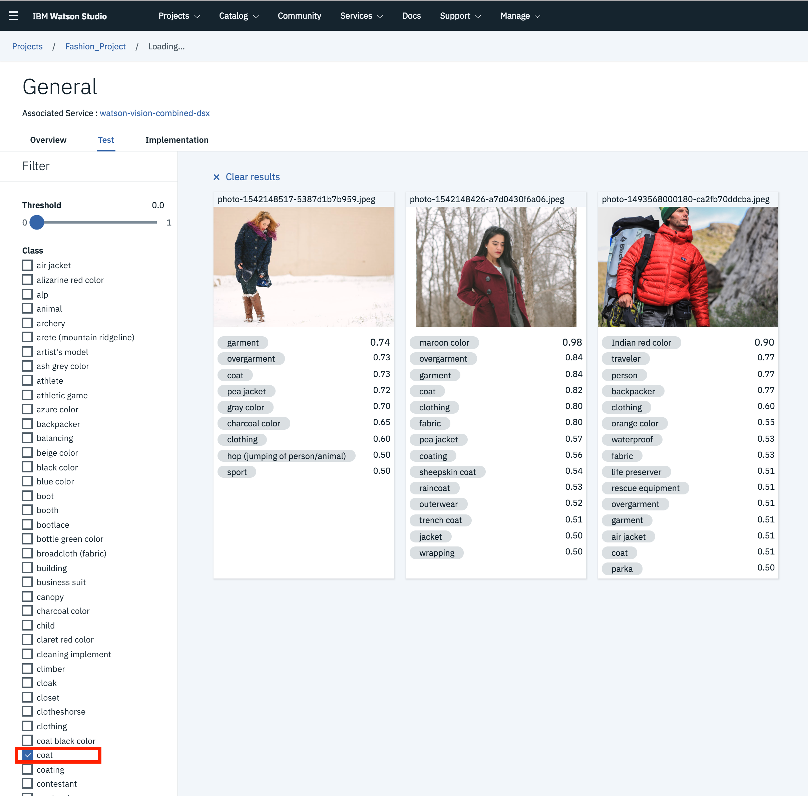