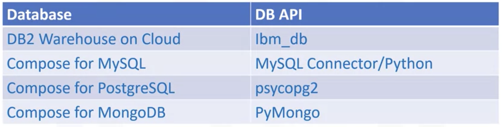
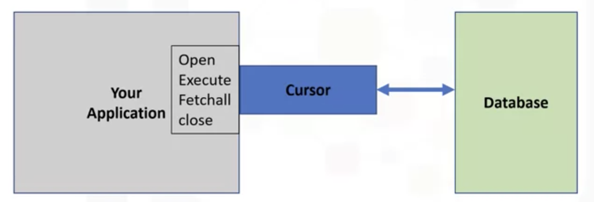
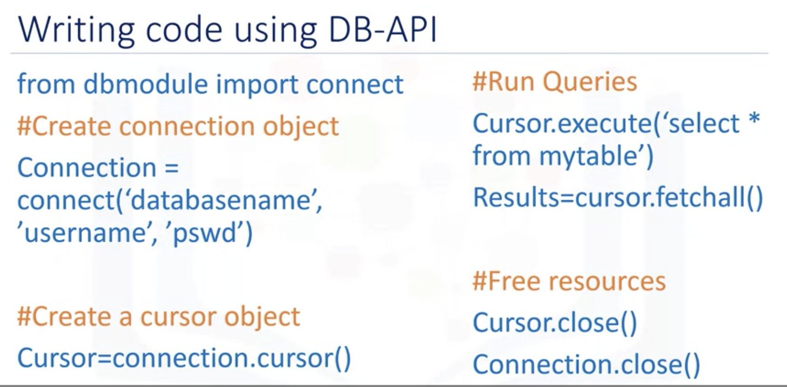

# Accessing Database using Python

* Describe concepts related to accessing Databases using Python
* Learn and Practice how to connect to a database from a Jupyter notebook
* Understand and demonstrate how to create tables and insert data from Python
* Write SQL queries and retrieve result sets from Python
* Practice how to perform simplified database access from Python using SQL magic
* Enumerate different type of JOIN operations
* Explain what is an INNER JOIN and practice hands-on
* Distinguish between different types of OUTER JOINs and apply your understanding

- [Accessing Database using Python](#accessing-database-using-python)
  - [Writing code using DB-API](#writing-code-using-db-api)
  - [Access mysql using workbrench](#access-mysql-using-workbrench)

## Writing code using DB-API

* The basic concepts related to the Python DB-API and database cursors. 
* Write code using DB-APIs

The two main concepts in the Python DB-API are connection objects and query objects.
* Connect objects
  * Database connections
  * Manage transactions
* Cursor Objects
  * Database Queries: Cursors are used to scan through the results of a database.
    
  * A database cursor is a control structure that enables traversal over the records in a database. It behaves like a file name or file handle in a programming language. Just as a program opens a filed accesses files contents, it opens a cursor to gain access to the query results. 
  * Another similarity is that just as file handle keeps track of the program's current position within an open file, a cursor keeps track of the program's current position within the query results. 
    

## Access mysql using workbrench

* Open MySQL from System Preferences > Initialize Database >
* Type your new password.
* Choose 'Use legacy password'
* Start the Server again.
* Now connect the MySQL Workbench