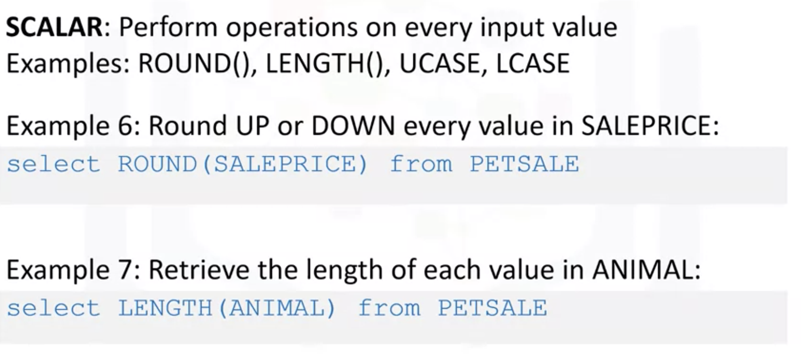
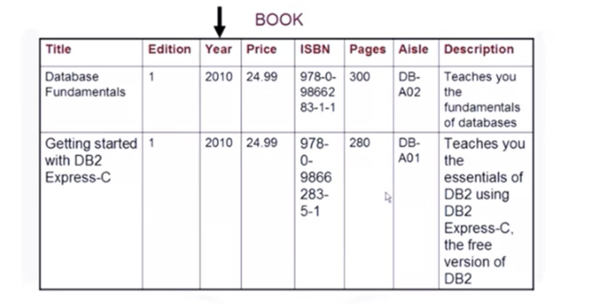

# Advanced SQL

* Explain how to use string patterns and ranges in SQL queries
* Demonstrate how to sort and order result sets
* Practice use of grouping data in result sets
* Employ Built-in functions in Queries
* Demonstrate how to write sub-queries and nested selects
* Build queries to access multiple tables

TABLE

- [Advanced SQL](#advanced-sql)
  - [Using String Patterns, Ranges](#using-string-patterns-ranges)
    - [like clause](#like-clause)
    - [between and clause](#between-and-clause)
    - [in clause](#in-clause)
  - [Sorting Result Sets](#sorting-result-sets)
    - [order by clause](#order-by-clause)
  - [Grouping Result Sets](#grouping-result-sets)
    - [Eliminating Duplicates distinct clause](#eliminating-duplicates-distinct-clause)
    - [Grouping Data with same attributes group by clause and as clause](#grouping-data-with-same-attributes-group-by-clause-and-as-clause)
    - [having clause with group by](#having-clause-with-group-by)
  - [Functions, Sub-Queries, Multiple Tables](#functions-sub-queries-multiple-tables)
    - [Built-in Database Functions](#built-in-database-functions)
      - [Aggregate or Column Function](#aggregate-or-column-function)
      - [SCALER and STRING FUNCTIONS](#scaler-and-string-functions)
    - [Date and Time Built-in Function](#date-and-time-built-in-function)
  - [Sub-Queries and Nested Selects](#sub-queries-and-nested-selects)
    - [Sub-Queries](#sub-queries)
    - [Column Expressions](#column-expressions)
    - [Table Expressions](#table-expressions)
  - [Multiple Tables](#multiple-tables)
    - [Sub-queries with multiple table](#sub-queries-with-multiple-table)
    - [Join with multiple table](#join-with-multiple-table)
  - [Relational Model Constraints](#relational-model-constraints)
    - [Relations](#relations)
    - [Constraints](#constraints)
      - [Entity integrity constraint](#entity-integrity-constraint)
      - [Referential integrity constraint](#referential-integrity-constraint)
      - [Semantic integrity constraint](#semantic-integrity-constraint)
      - [Domain constraint](#domain-constraint)
      - [Null constraint](#null-constraint)
      - [Check constraint.](#check-constraint)

[Lab-String Patterns, Sorting & Grouping Lab](Coursera-Database&32;and&32;SQL&32;for&32;Data&32;Science/Advanced&32;SQL/Lab-String&32;Patterns,&32;Sorting&32;&&32;Grouping&32;Lab)

[Lab-Built-in functions](Coursera-Database&32;and&32;SQL&32;for&32;Data&32;Science/Advanced&32;SQL/Lab-Built-in&32;functions)


## Using String Patterns, Ranges

* Describe how to simplify a SELECT statement by using string patterns, ranges or sets of values. 

Usually we can use ```select``` and ```where``` clause to retrive rows from data. 


But if we don't remember the condition concretely? Like their first name starts with R? 

So we can use string patterns

### ```like``` clause

For example, select first name from author, where firstname like 'R%'. This will return all rows in the author table whose author's first name starts with the letter R. And here is the result set.


### ```between and``` clause

What if we wanted to retrieve the list of books whose number of pages is more than 290, but less than 300. We could write the SELECT statement like this, specifying the WHERE clause as, where pages is greater than or equal to 290, and pages is less than or equal to 300. But in a relational database, we can use a range of numbers to specify the same condition. Instead of using the comparison operators greater than or equal to, we use the comparison operator 'between and'.


### ```in``` clause

In some cases, there are data values that cannot be grouped under ranges. For example, if we want to know which countries the authors are from. If we wanted to retrieve authors from Australia or Brazil, we could write the SELECT statement with the WHERE clause repeating the two country values. 

However, what if we want to retrieve authors from Canada, India and China? The WHERE clause would become very long repeatedly listing the required country conditions. Instead, we can use the N operator.


## Sorting Result Sets

* Descending order and explain how to indicate which column to use for the sorting order.

### ```order by``` clause

The order by clause is used in a query to sort the result set by a specified column. In this example, we have used order by on the column title to sort the result set. 

By default, the result set is sorted in ascending order. In this example, the result set is sorted in alphabetical order by book title. 

To sort in descending order, use the key word" desc." 

The result set is now sorted according to the column specified, which is title, and is sorted in descending order.The first three words of the title are the same, so the sorting starts from the point where the characters differ.


Instead of specifying the column name pages, the number two is used. In the select statement, the second column specified in the column list is pages, so the sort order is based on the values in the pages column.


## Grouping Result Sets

* Explain how to eliminate duplicates from a result set and describe how to further restrict a result set. 

### Eliminating Duplicates ```distinct``` clause

But some of the authors come from the same country, so the result set contains duplicates. However, all we need is a list of countries the authors come from. So in this case, duplicates do not make sense. To eliminate duplicates, we use the keyword distinct. Using the keyword "distinct" reduces the result set to just six rows. 


### Grouping Data with same attributes ```group by``` clause and ```as``` clause

But what if we wanted to also know how many authors come from the same country? So now we know that the 20 authors come from six different countries. But we might want to also know how many authors come from the same country. To display the result set listing the country and number of authors that come from that country, we add the "group by" clause to the select statement. 

Instead of using the column named "2", we can assign a column name to the result set. We do this using the "as" keyword. In this example, we change the derived column name "2" to column name "Count" using the "as count" keyword. 


### ```having``` clause with ```group by```

we can check if there are more than four authors from the same country. To set a condition to a "group by" clause, we use the keyword "having". The "having" clause is used in combination with the "group by" clause. 

It is very important to note that the "where" clause is for the entire result set, but **the "having" clause works only with the "group by" clause**. To check if there are more than four authors from the same country, we add the following to the select statement, having count country greater than four. Only countries that have five or more authors from that country are listed in the result set.


## Functions, Sub-Queries, Multiple Tables

### Built-in Database Functions


#### Aggregate or Column Function


  * SUM()
  * MIN()
  * MAX()
  * AVG()


#### SCALER and STRING FUNCTIONS

* ROUND()
* LENGTH()
* UCASE()
* LCASE()
* DISTINCT()




### Date and Time Built-in Function

* YEAR()
* MONTH()
* DAY()
* DAYOFMONTH()
* DAYOFWEEK()
* DAYOFYEAR()
* WEEK()
* HOUR()
* MINUTE()
* DECOND()


## Sub-Queries and Nested Selects

* Write sub-queries or nested selects statements.
* How sub-queries and nested queries can be used to form richer queries
* How they can overcome some of the limitations of aggregate functions.
* Use sub-queries in the WHERE clause, in the list of columns and in the FROM clause. 

### Sub-Queries


However,running following query will result in an error like the one shown. Indicating an invalid use of the aggregate function. One of the limitations of built in aggregate functions like the average function, is that they cannot always be evaluated in the WHERE clause. 


 Notice that the average function is evaluated in the first part of the sub-query. Allowing us to circumvent the limitation of evaluating it directly in the WHERE clause. 

### Column Expressions

 

 The sub-select doesn't just have to go in the WHERE clause. It can also go in other parts of the query such as in the list of columns to be selected. Such sub-queries are called **column expressions**. 

 

 Running this query will result in an error indicating that no group by clause is specified. We can circumvent this error by using the average function in a sub-query placed in the list of the columns.

### Table Expressions


Another option is to make the sub-query be part of the FROM clause. Sub-queries like these are sometimes called **derived tables or table expressions**. Because the outer query uses the results of the sub-query as a data source.


## Multiple Tables


Now, let's use sub-queries to work with multiple tables. If we want to retrieve only the employee records from the employees table for which a department ID exists in the departments table, we can use a sub-query as follows. 

### Sub-queries with multiple table


### Join with multiple table


## Relational Model Constraints

* Explain referencing, differentiate between a primary key and a foreign key 
* Identify apparent table and dependent table.

### Relations

Reference

At least one author writes one book. This is a one to one relationship. To look up the author information, the book entity refers to the author entity. In a relational data model, this is called referencing


Primary Key

Notice that the attributes author underscore Id, book underscore Id, and borrower underscore Id have a special icon. This identifies the primary key


Foreign Key

A primary key of a relational table uniquely identifies each row in a table. Notice the entities on the lower half of the screen, some attributes have FK in brackets next to them. For example, the copy entity has attribute book underscore Id with the FK in brackets. This identifies the foreign key. 

A foreign key is a set of columns referring to a primary key of another table.

Parent Table

A table containing a primary key that is related to at least one foreign key is called a parent table. 

In the example, the author entity is the parent table. The book entity is also a parent table. 

Child Table

A table containing one or more foreign keys is called a dependent table. It might also be referred to as a child table. 

### Constraints

There are six constraints in relational model.

#### Entity integrity constraint

To identify each topple in a relation, the relation must have a primary key. The primary key is a unique value that identifies each topple or row in a table. This is the entity integrity constraint.

#### Referential integrity constraint

Referential integrity constraint defines relationships between tables and ensures that these relationships remain valid. The validity of the data is enforced using a combination of primary keys and foreign keys.


#### Semantic integrity constraint

The semantic integrity constraint refers to the correctness of the meaning of the data. For example, in the relation author, if the attribute or column city contains a garbage value instead of Toronto, the garbage value does not have any meaning. The semantic integrity constraint is related to the correctness of the data. 


#### Domain constraint

A domain constraint specifies the permissible values for a given attribute. For example, in the relation author, the attribute country must contain a two letter country code such as CA for Canada or IN for India. If a number value of 34 is entered for the country attribute instead of a two let her country code, the value 34 does not have any meaning. 


#### Null constraint

The null constraint specifies that attribute values cannot be null. For example, in the relation author, if either last name or first name contains a null value, it could be difficult to identify the correct author. In this example, first name and last name attribute values cannot be null and author must have a name. 


#### Check constraint. 

The check constraint **enforces** domain integrity by limiting the values that are accepted by an attribute. The relation author does not have a suitable attribute to explain the check constraint. So we will use the relation book. In the relation book, the attribute year is the year in which a particular book is published. This was still the year 2010. It would not be meaningful to have a year greater than the current year. The check constraint would enforce the domain integrity by limiting the values that are accepted by the attribute year.

