# Introduction to Databases and Basic SQL

- [Introduction to Databases and Basic SQL](#introduction-to-databases-and-basic-sql)
  - [Introduction](#introduction)
    - [What is SQL](#what-is-sql)
    - [What is database](#what-is-database)
    - [What is relational database](#what-is-relational-database)
    - [What is RDBMS](#what-is-rdbms)
    - [What are basic command of database](#what-are-basic-command-of-database)
  - [Cloud database](#cloud-database)
    - [IBM DB2](#ibm-db2)
  - [Basic SQL](#basic-sql)
    - [Distinguish between](#distinguish-between)
    - [Create and Drop a Table](#create-and-drop-a-table)
    - [Select statement in database](#select-statement-in-database)
    - [Count Distinct Limit function in SQL](#count-distinct-limit-function-in-sql)
    - [Insert statement](#insert-statement)
    - [Update and Delete statement](#update-and-delete-statement)
  - [Relational Database Concepts](#relational-database-concepts)
    - [Information model and Data model](#information-model-and-data-model)
    - [Types of Relationships](#types-of-relationships)
    - [Relational Model](#relational-model)
  - [Additional Information](#additional-information)
    - [Create Schema](#create-schema)
      - [CREATE TABLE Statement](#create-table-statement)
      - [SELECT Statement](#select-statement)


[Lab - Composing and Running basic SQL queries](Lab&#32;-&#32;Composing&#32;and&#32;Running&#32;basic&#32;SQL&#32;queries.md)

## Introduction

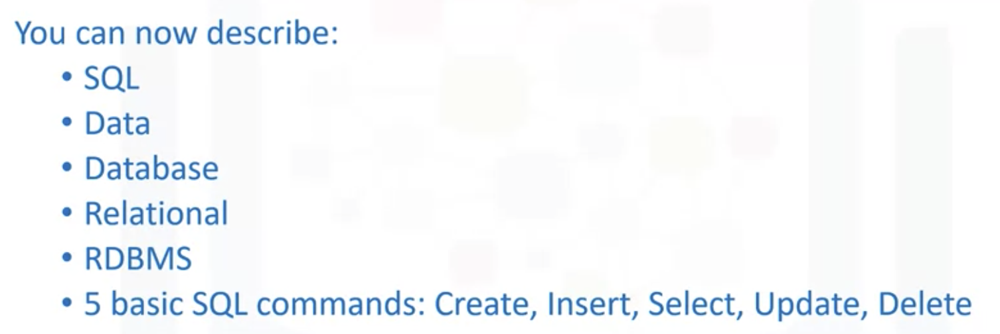

### What is SQL
SQL is a language used for relational databases to query or get data out of a database.

And is short for its original name Structured English Query Language.

### What is database
But what is data and what is a database? Data is a collection of facts in the form of words, numbers or even pictures. Data is one of the most critical assets of any business. It is used and collected practically everywhere.

Databases are everywhere and used every day but they are largely taken for granted. A database is a repository of data. It is a program that stores data.

### What is relational database
There are different kinds of databases of different requirements. The data can be stored in various forms. When data is stored in tabular form, the data is organized in tables like in a spreadsheet, which is columns and rows. That's a relational database. 

### What is RDBMS
A set of software tools for the data in the database is called a database management system or DBMS for short. The terms database, database server, database system, data server and database management systems are often used interchangeably. For relational databases, it's called a relational database management system or RDBMS.

Examples of relational database management systems are, my SQL, Oracle Database, DB2 Warehouse on Cloud and DB2 Express C. 

### What are basic command of database
For the majority of people using a database, there are five simple commands to create a table, insert data to populate the table, select data from the table, update data in the table, delete data from the table.

## Cloud database

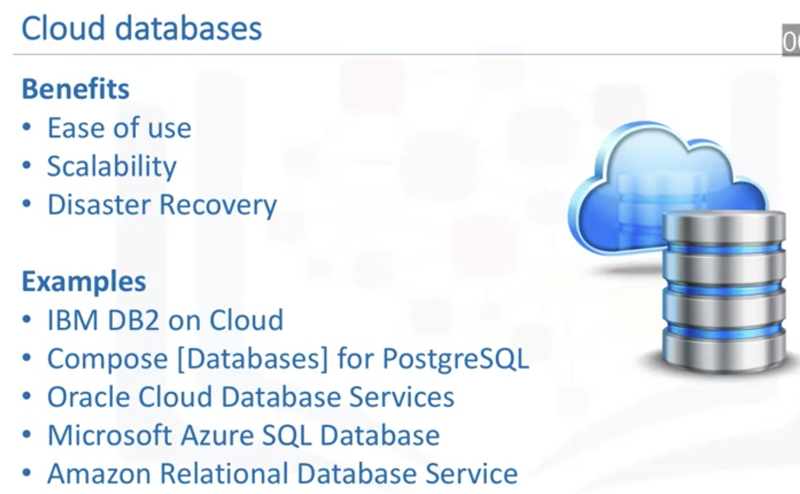

A few examples of cloud SQL databases are IBM Db2 on Cloud, Compose for PostgreSQL, Oracle Database Cloud, Microsoft Azure Cloud - SQL Database, Amazon Relational Database Services, which can run in the Cloud, either in a virtual machine or as a service depending on the vendor.

### IBM DB2 

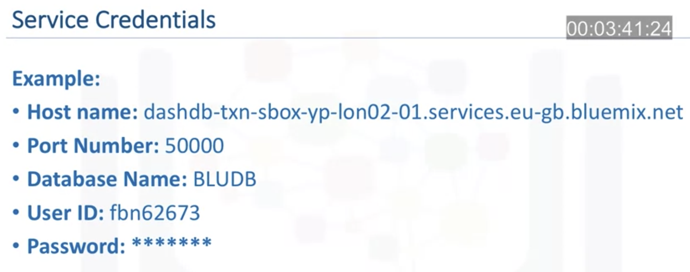

## Basic SQL

### Distinguish between 
* data definition language statements 
* data manipulation language statements

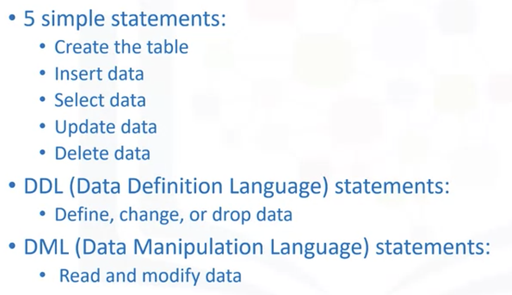

### Create and Drop a Table

Here we will look at some examples to create and drop tables.

In the previous video we saw the general syntax to create a table:

```sql
create table TABLENAME (
    COLUMN1 datatype,
    COLUMN2 datatype,
    COLUMN3 datatype,
        ...
    ) ;
```

Therefore to create a table called TEST with two columns - ID of type integer, and Name of type varchar, we could create it using the following SQL statement:

```sql
create table TEST (
    ID integer,
    NAME varchar(30)
    );
```

Now let's create a table called COUNTRY with an ID column, a two letter country code column, and a variable length country name column:

```sql
create table COUNTRY (
    ID int,
    CCODE char(2),
    NAME varchar(60)
    );
```

Sometimes you may see additional keywords in a create table statement:

```sql
create table COUNTRY (
    ID int NOT NULL,
    CCODE char(2),
    NAME varchar(60),
    PRIMARY KEY (ID)
    );
```

In the above example the ID column has the "NOT NULL" constraint added after the datatype - meaning that it cannot contain a NULL or an empty value. If you look at the last row in the create table statement above you will note that we are using ID as a Primary Key and the database does not allow Primary Keys to have NULL values. A Primary Key is a unique identifier in a table, and using Primary Keys can help speed up your queries significantly.

If the table you are trying to create already exists in the database, you will get an error indicating "table XXX.YYY already exists". To circumvent this error, either create a table with a different name or first DROP the existing table. It is quite common to issue a DROP before doing a CREATE in test and development scenarios.

Here is an example:

```sql
drop table COUNTRY;
create table COUNTRY (
    ID integer PRIMARY KEY NOT NULL,
    CCODE char(2),
    NAME varchar(60)
    );
```

WARNING: before dropping a table ensure that it doesn't contain important data that can't be recovered easily.

Note that if the table does not already exist and you try to drop it, you will see an error like "XXX.YYY is an undefined name". You can ignore this error as long as the subsequent CREATE statement executed successfully.

### Select statement in database

* Retrieve data from a relational database table
* Find the use of a predicate.
* Identify the syntax of the SELECT statement using the WHERE clause.
* List the comparison operators supported by a relational database management system.

The general syntax of SELECT statments is:

```sql
select COLUMN1, COLUMN2, ... from TABLE1 ;
```

To retrieve a list of all country names and their IDs from the COUNTRY table we would issue:

```sql
select ID, NAME from COUNTRY ;
```

To retrieve all columns from the COUNTRY table we could use "*" instead of specifying individual column names:

```sql
select * from COUNTRY ;
```

The WHERE clause can be added to your query to filter results or get specific rows of data. To retrieve data for all rows in the COUNTRY table where the ID is less than 5:
```sql
select * from COUNTRY where ID < 5 ;
```

In case of character based columns the values of the predicates in the where clause need to be enclosed in single quotes. To retrieve the data for the country with country code "CA" we would issue:
```sql
select * from COUNTRY where CCODE = 'CA'; 
```

### Count Distinct Limit function in SQL

COUNT is a built-in database function that retrieves the number of rows that match the query criteria.

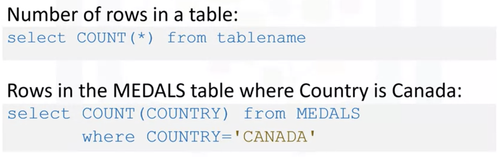

DISTINCT is used to remove duplicate values from a result set.

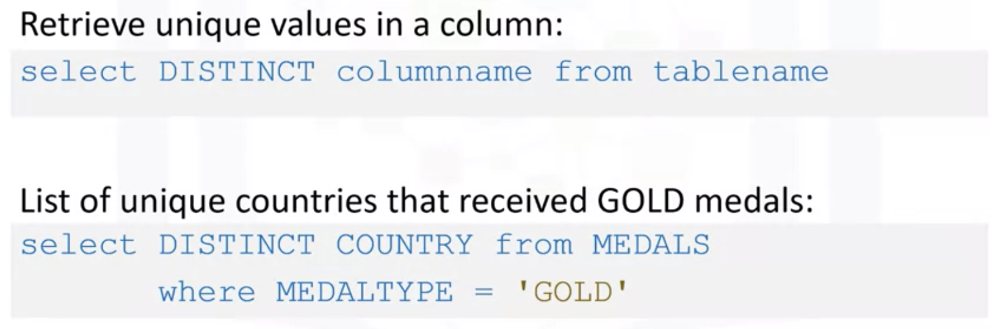

LIMIT is used for restricting the number of rows retrieved from the database.

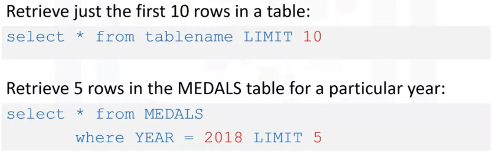

### Insert statement

* Identify the syntax of the INSERT statement
* Explain two methods to add rows to a table.

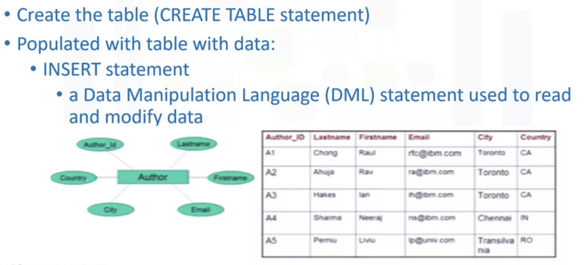

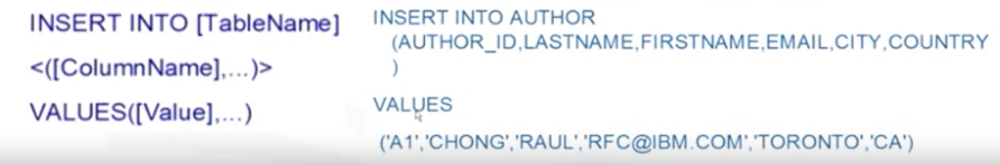

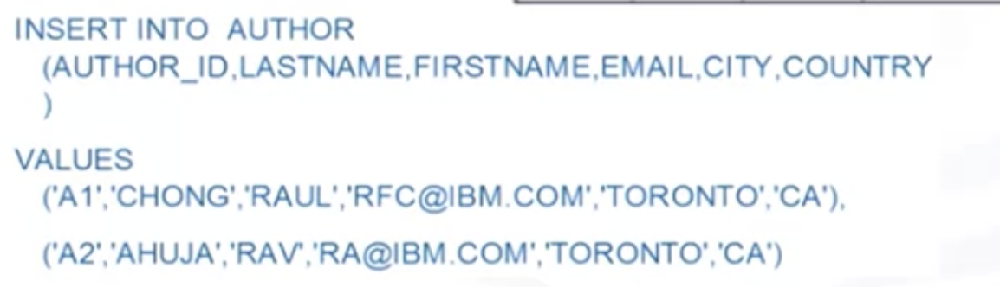

### Update and Delete statement

* Identify the syntax of the UPDATE statement and DELETE statement
* Explain the importance of the WHERE clause in these statements.

Update

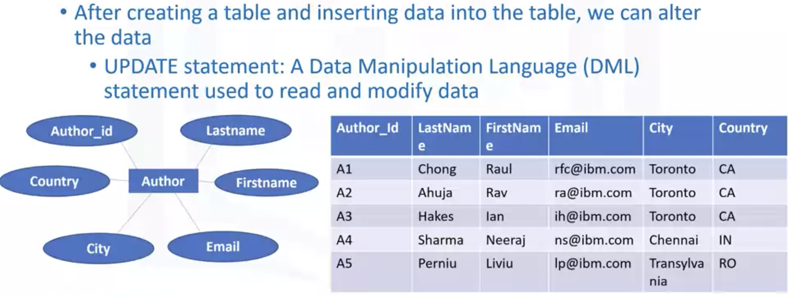

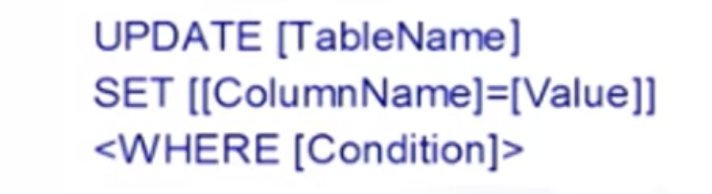

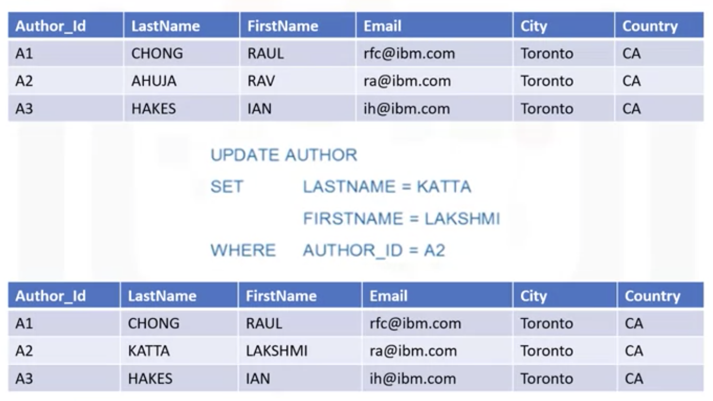

Delete

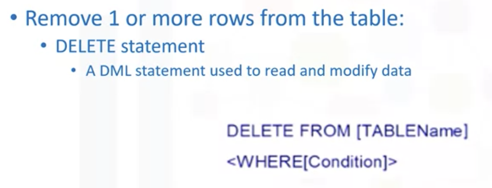

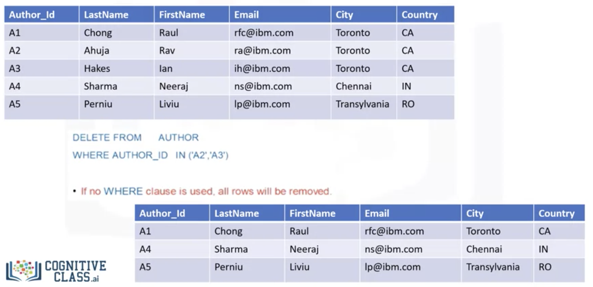

## Relational Database Concepts

It provides additional terminology and concepts about the relational model and relational databases.

* Describe the difference between an information model and a data model.
* Explain the advantage of the relational model.
* Describe the difference between an entity and an attribute. 

### Information model and Data model

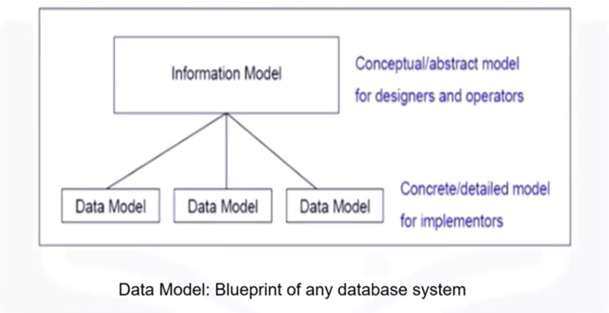

* The entities being modeled can be from the real world, such as a library. 

* Information models and data models are different and serve different purposes. 
  * An information model is at the conceptual level and defines relationships between objects. 

    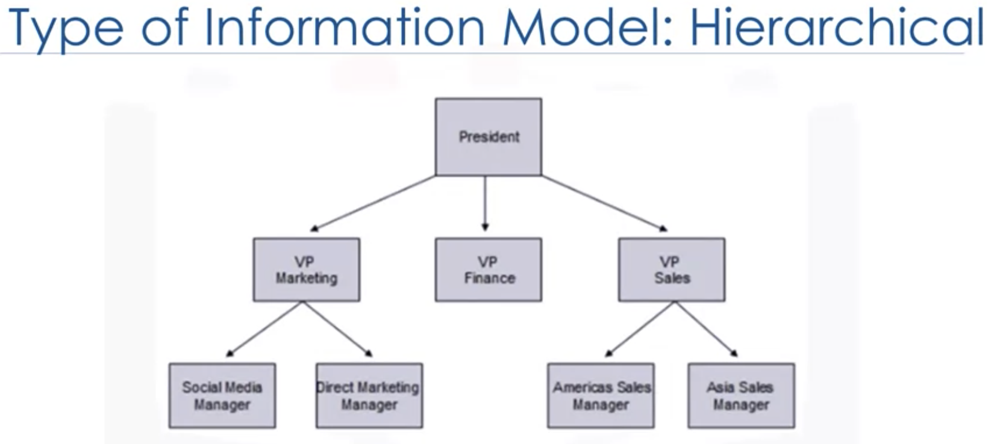

* Data models are defined in a more concrete level, are specific and include details. 
  * A data model is the blueprint of any database system. 
  * The relational model is the most used data model for database
    * Advantages: 
      * logical data independence,  
      * physical data independence,     
      * and physical storage independence
  * An entity-relationship data model or ER data model, is an alternative to a relational data model
    * In the ER model, entities are objects that exist independently of any other entities in the database. It is simple to convert an ER diagram into a collection of tables. 
    * The building blocks of an ER diagram are **entities** and **attributes**. Entities have attributes, which are the data elements that characterize the entity. Attributes tell us more about the entity. 
    * In an ER diagram, an **entity** is drawn, as a **rectangle**, and **attributes** are drawn as **ovals**. Entities can be a noun, person, place, or thing.
    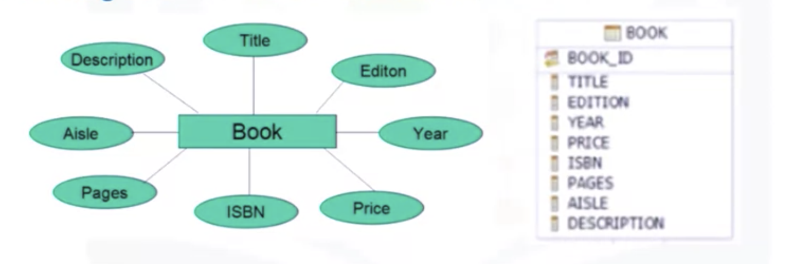
  * Using a simplified library database as an example, this figure shows an Entity Relationship Diagram or ERD, that represents entities called tables and their relationships.

    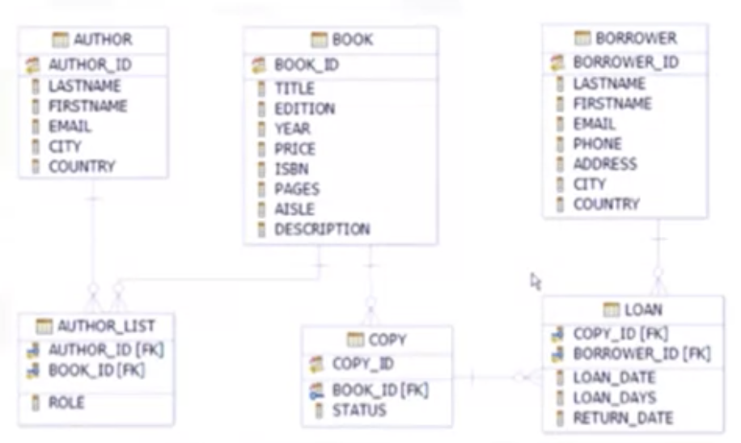

### Types of Relationships

* Building blocks of a relationship
* Explain the symbols used in a relationship set
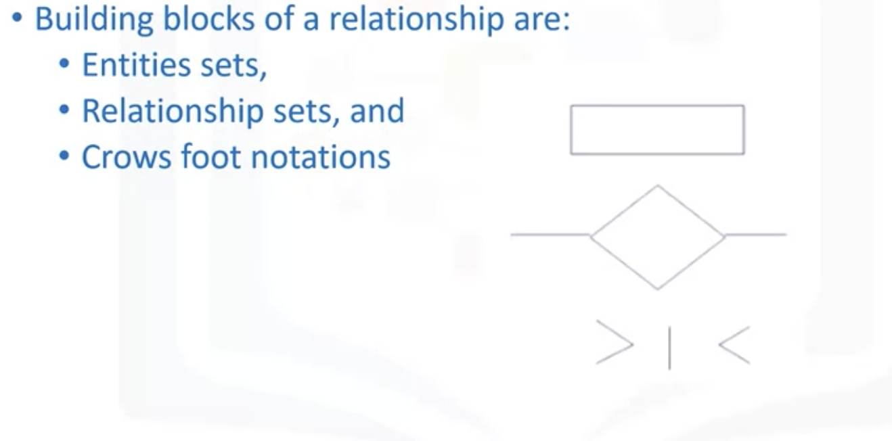
* Describe the difference between the one-to-one and many-to-many relationship.
  * One to one relationship
    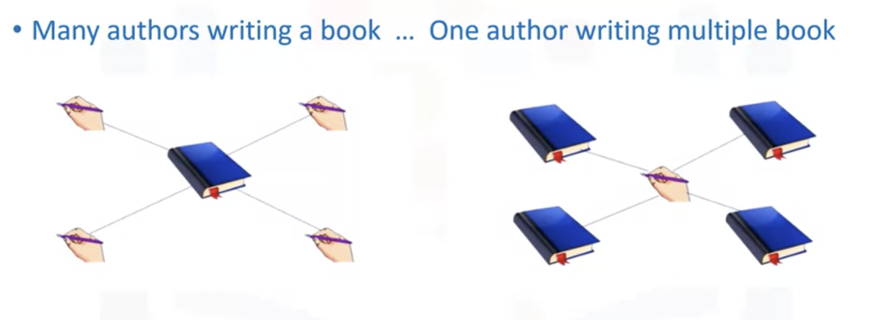
    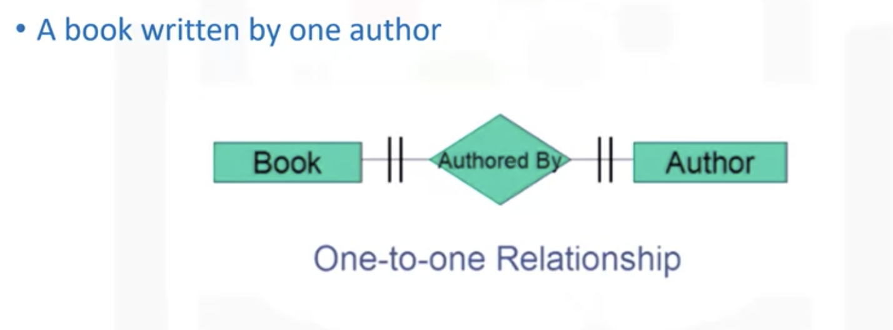
  * One to many relationship
    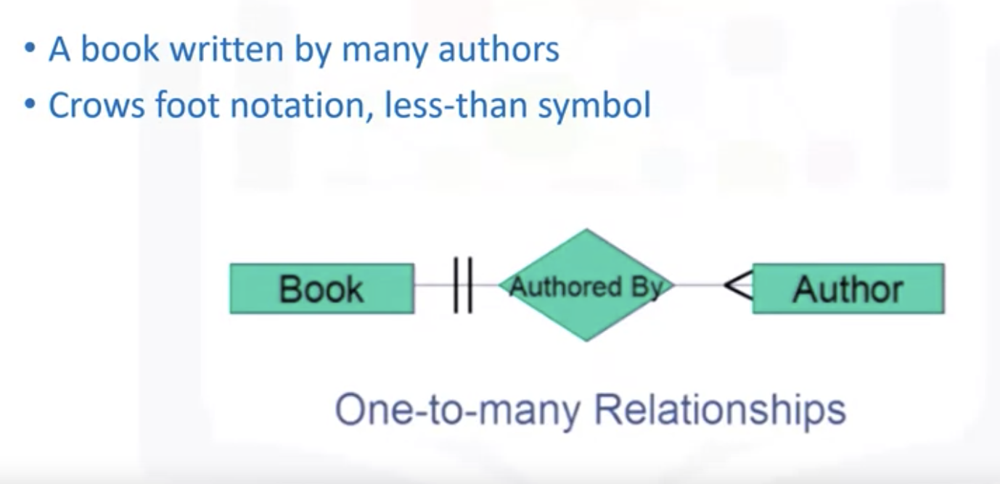
  * Many to many relationship
    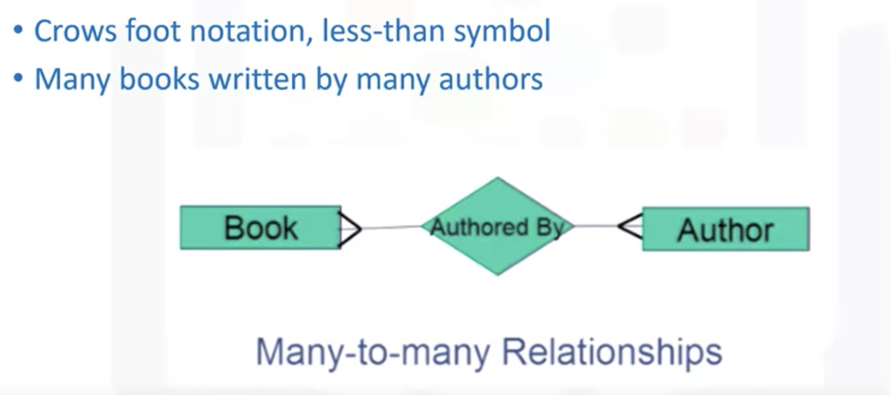

### Relational Model

* Define the relational terms, relation, degree and cardinality 
  * The building blocks of the relational model are relation and sets.
    * A relation is a mathematical concept based on the idea of sets. 
    * A set is unordered collection of distinct elements. 
      * It is a collection of items of the same type. It would have no order and no duplicates
  *  A relational database is a set of relations. 
     *  A relation is also the mathematical term for a table. 
        *  A table is a combination of rows and columns. 
  *  A relation is made up of two parts, relational schema and relational instance.
     *  A relational schema specifies the name of a relation and the attributes.
        *  The example here is the entity author. Author is the name of the **relation**. Author_ ID is an attribute which can hold the data type char, which is a character string of a fixed length. Likewise, lastname, firstname, email and city have the data type varchar, which is a character string of a variable length. The last attribute country, also has a data type of char. This constitutes the **relational schema**.
     *  A relational instance is a table made up of the attributes or columns and the tuples or rows. The columns are the attributes or fields. The rows are tuples.
        *  Degree refers to the number of attributes or columns in a relation. 
        *  Cardinality refers to the number of tuples or rows. 
        *  In this example, the degree is six because there are six columns, and the cardinality is five because there are five tuples or rows.
* Explain the difference between a relational schema and a relational instance.
  * A relational schema specifies the name of a relation and the attributes.
  * A relational instance is a table made up of the attributes or columns and the tuples or rows.

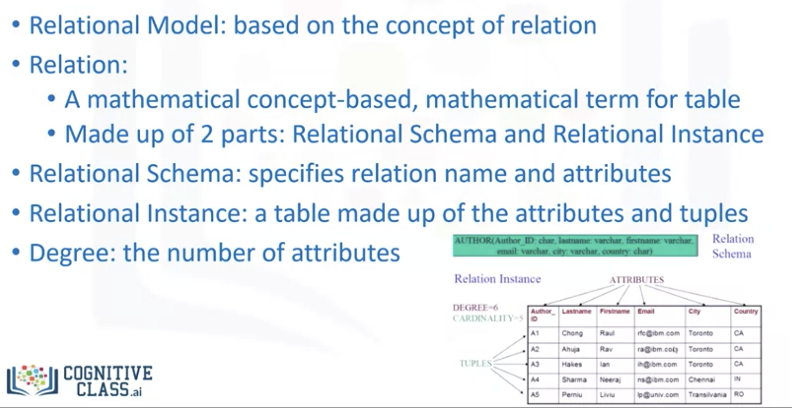

## Additional Information
This section gives more detailed explanation about concepts that were not covered in the videos in this module.

### Create Schema
A SQL schema is identified by a schema name, and includes a authorization identifier to indicate the user or account who owns the schema. Schema elements include tables, constraints, views, domains and other constructs that describe the schema.

A schema is created using the CREATE SCHEMA statement. For example, we can create a schema called LIBRARY for this course:

```sql
CREATE SCHEMA LIBRARY AUTHORIZATION ‘Robert’
```

The data types used can be: numeric, character-string, bit-string, Boolean, DATE, timestamp, etc.


#### CREATE TABLE Statement
The CREATE TABLE statement includes these clauses:

* DEFAULT

* CHECK

Use the DEFAULT clause in the CREATE TABLE statement to specify the default value for the database server to insert into a column when no explicit value for the column is specified.

Use the CHECK clause to designate conditions that must be met before data can be assigned to a column during an INSERT or UPDATE statement.

During an insert or update, if the check constraint of a row evaluates to false, the database server returns an error. The database server does not return an error if a row evaluates to NULL for a check constraint. In some cases, you might want to use both a check constraint and a NOT NULL constraint.

#### SELECT Statement
The basic structure of the SELECT statement is formed from three clauses: SELECT, FROM and WHERE.

```<attribute list>``` is a list of attribute names whose values are to be retrieved by the query

```<table list>``` is a list of the relation names required to process the query

```<condition>``` is a conditional(Boolean) expression that identifies the tuples to be retrieved by the query

In situations where you might want to use multiple IF-THEN-ELSE statements, you can often use a single SELECT statement instead. The SELECT statement allows a CLIST to select actions from a list of possible actions. An action consists of one or more statements or commands. The SELECT statement has the following syntax, ending with the END statement. You can use the SELECT statement with or without the initial test expression.
```sql
SELECT [test expression]

WHEN [expression1]

...

(action)

...

WHEN [expression2]

WHEN [expression3]

...

[OTHERWISE]

...

(action)

...

END
```