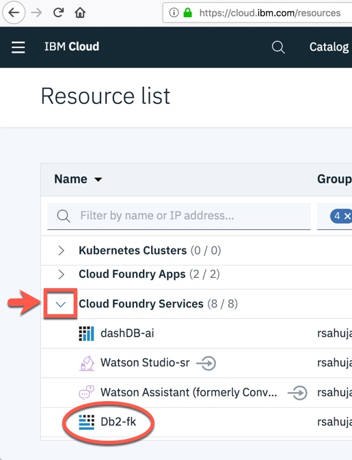
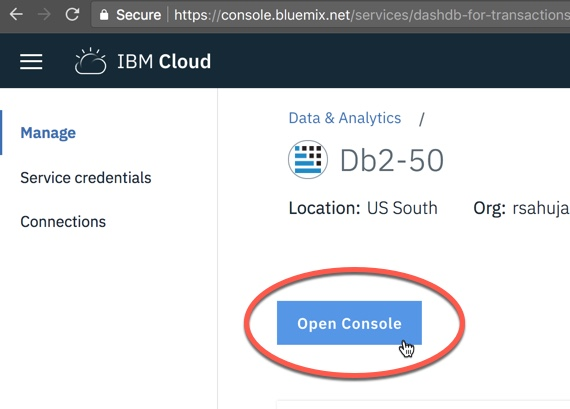
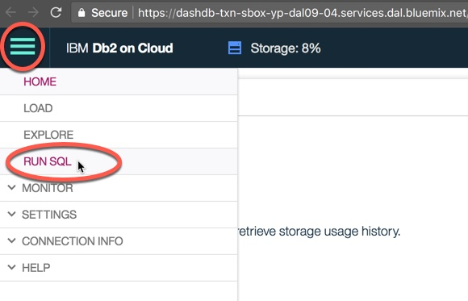
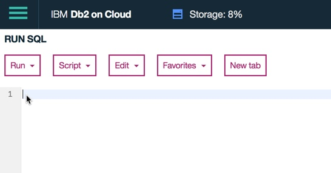
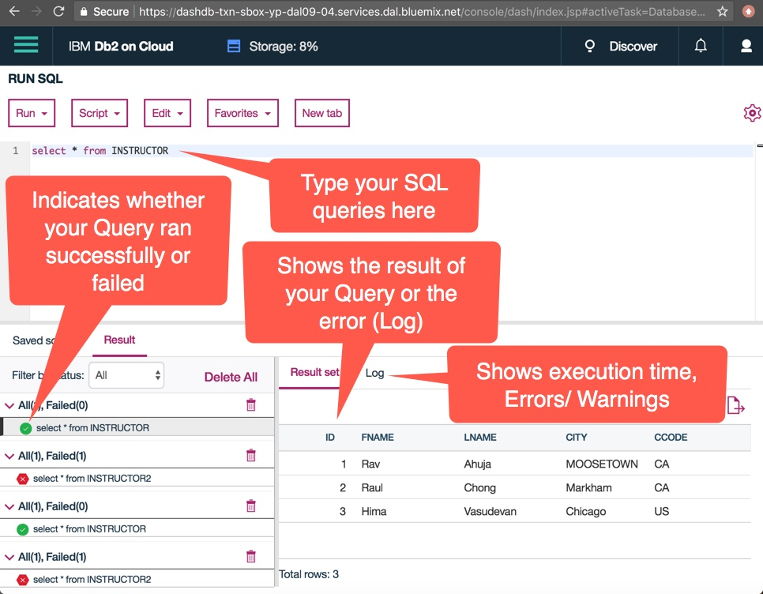
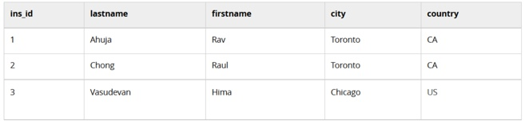

# Lab: Composing and Running basic SQL queries

- [Lab: Composing and Running basic SQL queries](#lab-composing-and-running-basic-sql-queries)
  - [How to use the IBM DB2](#how-to-use-the-ibm-db2)
  - [Now let’s practice creating and running some SQL queries in the SQL editor.](#now-lets-practice-creating-and-running-some-sql-queries-in-the-sql-editor)

So far in this module you learned about the five basic SQL statements to create tables, insert data, select results, update and delete data. In this lab you will practice composing and running these statements hands-on.

To write and execute the SQL statements in this lab, you will need to launch the SQL editor (Run SQL) in your Db2 database instance on IBM Cloud that you created in the previous lab.

NOTE: some users have reported issues performing this lab using Microsoft Edge. It is recommended using Google Chrome or Mozilla Firefox as your web browser to complete these labs.

[Cloud resources](https://cloud.ibm.com/resources)

## How to use the IBM DB2

First you will launch the SQL editor in the Db2 console using the following steps:


* Go to your IBM Cloud dashboard (you may need to log into IBM Cloud in the process):
* Expand the Cloud Foundry Services and locate and click on your instance of Db2 you provisioned in the previous lab (the name typically starts with Db2-xx for example Db2-fk, Db2-50, etc.)
* Click on the Open Console button.


* The Db2 console will open in a new tab in your web browser. Click on the 3 bar menu icon in the top left corner and then click on RUN SQL.



* The SQL editor will open where you can start typing and running queries.



The SQL editor has several areas for different things:



## Now let’s practice creating and running some SQL queries in the SQL editor.

Consider the following table called INSTRUCTOR:



Task 0: Drop the table INSTRUCTOR from the database in case it already exists, so that we start from a clean state.

(Hint: Ignore the undefined error if this table does not already exist in your database)

Task 1: Create the INSTRUCTOR table as defined above. Have the ins_id be the primary key, and ensure the lastname and firstname are not null.

(Hint: ins_id is of type INTEGER, country of type CHAR(2), and rest of the fields VARCHAR)

Task 2A: Insert one row into the INSTRUCTOR table for the the instructor Rav Ahuja.

(Hint: values for the character fields require a singe quotation mark (') before and after each value)

Task 2B: Insert two rows at once in the INSTRUCTOR table for instructors Raul Chong and Hima Vasudevan.

(Hint: list the values for the second row after the first row)

Task 3: Select all rows from the INSTRUCTOR table.

Task 3B: Select the firstname, lastname and country where the city is Toronto

Task 4: Update the row for Rav Ahuja and change his city to Markham.

Task 5: Delete the row for Raul Chong from the table.

Task 5B: Retrieve all rows in the INSTRUCTOR table

```sql
DROP table INSTRUCTOR;
CREATE table INSTRUCTOR(
	ins_id INTEGER not null,
	lastname CHAR(30),
	firstname CHAR(30),
	city CHAR(20),
	country CHAR(2),
	PRIMARY KEY (ins_id)
);
INSERT INTO INSTRUCTOR(
	ins_id,lastname,firstname,city,country
) VALUES(
	1, 'Ahuja', 'Rav', 'Tornoto', 'CA'
);
INSERT INTO INSTRUCTOR(
	ins_id,lastname,firstname,city,country
) VALUES(
	2,'Chong','Raul','Toronto','CA'
),(
	3, 'Vasudevan', 'Hima', 'Chicago', 'US'
);
SELECT * FROM INSTRUCTOR;
SELECT firstname, lastname, country FROM INSTRUCTOR WHERE city = 'Toronto';
UPDATE INSTRUCTOR SET city = 'Markham' WHERE ins_id = 1;
DELETE FROM INSTRUCTOR WHERE firstname = 'Raul' AND lastname = 'Chong';
SELECT * FROM INSTRUCTOR;
```