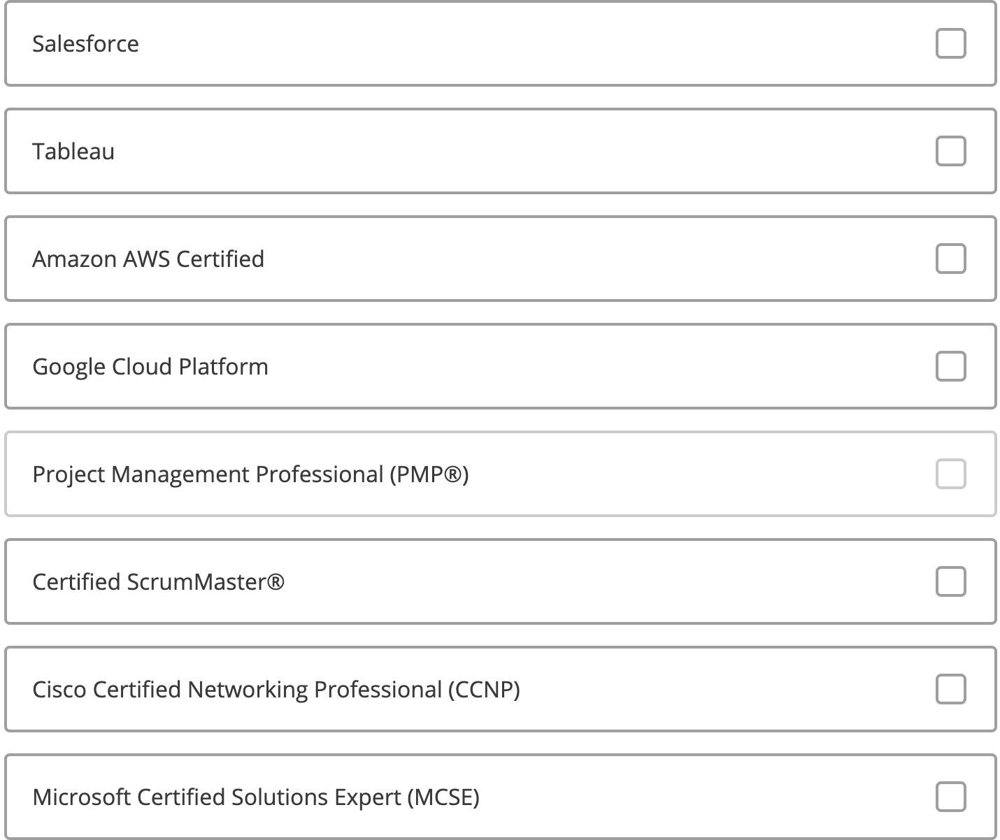

# Data Science Self Learning Related

- [Data Science Self Learning Related](#data-science-self-learning-related)
  - [Research](#research)
  - [Coursera](#coursera)
    - [Data Science Introduction](#data-science-introduction)
    - [Open Source Tools for Data Science](#open-source-tools-for-data-science)
    - [Data Science Methodology](#data-science-methodology)
    - [Python for Data Science an AI](#python-for-data-science-an-ai)
    - [Database and SQL for Data Science](#database-and-sql-for-data-science)
  - [Server](#server)
    - [Shell Self-learning](#shell-self-learning)

## Research

* [腾讯云-2017 DS 学习路线](https://cloud.tencent.com/developer/article/1102892)
* [Northeastern University Data Science Career Design](https://careers.northeastern.edu/article/data-science/)
* BA course preparation  
    ▶ 数据分析MSBA：
    * 课程：
      * 微积分
      * 线性代数
      * 概率/统计
    * 计算机/编程语言：
      * SPSS/R/SAS
      * 基础语言 C/VBA

    ▶ 数据科学Data Science:
    * 课程：
        * 统计理论
        * 数据挖掘/Machine Learning
        * Optimization
        * 数据可视化
    * 计算机/编程语言：
      * R/SAS
      * 数据库SQL
      * 面向对象编程Python

* Certifications

## Coursera

### Data Science Introduction

* [Indntifying objects in images with IBM Waston](Coursera-DataScience/Identifying&#32;objects&#32;in&#32;images&#32;with&#32;IBM&#32;Waston.md)
* [Create a Speech to Text Instance](Coursera-DataScience/Create&#32;a&#32;Speech&#32;to&#32;Text&#32;Instance.md)

### Open Source Tools for Data Science

1. [IBM Cloud](https://cloud.ibm.com/)
2. [IBM Studio](https://cloud.ibm.com/)
3. [IBM Skills Network Labs](https://labs.cognitiveclass.ai/)

### [Data Science Methodology](Coursera-Data&#32;Science&#32;Methodology/Syllabus.md)

### [Python for Data Science an AI](Coursera-Python&#32;for&#32;Data&#32;Science&#32;and&#32;AI/Syllabus.md)

### [Database and SQL for Data Science](Coursera-Database&#32;and&#32;SQL&#32;for&#32;Data&#32;Science/Syllabus.md)

## Server

### [Shell Self-learning](Shell%20Learning/Shell%20Learning.md)