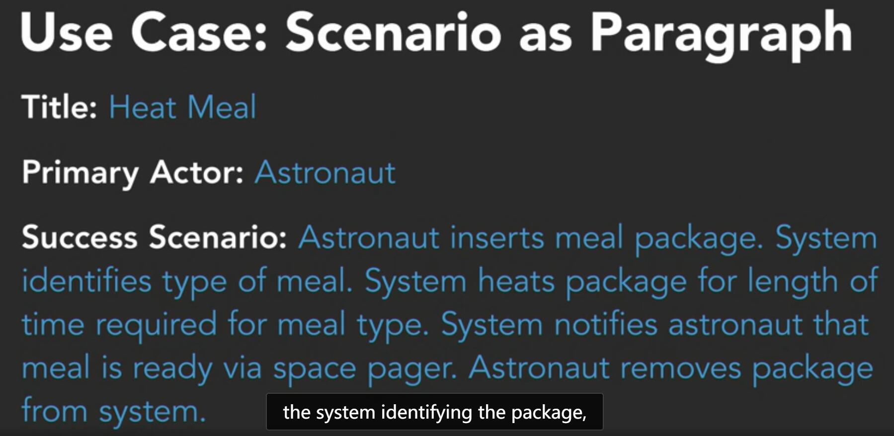

# Use case

## Use cases

* Title: What is the goal
* Primary Actor: Who desires it?
* Success Scenario: How is it accomplished?
* Preconditions: What need to be prepared

Keep the title short and simple

Actor can be more specific like customers, cumputer system, etc

Scenario often descript the success situation. And it will look better if ordered in steops.

But you can alos add some extension for what happens when things go wrong

Want more? Use **fully dressed use case**

## Steps

* Identifying actors: It is not necessarily to figure out who is the primary actor. It is fine that there are many actors in on use case

* Identifying the scenarios: Focus on the intention and typical situation. And use **active voice** to descript the scenarios

    >Bad one: The system is provided with the meal package by the astronaut

    >Better one: Astronaut inserts meal package

## Diagramming use cases