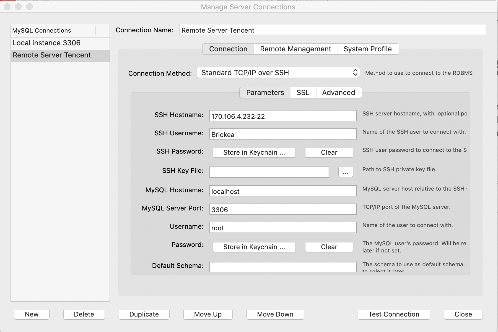

# Connect to remote MySQL

- [Connect to remote MySQL](#connect-to-remote-mysql)
  - [Using WorkBrench](#using-workbrench)
    - [Check default protal](#check-default-protal)
    - [Use SSH Method to connnect to mysql](#use-ssh-method-to-connnect-to-mysql)
  - [Using ip and Python to connect to Mysql](#using-ip-and-python-to-connect-to-mysql)

## Using WorkBrench

### Check default protal

```shell
 如何查看mysql 默认端口号和修改端口号 2015-03-19 17:42:18
 
 
1. 登录mysql
 
[root@test /]# mysql -u root -p
Enter password:
 
 
2. 使用命令show global variables like 'port';查看端口号
 
mysql> show global variables like 'port';
+---------------+-------+
| Variable_name | Value |
+---------------+-------+
| port | 3306 |
+---------------+-------+
1 row in set (0.00 sec)
 
 
3. 修改端口，编辑/etc/my.cnf文件，早期版本有可能是my.conf文件名，增加端口参数，并且设定端口，注意该端口未被使用，保存退出。
 
[root@test etc]# vi my.cnf
[mysqld]
port=3506
datadir=/var/lib/mysql
socket=/var/lib/mysql/mysql.sock
user=mysql
# Disabling symbolic-links is recommended to prevent assorted security risks
symbolic-links=0
 
[mysqld_safe]
log-error=/var/log/mysqld.log
pid-file=/var/run/mysqld/mysqld.pid
 
"my.cnf" 11L, 261C written
[root@test etc]#
 
4. 重新启动mysql
 
[root@test ~]# sudo systemctl restart mysqld
Stopping mysqld: [ OK ]
Starting mysqld: [ OK ]
 
5.再次登录后检查端口已修改为’3506’.
 
[root@test etc]# mysql -u root -p
Enter password:
Welcome to the MySQL monitor. Commands end with ; or \g.
Your MySQL connection id is 2
Server version: 5.1.66 Source distribution
 
Copyright (c) 2000, 2012, Oracle and/or its affiliates. All rights reserved.
 
Oracle is a registered trademark of Oracle Corporation and/or its
affiliates. Other names may be trademarks of their respective
owners.
 
Type 'help;' or '\h' for help. Type '\c' to clear the current input statement.
 
mysql> show global variables like 'port';
+---------------+-------+
| Variable_name | Value |
+---------------+-------+
| port | 3506 |
+---------------+-------+
1 row in set (0.00 sec)
 
mysql>
 
总结：注意修改的端口不要被占用，而且要有规划，不要轻意的总是调整数据库端口。还有就是安全保障，记得与负责网络的人提前通知，以免端口无法正常使用。 
```

### Use SSH Method to connnect to mysql




## Using ip and Python to connect to Mysql

* Check if the port you want to use is disable
```shell
netstat -an | grep 3306
```

* Disable the localhost
```shell
vim /etc/my.cnf

# Comment this row
bind-address=127.0.0.1 ==> #bind-address=127.0.0
```

* Set ip to connect the mysql
```shell
# % means that every ip can connect to this database
update user set host='%' where user='root' and host='localhost';

# Or you can create a certain user for remote connection
grant all on *.* to 'newname'@'%' identified by 'Navicat_123';
grant all on *.* to 'newname'@'106.39.178.131' identified by 'Navicat_123';

# Remember to refresh the privileges to make true that the new rule works
flush privileges;
```