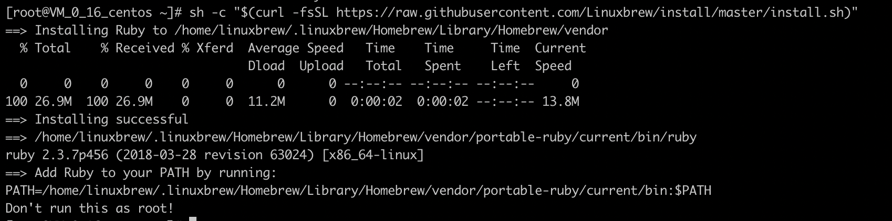

# Server Information - Tencent Cloud

## Basic Information

* 170.106.4.232
* root
* Brickea
* Eggplant

## Available portals

* 80
* 443

## Things have done base on root

* install git ```sudo yum install git```
  * git can be used in all account
* Trying to install brew in root to make it right for every accounts.
  * But there is a problem:
    
    > the message is "Don't run this as root"
  * **Solve it later**
* Install ```zsh``` in root account
  * Install ```sudo yum update && sudo yum -y install zsh```.
  * Check version to verify installation ```zsh --version```.
  * Make Zsh your default shell ```chsh -s /bin/zsh```. You will be prompted to enter your password.
* Install oh-my-zsh ```sh -c "$(wget -O- https://raw.githubusercontent.com/ohmyzsh/ohmyzsh/master/tools/install.sh)"```
  * Change the default bash to zsh```chsh -s $(which zsh)```
  * Change the theme to ```ys``` in ```.zshrc```
* Things need to be done
  * Make right configuration about jupyter notebook
    * The problem is that when doing 'Create a self-signed certificate and the matched key:' the process is not respond.
  * [Reference](https://www.vultr.com/docs/how-to-install-jupyter-notebook-on-a-vultr-centos-7-server-instance)
* Jupyter notebook password
> 'sha1:3c1ffd8dce53:8940d36f29f595ca78e41484f00759fdbf0f9f98'

## Things have done base on Brickea

* Create path for linuxbrew 
  * Add path ```export PATH=/home/Brickea/.linuxbrew/bin:$PATH``` to ```.profile``` in the ~ path
  * brew can only be uesd in Brickea account
* Install homebrew 
  * install brew [reference](https://docs.brew.sh/Homebrew-on-Linux)
  * brew can be use for account Brickea **only** for now
* Trying to figure out how to apply the root zsh to all users.
  * But it seems like not a good idea.
  * Solve it later
* Add sudo permission to Brickea

### Install MySQL in Brickea account

* Follow the [instruction](https://dev.mysql.com/doc/refman/8.0/en/linux-installation-yum-repo.html)
* [Problems Solutions](Mysql%20in%20Centos.md)