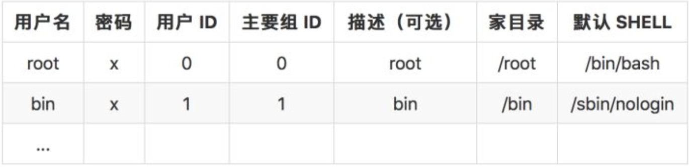
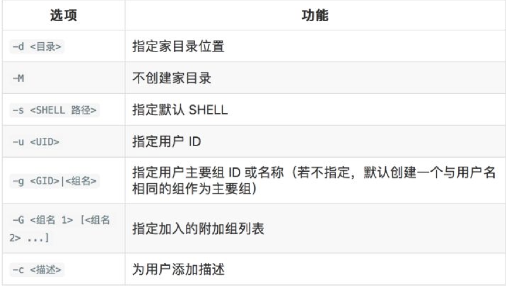
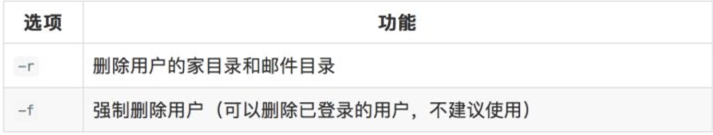
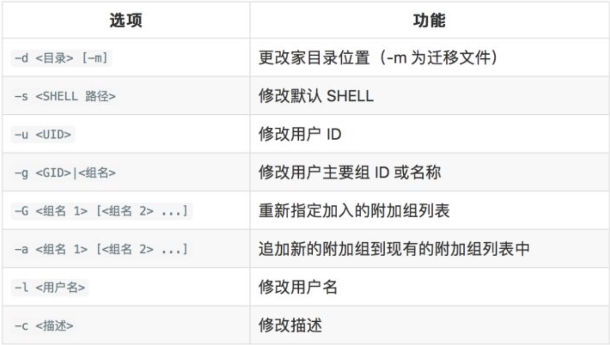
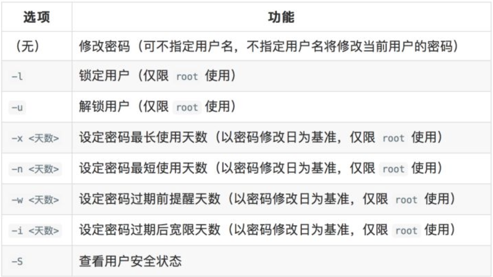
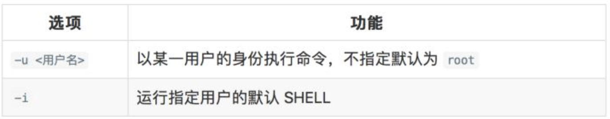

# User management

- [User management](#user-management)
  - [CentOS User management](#centos-user-management)
    - [Type of User](#type-of-user)
    - [Check Users' information](#check-users-information)
    - [Add users](#add-users)
    - [Change users' parameters](#change-users-parameters)
    - [Switch to another user](#switch-to-another-user)
    - [Group Management](#group-management)
    - [Add sudo right to user](#add-sudo-right-to-user)

## CentOS User management

### Type of User

* Super User: root
  * ID: 0
* Normal User
  * ID: start from 1000
* System Service User
  * ID: start from 1 to 499. Only for system service
  * Default shell is ```/sbin/nologin``` 

### Check Users' information

* File path: ```/etc/passwd```
  * The informations are ordered in following ways
    
* File path: ```/etc/shadow```
  * The information are ordered in following ways
    

### Add users

```useradd [options] <username>```



### Delete users

```userdel [options] <username>```



### Change users' parameters

```usermod [options] <username>```



### User' passwords and security management

```passwd [options] <username>```



### Switch to another user

```sudo [options] <command>```



### [Group Management](https://zhuanlan.zhihu.com/p/30252309)

### Add sudo right to user

* Use root and enter ```cd root```
* Run ```visudo``` in order to change the ```/etc/sudoers``` file
* Find row like this ``` root  ALL=(ALL)    ALL```
* Add row ```username ALL=(ALL)     ALL```